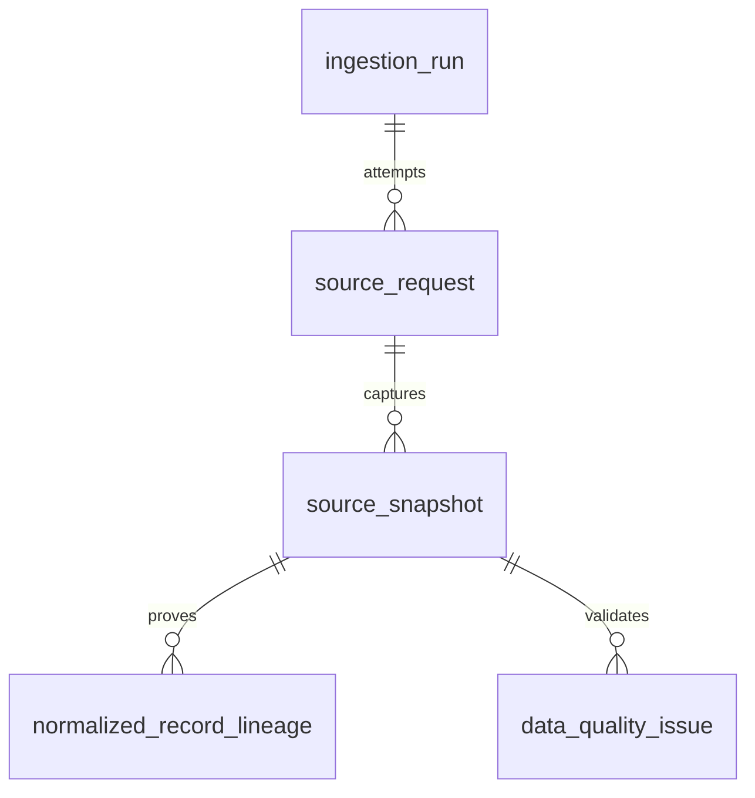
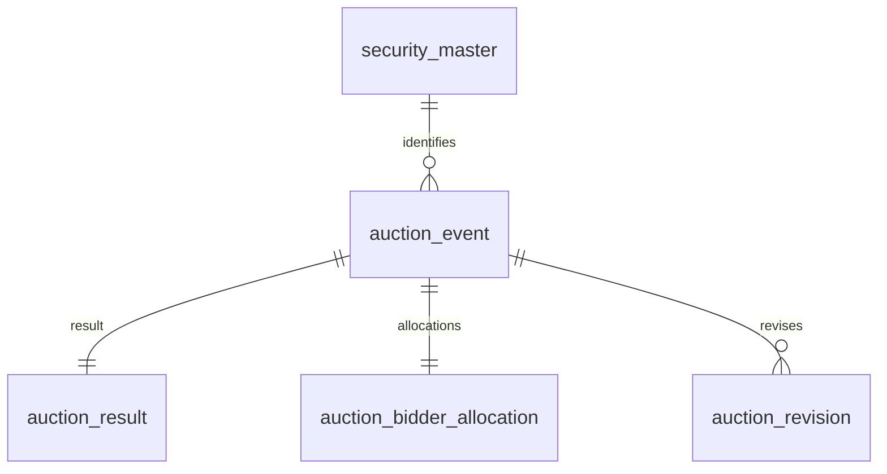

# PostgreSQL DB 명세 — 입찰 전용 v1

기준 화면: `UST_AUCTION_ui-baseline-v3.html`. 아래 객체는 `../db/auction_schema.sql`에서 생성한다. 기존 통합 DB catalog에서 입찰 관련 정의를 선별했으며, 이 파일의 DDL을 새 DB에서 실행하는 것이 이 버전의 기준이다. 기존 통합 DB의 변경·삭제 절차는 포함하지 않는다.

## 구현 범위

- 고객 화면은 `입찰 결과` 단일 메뉴다. 예정 일정과 월간 캘린더는 `v_auction_dashboard`의 `ANNOUNCED` 행을 사용한다.
- 실제 결과는 `RESULT_AVAILABLE` 행을 사용하고 CUSIP는 내부 식별에만 쓴다.
- 실시간 2Y·10Y·30Y 시장금리는 미연결 상태다. 입찰 Stop으로 대체하지 않는다.

## 화면 조회 계약
| 화면 요소 | DB 객체·필드 | 조회·계산 규칙 |
|---|---|---|
| 최근 입찰·KPI·결과표 | `v_auction_dashboard`의 `RESULT_AVAILABLE` 행 | 사용자 결과 기간과 상품 필터를 적용한다. CUSIP는 내부 식별에만 사용하고 화면에는 표시하지 않는다. |
| 예정 입찰 일정·월간 캘린더 | `v_auction_dashboard`의 `ANNOUNCED` 행 | 기준일 이상 90일 이내의 공식 공고만 표시한다. 결과와 예정이 같은 사건이면 `auction_event_id` 기준으로 결과를 우선한다. |
| 낙찰금리·참여자 비중 | `stop_value`, `*_share_pct`, `other_ui_residual_pct` | 선택 결과와 동일한 `security_type + normalized_security_term`만 비교한다. |
| 응찰률 KPI | `bid_to_cover_ratio` | 원본 배수에 100을 곱해 %로 표시한다. 선택 결과 이전 최대 6개 유효값 평균과 %p가 아닌 퍼센트 값 차이를 계산한다. |
| 응찰률 장기 차트 | `bid_to_cover_ratio`, `auction_date` | 동일 상품·만기 전 이력을 날짜순으로 계산한다. 각 관측일 직전 24개월 초과 경계의 유효값으로 평균·모집단 표준편차(±1σ)를 계산하고 최근 6회 평균은 6건이 모두 있을 때만 표시한다. 조회 시작일보다 25개월 앞선 warm-up 데이터를 확보한다. |
| 상태·출처 | `v_ingestion_status`, `source_snapshot` | 마지막 시도와 성공을 구분하며, 수신 실패 시 표본값으로 대체하지 않는다. |

## ERD

### 수집·원천·품질 추적



### 국채 입찰



## 공통 갱신·보관 정책

- **A**는 감사 이력으로 추가하고, **C**는 업무키 기준 현재값을 갱신한다. 수집 명령은 실행·원본·정정 이력을 자동 삭제하지 않는다.
- 업무키는 `(cusip, auction_date, issue_date)`이며, 같은 정규화 내용은 최근 관측만 갱신하고 변경 시 `auction_revision`을 추가한다.
- USD는 `NUMERIC(24,2)`, 금리·비율은 `NUMERIC(18,9)`와 Python `Decimal`을 사용한다.
- DATE는 원천 달력일, TIMESTAMPTZ는 실제 순간이다. ET만 있는 시각은 TIME과 `America/New_York`으로 보관한다.
- NULL과 실제 0을 구분하며 누락 사유는 원본과 `data_quality_issue`에 남긴다.
- `source_snapshot`은 URL과 본문 해시로 재사용한다. 동시 수집은 PostgreSQL advisory lock으로 직렬화한다.

## auction_bidder_allocation

참여자별 응찰·낙찰 원 단위 금액。 갱신·보관 규칙: **C** (공통 정책 참조).

| 컬럼 | 한글 설명 | PostgreSQL 타입 | 단위 | NULL | 기본값 | 원천/생성 | 예시 |
|---|---|---|---|---|---|---|---|
| `auction_event_id` | auction_event 식별키(UUID/연결키) | `uuid` | — | 불가 | `없음` | 정규화/감사 생성 | UUID |
| `primary_dealer_tendered_usd` | PD_응찰액 | `numeric(24,2)` | USD | 허용 | `없음` | API.primary_dealer_tendered | NULL |
| `primary_dealer_accepted_usd` | PD_낙찰액 | `numeric(24,2)` | USD | 허용 | `없음` | API.primary_dealer_accepted | NULL |
| `direct_bidder_tendered_usd` | 직접입찰자_응찰액 | `numeric(24,2)` | USD | 허용 | `없음` | API.direct_bidder_tendered | NULL |
| `direct_bidder_accepted_usd` | 직접입찰자_낙찰액 | `numeric(24,2)` | USD | 허용 | `없음` | API.direct_bidder_accepted | NULL |
| `indirect_bidder_tendered_usd` | in직접입찰자_응찰액 | `numeric(24,2)` | USD | 허용 | `없음` | API.indirect_bidder_tendered | NULL |
| `indirect_bidder_accepted_usd` | in직접입찰자_낙찰액 | `numeric(24,2)` | USD | 허용 | `없음` | API.indirect_bidder_accepted | NULL |
| `treasury_retail_accepted_usd` | 재무부 소매_낙찰액 | `numeric(24,2)` | USD | 허용 | `없음` | API.treas_retail_accepted | NULL |
| `soma_tendered_usd` | SOMA_응찰액 | `numeric(24,2)` | USD | 허용 | `없음` | API.soma_tendered | NULL |
| `soma_accepted_usd` | SOMA_낙찰액 | `numeric(24,2)` | USD | 허용 | `없음` | API.soma_accepted | NULL |
| `soma_holdings_usd` | SOMA_보유액 | `numeric(24,2)` | USD | 허용 | `없음` | API.soma_holdings | NULL |
| `fima_noncomp_tendered_usd` | FIMA 비경쟁_응찰액 | `numeric(24,2)` | USD | 허용 | `없음` | API.fima_noncomp_tendered | NULL |
| `fima_noncomp_accepted_usd` | FIMA 비경쟁_낙찰액 | `numeric(24,2)` | USD | 허용 | `없음` | API.fima_noncomp_accepted | NULL |
| `updated_at` | 갱신 순간(UTC 저장) | `timestamp with time zone` | — | 불가 | `clock_timestamp()` | 정규화/감사 생성 | 2026-08-05T12:30:00Z |

키·제약:

```sql
-- auction_bidder_allocation_auction_event_id_fkey
FOREIGN KEY (auction_event_id) REFERENCES ust.auction_event(auction_event_id) ON DELETE CASCADE;
-- auction_bidder_allocation_direct_bidder_accepted_usd_check
CHECK ((direct_bidder_accepted_usd >= (0)::numeric));
-- auction_bidder_allocation_indirect_bidder_accepted_usd_check
CHECK ((indirect_bidder_accepted_usd >= (0)::numeric));
-- auction_bidder_allocation_pkey
PRIMARY KEY (auction_event_id);
-- auction_bidder_allocation_primary_dealer_accepted_usd_check
CHECK ((primary_dealer_accepted_usd >= (0)::numeric));
```

인덱스:

```sql
CREATE UNIQUE INDEX auction_bidder_allocation_pkey ON ust.auction_bidder_allocation USING btree (auction_event_id)
```

## auction_event

공고·일정과 입찰 사건의 현재 상태。 갱신·보관 규칙: **C** (공통 정책 참조).

| 컬럼 | 한글 설명 | PostgreSQL 타입 | 단위 | NULL | 기본값 | 원천/생성 | 예시 |
|---|---|---|---|---|---|---|---|
| `auction_event_id` | auction_event 식별키(UUID/연결키) | `uuid` | — | 불가 | `gen_random_uuid()` | 정규화/감사 생성 | UUID |
| `security_id` | security 식별키(UUID/연결키) | `uuid` | — | 불가 | `없음` | 정규화/감사 생성 | UUID |
| `cusip` | 미국 증권 식별번호 | `character varying(20)` | — | 불가 | `없음` | API.cusip | 원천 문자열 |
| `record_date` | API 레코드 기준일 | `date` | — | 불가 | `없음` | API.record_date | 2026-08-05 |
| `announcement_date` | 공고일 | `date` | — | 허용 | `없음` | API.announcemt_date | NULL |
| `auction_date` | 입찰일 | `date` | — | 불가 | `없음` | API.auction_date | 2026-08-05 |
| `issue_date` | 발행·결제일 | `date` | — | 허용 | `없음` | API.issue_date | NULL |
| `maturity_date` | 만기일 | `date` | — | 허용 | `없음` | API.maturity_date | NULL |
| `security_type` | 정규화 상품 종류 | `text` | — | 불가 | `없음` | API.security_type | 원천 문자열 |
| `source_security_type` | API 원문 상품 종류 | `text` | — | 허용 | `없음` | 정규화/감사 생성 | NULL |
| `security_term` | 원문 만기 | `text` | — | 불가 | `없음` | API.security_term | 원천 문자열 |
| `normalized_security_term` | 비교용 표준 만기 | `text` | — | 불가 | `없음` | 정규화/감사 생성 | 원천 문자열 |
| `security_term_day_month` | 일·월 기준 원문만기 | `text` | — | 허용 | `없음` | API.security_term_day_month | NULL |
| `security_term_week_year` | 주·년 기준 원문만기 | `text` | — | 허용 | `없음` | API.security_term_week_year | NULL |
| `auction_format` | 입찰 방식 | `text` | — | 허용 | `없음` | API.auction_format | NULL |
| `reopening` | 재발행 여부 | `boolean` | — | 허용 | `없음` | API.reopening | NULL |
| `cash_management_bill` | CMB 여부 | `boolean` | — | 허용 | `없음` | API.cash_management_bill_cmb | NULL |
| `closing_time_comp_raw` | closing_time_comp_raw / 원천 ET 시각 원문 | `text` | — | 허용 | `없음` | 정규화/감사 생성 | NULL |
| `closing_time_comp_et` | closing_time_comp_et / 원천 ET 시각 TIME | `time without time zone` | — | 허용 | `없음` | 정규화/감사 생성 | NULL |
| `closing_time_noncomp_raw` | closing_time_noncomp_raw / 원천 ET 시각 원문 | `text` | — | 허용 | `없음` | 정규화/감사 생성 | NULL |
| `closing_time_noncomp_et` | closing_time_noncomp_et / 원천 ET 시각 TIME | `time without time zone` | — | 허용 | `없음` | 정규화/감사 생성 | NULL |
| `source_timezone` | 원천 시간대 IANA명 | `text` | — | 불가 | `'America/New_York'::text` | 정규화/감사 생성 | 원천 문자열 |
| `offering_amount_usd` | 공고 발행액 | `numeric(24,2)` | USD | 허용 | `없음` | API.offering_amt | NULL |
| `business_key_hash` | cusip/입찰일/발행일 업무키 SHA-256 | `character(64)` | — | 불가 | `없음` | 정규화/감사 생성 | 원천 문자열 |
| `current_content_hash` | 현재 정규화 내용 SHA-256 | `character(64)` | — | 불가 | `없음` | 정규화/감사 생성 | 원천 문자열 |
| `current_snapshot_id` | current_snapshot 식별키(UUID/연결키) | `uuid` | — | 허용 | `없음` | 정규화/감사 생성 | NULL |
| `raw_record` | 원문 필드값 JSON | `jsonb` | — | 불가 | `없음` | 정규화/감사 생성 | {} |
| `first_seen_at` | 최초 관측 순간(UTC 저장) | `timestamp with time zone` | — | 불가 | `clock_timestamp()` | 정규화/감사 생성 | 2026-08-05T12:30:00Z |
| `last_seen_at` | 최근 관측 순간(UTC 저장) | `timestamp with time zone` | — | 불가 | `clock_timestamp()` | 정규화/감사 생성 | 2026-08-05T12:30:00Z |

키·제약:

```sql
-- auction_event_business_key_hash_check
CHECK ((business_key_hash ~ '^[0-9a-f]{64}$'::text));
-- auction_event_business_key_hash_key
UNIQUE (business_key_hash);
-- auction_event_check
CHECK (((maturity_date IS NULL) OR (issue_date IS NULL) OR (maturity_date > issue_date)));
-- auction_event_current_content_hash_check
CHECK ((current_content_hash ~ '^[0-9a-f]{64}$'::text));
-- auction_event_current_snapshot_id_fkey
FOREIGN KEY (current_snapshot_id) REFERENCES ust.source_snapshot(source_snapshot_id);
-- auction_event_cusip_auction_date_issue_date_key
UNIQUE NULLS NOT DISTINCT (cusip, auction_date, issue_date);
-- auction_event_offering_amount_usd_check
CHECK ((offering_amount_usd >= (0)::numeric));
-- auction_event_pkey
PRIMARY KEY (auction_event_id);
-- auction_event_security_id_fkey
FOREIGN KEY (security_id) REFERENCES ust.security_master(security_id);
-- auction_event_source_timezone_check
CHECK ((source_timezone = 'America/New_York'::text));
```

인덱스:

```sql
CREATE UNIQUE INDEX auction_event_business_key_hash_key ON ust.auction_event USING btree (business_key_hash)
CREATE UNIQUE INDEX auction_event_cusip_auction_date_issue_date_key ON ust.auction_event USING btree (cusip, auction_date, issue_date) NULLS NOT DISTINCT
CREATE UNIQUE INDEX auction_event_pkey ON ust.auction_event USING btree (auction_event_id)
CREATE INDEX ix_auction_comparable ON ust.auction_event USING btree (security_type, normalized_security_term, auction_date DESC)
CREATE INDEX ix_auction_cusip ON ust.auction_event USING btree (cusip, auction_date DESC)
CREATE INDEX ix_auction_recent ON ust.auction_event USING btree (auction_date DESC, security_type, normalized_security_term)
```

## auction_result

입찰 결과 수치와 상품별 Stop。 갱신·보관 규칙: **C** (공통 정책 참조).

| 컬럼 | 한글 설명 | PostgreSQL 타입 | 단위 | NULL | 기본값 | 원천/생성 | 예시 |
|---|---|---|---|---|---|---|---|
| `auction_event_id` | auction_event 식별키(UUID/연결키) | `uuid` | — | 불가 | `없음` | 정규화/감사 생성 | UUID |
| `stop_metric_code` | Stop 지표 코드 | `text` | — | 불가 | `없음` | 정규화/감사 생성 | 원천 문자열 |
| `stop_metric_label` | Stop 표시 명칭 | `text` | — | 불가 | `없음` | 정규화/감사 생성 | 원천 문자열 |
| `stop_value` | 상품별 낙찰 Stop | `numeric(18,9)` | % | 허용 | `없음` | 정규화/감사 생성 | NULL |
| `high_discount_rate` | 최고 할인율 | `numeric(18,9)` | % | 허용 | `없음` | API.high_discnt_rate | NULL |
| `high_investment_rate` | 최고 투자수익률 | `numeric(18,9)` | % | 허용 | `없음` | API.high_investment_rate | NULL |
| `high_discount_margin` | 최고 할인마진 | `numeric(18,9)` | % | 허용 | `없음` | API.high_discnt_margin | NULL |
| `high_yield` | 최고 수익률 | `numeric(18,9)` | % | 허용 | `없음` | API.high_yield | NULL |
| `spread` | FRN 스프레드 | `numeric(18,9)` | % | 허용 | `없음` | API.spread | NULL |
| `interest_rate` | 쿠폰금리 | `numeric(18,9)` | % | 허용 | `없음` | API.int_rate | NULL |
| `price_per_100` | 액면100당 낙찰가격 | `numeric(20,9)` | USD/액면100 | 허용 | `없음` | API.price_per100 | NULL |
| `high_price` | 최고가격 | `numeric(20,9)` | USD/액면100 | 허용 | `없음` | API.high_price | NULL |
| `bid_to_cover_ratio` | 원본 응찰배수(2.48 보존) | `numeric(18,9)` | 배 | 허용 | `없음` | API.bid_to_cover_ratio | NULL |
| `allocation_percentage` | 고율에서 비례 배정률 | `numeric(18,9)` | % | 허용 | `없음` | API.allocation_pctage | NULL |
| `total_tendered_usd` | 전체 응찰액 | `numeric(24,2)` | USD | 허용 | `없음` | API.total_tendered | NULL |
| `total_accepted_usd` | 전체 낙찰액 | `numeric(24,2)` | USD | 허용 | `없음` | API.total_accepted | NULL |
| `competitive_tendered_usd` | 경쟁 응찰액 | `numeric(24,2)` | USD | 허용 | `없음` | API.comp_tendered | NULL |
| `competitive_accepted_usd` | 경쟁 낙찰액 | `numeric(24,2)` | USD | 허용 | `없음` | API.comp_accepted | NULL |
| `noncompetitive_accepted_usd` | 비경쟁 낙찰액 | `numeric(24,2)` | USD | 허용 | `없음` | API.noncomp_accepted | NULL |
| `pdf_filename_announcement` | pdf_filename_announcement (원천 명칭 보존) | `text` | — | 허용 | `없음` | API.pdf_filenm_announcemt | NULL |
| `pdf_filename_comp_results` | pdf_filename_comp_results (원천 명칭 보존) | `text` | — | 허용 | `없음` | API.pdf_filenm_comp_results | NULL |
| `pdf_filename_noncomp_results` | pdf_filename_noncomp_results (원천 명칭 보존) | `text` | — | 허용 | `없음` | API.pdf_filenm_noncomp_results | NULL |
| `xml_filename_announcement` | xml_filename_announcement (원천 명칭 보존) | `text` | — | 허용 | `없음` | API.xml_filenm_announcemt | NULL |
| `xml_filename_comp_results` | xml_filename_comp_results (원천 명칭 보존) | `text` | — | 허용 | `없음` | API.xml_filenm_comp_results | NULL |
| `updated_at` | 갱신 순간(UTC 저장) | `timestamp with time zone` | — | 불가 | `clock_timestamp()` | 정규화/감사 생성 | 2026-08-05T12:30:00Z |

키·제약:

```sql
-- auction_result_allocation_percentage_check
CHECK (((allocation_percentage >= (0)::numeric) AND (allocation_percentage <= (100)::numeric)));
-- auction_result_auction_event_id_fkey
FOREIGN KEY (auction_event_id) REFERENCES ust.auction_event(auction_event_id) ON DELETE CASCADE;
-- auction_result_bid_to_cover_ratio_check
CHECK ((bid_to_cover_ratio >= (0)::numeric));
-- auction_result_pkey
PRIMARY KEY (auction_event_id);
-- auction_result_stop_metric_code_check
CHECK ((stop_metric_code = ANY (ARRAY['HIGH_DISCOUNT_RATE'::text, 'HIGH_YIELD'::text, 'HIGH_REAL_YIELD'::text, 'HIGH_DISCOUNT_MARGIN'::text, 'UNMAPPED'::text])));
-- auction_result_total_accepted_usd_check
CHECK ((total_accepted_usd >= (0)::numeric));
-- auction_result_total_tendered_usd_check
CHECK ((total_tendered_usd >= (0)::numeric));
```

인덱스:

```sql
CREATE UNIQUE INDEX auction_result_pkey ON ust.auction_result USING btree (auction_event_id)
```

## auction_revision

정규화 내용 변경 이력과 당시 원문。 갱신·보관 규칙: **A** (공통 정책 참조).

| 컬럼 | 한글 설명 | PostgreSQL 타입 | 단위 | NULL | 기본값 | 원천/생성 | 예시 |
|---|---|---|---|---|---|---|---|
| `auction_revision_id` | auction_revision 식별키(UUID/연결키) | `uuid` | — | 불가 | `gen_random_uuid()` | 정규화/감사 생성 | UUID |
| `auction_event_id` | auction_event 식별키(UUID/연결키) | `uuid` | — | 불가 | `없음` | 정규화/감사 생성 | UUID |
| `revision_number` | 입찰 정정 번호 | `integer` | — | 불가 | `없음` | 정규화/감사 생성 | 0 |
| `content_hash` | 정규화 내용 SHA-256 | `character(64)` | — | 불가 | `없음` | 정규화/감사 생성 | 원천 문자열 |
| `source_snapshot_id` | source_snapshot 식별키(UUID/연결키) | `uuid` | — | 허용 | `없음` | 정규화/감사 생성 | NULL |
| `raw_record` | 원문 필드값 JSON | `jsonb` | — | 불가 | `없음` | 정규화/감사 생성 | {} |
| `typed_record` | 당시 Decimal/날짜 정규화 JSON | `jsonb` | — | 불가 | `없음` | 정규화/감사 생성 | {} |
| `valid_from` | 버전 유효 시작 순간(UTC 저장) | `timestamp with time zone` | — | 불가 | `clock_timestamp()` | 정규화/감사 생성 | 2026-08-05T12:30:00Z |
| `valid_to` | 버전 유효 종료 순간(UTC 저장) | `timestamp with time zone` | — | 허용 | `없음` | 정규화/감사 생성 | NULL |
| `is_current` | 현재 버전 여부 | `boolean` | — | 불가 | `true` | 정규화/감사 생성 | true |
| `change_fields` | 이전 정정과 달라진 필드 목록 | `text[]` | — | 불가 | `ARRAY[]::text[]` | 정규화/감사 생성 | 원천 문자열 |

키·제약:

```sql
-- auction_revision_auction_event_id_fkey
FOREIGN KEY (auction_event_id) REFERENCES ust.auction_event(auction_event_id) ON DELETE CASCADE;
-- auction_revision_auction_event_id_revision_number_key
UNIQUE (auction_event_id, revision_number);
-- auction_revision_check
CHECK (((valid_to IS NULL) OR (valid_to >= valid_from)));
-- auction_revision_pkey
PRIMARY KEY (auction_revision_id);
-- auction_revision_revision_number_check
CHECK ((revision_number > 0));
-- auction_revision_source_snapshot_id_fkey
FOREIGN KEY (source_snapshot_id) REFERENCES ust.source_snapshot(source_snapshot_id);
```

인덱스:

```sql
CREATE UNIQUE INDEX auction_revision_auction_event_id_revision_number_key ON ust.auction_revision USING btree (auction_event_id, revision_number)
CREATE UNIQUE INDEX auction_revision_pkey ON ust.auction_revision USING btree (auction_revision_id)
CREATE UNIQUE INDEX uq_auction_revision_current ON ust.auction_revision USING btree (auction_event_id) WHERE is_current
```

## data_quality_issue

누락·타입·합계·검증 거절과 처리 상태。 갱신·보관 규칙: **A** (공통 정책 참조).

| 컬럼 | 한글 설명 | PostgreSQL 타입 | 단위 | NULL | 기본값 | 원천/생성 | 예시 |
|---|---|---|---|---|---|---|---|
| `data_quality_issue_id` | data_quality_issue 식별키(UUID/연결키) | `bigint` | — | 불가 | `IDENTITY` | 수집기/HTTP/계산 방법 설정 | 0 |
| `run_id` | run 식별키(UUID/연결키) | `uuid` | — | 허용 | `없음` | 수집기/HTTP/계산 방법 설정 | NULL |
| `source_snapshot_id` | source_snapshot 식별키(UUID/연결키) | `uuid` | — | 허용 | `없음` | 수집기/HTTP/계산 방법 설정 | NULL |
| `entity_type` | 연결 레코드 테이블/종류 | `text` | — | 허용 | `없음` | 수집기/HTTP/계산 방법 설정 | NULL |
| `entity_id` | entity 식별키(UUID/연결키) | `uuid` | — | 허용 | `없음` | 수집기/HTTP/계산 방법 설정 | NULL |
| `field_name` | 문제 원천 필드 | `text` | — | 허용 | `없음` | 수집기/HTTP/계산 방법 설정 | NULL |
| `severity` | 검증 심각도 | `text` | — | 불가 | `없음` | 수집기/HTTP/계산 방법 설정 | 원천 문자열 |
| `rule_code` | 검증 규칙 코드 | `text` | — | 불가 | `없음` | 수집기/HTTP/계산 방법 설정 | 원천 문자열 |
| `raw_value` | 문제 원문 값 | `text` | — | 허용 | `없음` | 수집기/HTTP/계산 방법 설정 | NULL |
| `null_reason` | NULL의 원인 | `text` | — | 허용 | `없음` | 수집기/HTTP/계산 방법 설정 | NULL |
| `message` | 검증 메시지 | `text` | — | 불가 | `없음` | 수집기/HTTP/계산 방법 설정 | 원천 문자열 |
| `resolution_status` | 이슈 처리 상태 | `text` | — | 불가 | `'OPEN'::text` | 수집기/HTTP/계산 방법 설정 | 원천 문자열 |
| `created_at` | 생성 순간(UTC 저장) | `timestamp with time zone` | — | 불가 | `clock_timestamp()` | 수집기/HTTP/계산 방법 설정 | 2026-08-05T12:30:00Z |
| `resolved_at` | 이슈 해결 순간(UTC 저장) | `timestamp with time zone` | — | 허용 | `없음` | 수집기/HTTP/계산 방법 설정 | NULL |

키·제약:

```sql
-- data_quality_issue_null_reason_check
CHECK ((null_reason = ANY (ARRAY['SOURCE_NULL'::text, 'NOT_APPLICABLE'::text, 'UNAVAILABLE_SOURCE'::text, 'NOT_CONNECTED'::text, 'PARSE_FAILED'::text])));
-- data_quality_issue_pkey
PRIMARY KEY (data_quality_issue_id);
-- data_quality_issue_resolution_status_check
CHECK ((resolution_status = ANY (ARRAY['OPEN'::text, 'ACCEPTED'::text, 'RESOLVED'::text, 'IGNORED'::text])));
-- data_quality_issue_run_id_fkey
FOREIGN KEY (run_id) REFERENCES ust.ingestion_run(run_id) ON DELETE SET NULL;
-- data_quality_issue_severity_check
CHECK ((severity = ANY (ARRAY['INFO'::text, 'WARN'::text, 'ERROR'::text, 'FATAL'::text])));
-- data_quality_issue_source_snapshot_id_fkey
FOREIGN KEY (source_snapshot_id) REFERENCES ust.source_snapshot(source_snapshot_id) ON DELETE SET NULL;
```

인덱스:

```sql
CREATE UNIQUE INDEX data_quality_issue_pkey ON ust.data_quality_issue USING btree (data_quality_issue_id)
CREATE INDEX ix_quality_open ON ust.data_quality_issue USING btree (resolution_status, severity, created_at DESC)
```

## ingestion_run

수집 실행, 범위, 진행·실패·적재 집계。 갱신·보관 규칙: **A** (공통 정책 참조).

| 컬럼 | 한글 설명 | PostgreSQL 타입 | 단위 | NULL | 기본값 | 원천/생성 | 예시 |
|---|---|---|---|---|---|---|---|
| `run_id` | run 식별키(UUID/연결키) | `uuid` | — | 불가 | `gen_random_uuid()` | 수집기/HTTP/계산 방법 설정 | UUID |
| `source_name` | 원천 종류 | `text` | — | 불가 | `없음` | 수집기/HTTP/계산 방법 설정 | 원천 문자열 |
| `job_type` | 수집 명령 종류 | `text` | — | 불가 | `없음` | 수집기/HTTP/계산 방법 설정 | 원천 문자열 |
| `requested_from` | 요청 범위 시작 | `date` | — | 허용 | `없음` | 수집기/HTTP/계산 방법 설정 | NULL |
| `requested_to` | 요청 범위 끝 | `date` | — | 허용 | `없음` | 수집기/HTTP/계산 방법 설정 | NULL |
| `started_at` | 실행 시작 순간(UTC 저장) | `timestamp with time zone` | — | 불가 | `clock_timestamp()` | 수집기/HTTP/계산 방법 설정 | 2026-08-05T12:30:00Z |
| `finished_at` | 실행 종료 순간(UTC 저장) | `timestamp with time zone` | — | 허용 | `없음` | 수집기/HTTP/계산 방법 설정 | NULL |
| `status` | 실행 상태 | `text` | — | 불가 | `'RUNNING'::text` | 수집기/HTTP/계산 방법 설정 | 원천 문자열 |
| `pages_attempted` | 페이지_시도 건수 | `integer` | 건 | 불가 | `0` | 수집기/HTTP/계산 방법 설정 | 0 |
| `pages_succeeded` | 페이지_성공 건수 | `integer` | 건 | 불가 | `0` | 수집기/HTTP/계산 방법 설정 | 0 |
| `rows_received` | 행_수신 건수 | `bigint` | 건 | 불가 | `0` | 수집기/HTTP/계산 방법 설정 | 0 |
| `rows_inserted` | 행_추가 건수 | `bigint` | 건 | 불가 | `0` | 수집기/HTTP/계산 방법 설정 | 0 |
| `rows_updated` | 행_수정 건수 | `bigint` | 건 | 불가 | `0` | 수집기/HTTP/계산 방법 설정 | 0 |
| `rows_unchanged` | 행_동일 건수 | `bigint` | 건 | 불가 | `0` | 수집기/HTTP/계산 방법 설정 | 0 |
| `rows_rejected` | 행_거절 건수 | `bigint` | 건 | 불가 | `0` | 수집기/HTTP/계산 방법 설정 | 0 |
| `checkpoint` | 완료 페이지와 전체 페이지 수 | `jsonb` | — | 불가 | `'{}'::jsonb` | 수집기/HTTP/계산 방법 설정 | {} |
| `error_summary` | 오류 요약 | `text` | — | 허용 | `없음` | 수집기/HTTP/계산 방법 설정 | NULL |

키·제약:

```sql
-- ingestion_run_check
CHECK (((finished_at IS NULL) OR (finished_at >= started_at)));
-- ingestion_run_check1
CHECK (((rows_received >= 0) AND (rows_rejected >= 0)));
-- ingestion_run_pkey
PRIMARY KEY (run_id);
-- ingestion_run_status_check
CHECK ((status = ANY (ARRAY['RUNNING'::text, 'SUCCESS'::text, 'PARTIAL_FAILURE'::text, 'FAILED'::text, 'DRY_RUN'::text])));
```

인덱스:

```sql
CREATE UNIQUE INDEX ingestion_run_pkey ON ust.ingestion_run USING btree (run_id)
CREATE INDEX ix_run_source ON ust.ingestion_run USING btree (source_name, job_type, started_at DESC)
CREATE INDEX ix_run_status ON ust.ingestion_run USING btree (status, started_at DESC)
```

## normalized_record_lineage

정규화 레코드와 모든 관측 원본의 연결。 갱신·보관 규칙: **A** (공통 정책 참조).

| 컬럼 | 한글 설명 | PostgreSQL 타입 | 단위 | NULL | 기본값 | 원천/생성 | 예시 |
|---|---|---|---|---|---|---|---|
| `normalized_record_lineage_id` | normalized_record_lineage 식별키(UUID/연결키) | `bigint` | — | 불가 | `IDENTITY` | 수집기/HTTP/계산 방법 설정 | 0 |
| `entity_type` | 연결 레코드 테이블/종류 | `text` | — | 불가 | `없음` | 수집기/HTTP/계산 방법 설정 | 원천 문자열 |
| `entity_id` | entity 식별키(UUID/연결키) | `uuid` | — | 불가 | `없음` | 수집기/HTTP/계산 방법 설정 | UUID |
| `source_snapshot_id` | source_snapshot 식별키(UUID/연결키) | `uuid` | — | 불가 | `없음` | 수집기/HTTP/계산 방법 설정 | UUID |
| `source_locator` | 페이지/시트/표/행/열/selector/인용문/추출신뢰도 | `jsonb` | — | 불가 | `'{}'::jsonb` | 수집기/HTTP/계산 방법 설정 | {} |
| `parser_version` | 추출/정규화 코드 버전 | `text` | — | 불가 | `없음` | 수집기/HTTP/계산 방법 설정 | 원천 문자열 |
| `confidence` | 추출 신뢰도 | `numeric(5,4)` | — | 허용 | `없음` | 수집기/HTTP/계산 방법 설정 | NULL |
| `created_at` | 생성 순간(UTC 저장) | `timestamp with time zone` | — | 불가 | `clock_timestamp()` | 수집기/HTTP/계산 방법 설정 | 2026-08-05T12:30:00Z |

키·제약:

```sql
-- normalized_record_lineage_confidence_check
CHECK (((confidence >= (0)::numeric) AND (confidence <= (1)::numeric)));
-- normalized_record_lineage_entity_type_entity_id_source_snap_key
UNIQUE (entity_type, entity_id, source_snapshot_id, parser_version);
-- normalized_record_lineage_pkey
PRIMARY KEY (normalized_record_lineage_id);
-- normalized_record_lineage_source_snapshot_id_fkey
FOREIGN KEY (source_snapshot_id) REFERENCES ust.source_snapshot(source_snapshot_id);
```

인덱스:

```sql
CREATE UNIQUE INDEX normalized_record_lineage_entity_type_entity_id_source_snap_key ON ust.normalized_record_lineage USING btree (entity_type, entity_id, source_snapshot_id, parser_version)
CREATE UNIQUE INDEX normalized_record_lineage_pkey ON ust.normalized_record_lineage USING btree (normalized_record_lineage_id)
```

## security_master

CUSIP 단위 증권 기본정보。 갱신·보관 규칙: **C** (공통 정책 참조).

| 컬럼 | 한글 설명 | PostgreSQL 타입 | 단위 | NULL | 기본값 | 원천/생성 | 예시 |
|---|---|---|---|---|---|---|---|
| `security_id` | security 식별키(UUID/연결키) | `uuid` | — | 불가 | `gen_random_uuid()` | 정규화/감사 생성 | UUID |
| `cusip` | 미국 증권 식별번호 | `character varying(20)` | — | 불가 | `없음` | API.cusip | 원천 문자열 |
| `security_type` | 정규화 상품 종류 | `text` | — | 불가 | `없음` | API.security_type | 원천 문자열 |
| `original_security_term` | 최초 발행 만기 | `text` | — | 허용 | `없음` | API.original_security_term | NULL |
| `series` | 발행 시리즈 | `text` | — | 허용 | `없음` | API.series | NULL |
| `inflation_index_security` | 물가연동 여부 | `boolean` | — | 허용 | `없음` | API.inflation_index_security | NULL |
| `floating_rate` | 변동금리 여부 | `boolean` | — | 허용 | `없음` | API.floating_rate | NULL |
| `original_issue_date` | 최초 발행일 | `date` | — | 허용 | `없음` | API.original_issue_date | NULL |
| `maturity_date` | 만기일 | `date` | — | 허용 | `없음` | API.maturity_date | NULL |
| `first_seen_at` | 최초 관측 순간(UTC 저장) | `timestamp with time zone` | — | 불가 | `clock_timestamp()` | 정규화/감사 생성 | 2026-08-05T12:30:00Z |
| `last_seen_at` | 최근 관측 순간(UTC 저장) | `timestamp with time zone` | — | 불가 | `clock_timestamp()` | 정규화/감사 생성 | 2026-08-05T12:30:00Z |

키·제약:

```sql
-- security_master_cusip_key
UNIQUE (cusip);
-- security_master_pkey
PRIMARY KEY (security_id);
```

인덱스:

```sql
CREATE UNIQUE INDEX security_master_cusip_key ON ust.security_master USING btree (cusip)
CREATE UNIQUE INDEX security_master_pkey ON ust.security_master USING btree (security_id)
```

## source_request

HTTP 시도 및 안전한 파라미터/응답 메타데이터。 갱신·보관 규칙: **A** (공통 정책 참조).

| 컬럼 | 한글 설명 | PostgreSQL 타입 | 단위 | NULL | 기본값 | 원천/생성 | 예시 |
|---|---|---|---|---|---|---|---|
| `source_request_id` | source_request 식별키(UUID/연결키) | `bigint` | — | 불가 | `IDENTITY` | 수집기/HTTP/계산 방법 설정 | 0 |
| `run_id` | run 식별키(UUID/연결키) | `uuid` | — | 불가 | `없음` | 수집기/HTTP/계산 방법 설정 | UUID |
| `request_url` | HTTP 요청 URL | `text` | — | 불가 | `없음` | 수집기/HTTP/계산 방법 설정 | 원천 문자열 |
| `safe_parameters` | 허용된 공개 쿼리 파라미터만 직렬화 | `jsonb` | — | 불가 | `'{}'::jsonb` | 수집기/HTTP/계산 방법 설정 | {} |
| `request_headers` | 비밀정보 제외 요청 헤더 | `jsonb` | — | 불가 | `'{}'::jsonb` | 수집기/HTTP/계산 방법 설정 | {} |
| `http_status` | HTTP 상태코드 | `integer` | — | 허용 | `없음` | 수집기/HTTP/계산 방법 설정 | NULL |
| `response_headers` | HTTP 응답 헤더 | `jsonb` | — | 불가 | `'{}'::jsonb` | 수집기/HTTP/계산 방법 설정 | {} |
| `fetched_at` | 수집 순간(UTC 저장) | `timestamp with time zone` | — | 불가 | `clock_timestamp()` | 수집기/HTTP/계산 방법 설정 | 2026-08-05T12:30:00Z |
| `elapsed_ms` | HTTP 소요시간 | `integer` | — | 허용 | `없음` | 수집기/HTTP/계산 방법 설정 | NULL |
| `attempt_number` | 재시도 순번 | `smallint` | — | 불가 | `1` | 수집기/HTTP/계산 방법 설정 | 0 |
| `error_message` | HTTP/처리 오류 | `text` | — | 허용 | `없음` | 수집기/HTTP/계산 방법 설정 | NULL |

키·제약:

```sql
-- source_request_http_status_check
CHECK (((http_status >= 100) AND (http_status <= 599)));
-- source_request_pkey
PRIMARY KEY (source_request_id);
-- source_request_run_id_fkey
FOREIGN KEY (run_id) REFERENCES ust.ingestion_run(run_id) ON DELETE CASCADE;
```

인덱스:

```sql
CREATE INDEX ix_request_url ON ust.source_request USING btree (request_url, fetched_at DESC)
CREATE UNIQUE INDEX source_request_pkey ON ust.source_request USING btree (source_request_id)
```

## source_snapshot

변경 불가능한 원본 파일의 해시·위치·응답 메타。 갱신·보관 규칙: **A** (공통 정책 참조).

| 컬럼 | 한글 설명 | PostgreSQL 타입 | 단위 | NULL | 기본값 | 원천/생성 | 예시 |
|---|---|---|---|---|---|---|---|
| `source_snapshot_id` | source_snapshot 식별키(UUID/연결키) | `uuid` | — | 불가 | `gen_random_uuid()` | 수집기/HTTP/계산 방법 설정 | UUID |
| `source_request_id` | source_request 식별키(UUID/연결키) | `bigint` | — | 허용 | `없음` | 수집기/HTTP/계산 방법 설정 | NULL |
| `source_name` | 원천 종류 | `text` | — | 불가 | `없음` | 수집기/HTTP/계산 방법 설정 | 원천 문자열 |
| `source_url` | 요청한 공식 URL | `text` | — | 불가 | `없음` | 수집기/HTTP/계산 방법 설정 | 원천 문자열 |
| `final_url` | 리디렉션 후 공식 URL | `text` | — | 불가 | `없음` | 수집기/HTTP/계산 방법 설정 | 원천 문자열 |
| `content_sha256` | 응답 본문 SHA-256 | `character(64)` | — | 불가 | `없음` | 수집기/HTTP/계산 방법 설정 | 원천 문자열 |
| `mime_type` | 원천 Content-Type | `text` | — | 불가 | `없음` | 수집기/HTTP/계산 방법 설정 | 원천 문자열 |
| `content_length` | 실제 응답 본문 바이트 수 | `bigint` | byte | 불가 | `없음` | 수집기/HTTP/계산 방법 설정 | 0 |
| `etag` | HTTP ETag | `text` | — | 허용 | `없음` | 수집기/HTTP/계산 방법 설정 | NULL |
| `last_modified` | HTTP Last-Modified 원문 | `text` | — | 허용 | `없음` | 수집기/HTTP/계산 방법 설정 | NULL |
| `fetched_at` | 수집 순간(UTC 저장) | `timestamp with time zone` | — | 불가 | `없음` | 수집기/HTTP/계산 방법 설정 | 2026-08-05T12:30:00Z |
| `raw_storage_uri` | 변경 불가 원본의 절대 경로 | `text` | — | 불가 | `없음` | 수집기/HTTP/계산 방법 설정 | 원천 문자열 |
| `parser_version` | 추출/정규화 코드 버전 | `text` | — | 허용 | `없음` | 수집기/HTTP/계산 방법 설정 | NULL |
| `response_meta` | API labels/dataTypes/dataFormats/count/pages 등 | `jsonb` | — | 불가 | `'{}'::jsonb` | 수집기/HTTP/계산 방법 설정 | {} |

키·제약:

```sql
-- source_snapshot_content_length_check
CHECK ((content_length >= 0));
-- source_snapshot_content_sha256_check
CHECK ((content_sha256 ~ '^[0-9a-f]{64}$'::text));
-- source_snapshot_pkey
PRIMARY KEY (source_snapshot_id);
-- source_snapshot_source_request_id_fkey
FOREIGN KEY (source_request_id) REFERENCES ust.source_request(source_request_id) ON DELETE SET NULL;
-- source_snapshot_source_url_content_sha256_key
UNIQUE (source_url, content_sha256);
```

인덱스:

```sql
CREATE INDEX ix_snapshot_hash ON ust.source_snapshot USING btree (content_sha256)
CREATE INDEX ix_snapshot_url ON ust.source_snapshot USING btree (source_url, fetched_at DESC)
CREATE UNIQUE INDEX source_snapshot_pkey ON ust.source_snapshot USING btree (source_snapshot_id)
CREATE UNIQUE INDEX source_snapshot_source_url_content_sha256_key ON ust.source_snapshot USING btree (source_url, content_sha256)
```

## 읽기 모델

화면별 컬럼 대응과 결측은 `DATA_REQUIREMENTS_AND_MAPPING.md`를 따른다.

### v_auction_dashboard

컬럼: `auction_event_id` (uuid), `cusip` (character varying), `security_type` (text), `security_term` (text), `normalized_security_term` (text), `reopening` (boolean), `announcement_date` (date), `auction_date` (date), `closing_time_comp_et` (time without time zone), `source_timezone` (text), `issue_date` (date), `maturity_date` (date), `offering_amount_usd` (numeric), `coupon_rate` (numeric), `stop_metric_code` (text), `stop_metric_label` (text), `stop_value` (numeric), `bid_to_cover_ratio` (numeric), `bid_to_cover_display_pct` (numeric), `allotted_at_high_pct` (numeric), `price_per_100` (numeric), `indirect_share_pct` (numeric), `direct_share_pct` (numeric), `primary_dealer_share_pct` (numeric), `other_ui_residual_pct` (numeric), `prior_auction_event_id` (uuid), `prior_stop_value` (numeric), `prior_bid_to_cover_ratio` (numeric), `prior_six_valid_stop_average` (numeric), `prior_six_valid_stop_sample_count` (integer), `indirect_change_pp` (numeric), `direct_change_pp` (numeric), `primary_dealer_change_pp` (numeric), `event_status` (text), `current_snapshot_id` (uuid), `last_seen_at` (timestamp with time zone)

```sql
 SELECT e.auction_event_id,
    e.cusip,
    e.security_type,
    e.security_term,
    e.normalized_security_term,
    e.reopening,
    e.announcement_date,
    e.auction_date,
    e.closing_time_comp_et,
    e.source_timezone,
    e.issue_date,
    e.maturity_date,
    e.offering_amount_usd,
    r.interest_rate AS coupon_rate,
    r.stop_metric_code,
    r.stop_metric_label,
    r.stop_value,
    r.bid_to_cover_ratio,
    (r.bid_to_cover_ratio * (100)::numeric) AS bid_to_cover_display_pct,
    r.allocation_percentage AS allotted_at_high_pct,
    r.price_per_100,
    ((a.indirect_bidder_accepted_usd / NULLIF(r.total_accepted_usd, (0)::numeric)) * (100)::numeric) AS indirect_share_pct,
    ((a.direct_bidder_accepted_usd / NULLIF(r.total_accepted_usd, (0)::numeric)) * (100)::numeric) AS direct_share_pct,
    ((a.primary_dealer_accepted_usd / NULLIF(r.total_accepted_usd, (0)::numeric)) * (100)::numeric) AS primary_dealer_share_pct,
        CASE
            WHEN ((((100)::numeric - ((((a.indirect_bidder_accepted_usd + a.direct_bidder_accepted_usd) + a.primary_dealer_accepted_usd) / NULLIF(r.total_accepted_usd, (0)::numeric)) * (100)::numeric)) >= (0)::numeric) AND (((100)::numeric - ((((a.indirect_bidder_accepted_usd + a.direct_bidder_accepted_usd) + a.primary_dealer_accepted_usd) / NULLIF(r.total_accepted_usd, (0)::numeric)) * (100)::numeric)) <= (100)::numeric)) THEN ((100)::numeric - ((((a.indirect_bidder_accepted_usd + a.direct_bidder_accepted_usd) + a.primary_dealer_accepted_usd) / NULLIF(r.total_accepted_usd, (0)::numeric)) * (100)::numeric))
            ELSE NULL::numeric
        END AS other_ui_residual_pct,
    pc.prior_auction_event_id,
    pc.prior_stop_value,
    pc.prior_bid_to_cover_ratio,
    pc.prior_six_valid_stop_average,
    pc.prior_six_valid_stop_sample_count,
    (((a.indirect_bidder_accepted_usd / NULLIF(r.total_accepted_usd, (0)::numeric)) * (100)::numeric) - pc.prior_indirect_share_pct) AS indirect_change_pp,
    (((a.direct_bidder_accepted_usd / NULLIF(r.total_accepted_usd, (0)::numeric)) * (100)::numeric) - pc.prior_direct_share_pct) AS direct_change_pp,
    (((a.primary_dealer_accepted_usd / NULLIF(r.total_accepted_usd, (0)::numeric)) * (100)::numeric) - pc.prior_primary_dealer_share_pct) AS primary_dealer_change_pp,
        CASE
            WHEN (r.bid_to_cover_ratio IS NULL) THEN 'ANNOUNCED'::text
            ELSE 'RESULT_AVAILABLE'::text
        END AS event_status,
    e.current_snapshot_id,
    e.last_seen_at
   FROM (((ust.auction_event e
     LEFT JOIN ust.auction_result r USING (auction_event_id))
     LEFT JOIN ust.auction_bidder_allocation a USING (auction_event_id))
     LEFT JOIN ust.v_auction_prior_comparable pc USING (auction_event_id));
```

### v_auction_prior_comparable

컬럼: `auction_event_id` (uuid), `prior_auction_event_id` (uuid), `prior_auction_date` (date), `prior_stop_metric_code` (text), `prior_stop_value` (numeric), `prior_bid_to_cover_ratio` (numeric), `prior_indirect_share_pct` (numeric), `prior_direct_share_pct` (numeric), `prior_primary_dealer_share_pct` (numeric), `prior_six_valid_stop_average` (numeric), `prior_six_valid_stop_sample_count` (integer)

```sql
 SELECT e.auction_event_id,
    p.auction_event_id AS prior_auction_event_id,
    p.auction_date AS prior_auction_date,
    pr.stop_metric_code AS prior_stop_metric_code,
    pr.stop_value AS prior_stop_value,
    pr.bid_to_cover_ratio AS prior_bid_to_cover_ratio,
    ((pa.indirect_bidder_accepted_usd / NULLIF(pr.total_accepted_usd, (0)::numeric)) * (100)::numeric) AS prior_indirect_share_pct,
    ((pa.direct_bidder_accepted_usd / NULLIF(pr.total_accepted_usd, (0)::numeric)) * (100)::numeric) AS prior_direct_share_pct,
    ((pa.primary_dealer_accepted_usd / NULLIF(pr.total_accepted_usd, (0)::numeric)) * (100)::numeric) AS prior_primary_dealer_share_pct,
    avg6.stop_average AS prior_six_valid_stop_average,
    avg6.sample_count AS prior_six_valid_stop_sample_count
   FROM ((((ust.auction_event e
     LEFT JOIN LATERAL ( SELECT pe.auction_event_id,
            pe.security_id,
            pe.cusip,
            pe.record_date,
            pe.announcement_date,
            pe.auction_date,
            pe.issue_date,
            pe.maturity_date,
            pe.security_type,
            pe.source_security_type,
            pe.security_term,
            pe.normalized_security_term,
            pe.security_term_day_month,
            pe.security_term_week_year,
            pe.auction_format,
            pe.reopening,
            pe.cash_management_bill,
            pe.closing_time_comp_raw,
            pe.closing_time_comp_et,
            pe.closing_time_noncomp_raw,
            pe.closing_time_noncomp_et,
            pe.source_timezone,
            pe.offering_amount_usd,
            pe.business_key_hash,
            pe.current_content_hash,
            pe.current_snapshot_id,
            pe.raw_record,
            pe.first_seen_at,
            pe.last_seen_at
           FROM (ust.auction_event pe
             JOIN ust.auction_result px USING (auction_event_id))
          WHERE ((pe.security_type = e.security_type) AND (pe.normalized_security_term = e.normalized_security_term) AND (pe.auction_date < e.auction_date) AND (px.stop_value IS NOT NULL))
          ORDER BY pe.auction_date DESC, pe.auction_event_id DESC
         LIMIT 1) p ON (true))
     LEFT JOIN ust.auction_result pr ON ((pr.auction_event_id = p.auction_event_id)))
     LEFT JOIN ust.auction_bidder_allocation pa ON ((pa.auction_event_id = p.auction_event_id)))
     LEFT JOIN LATERAL ( SELECT avg(x.stop_value) AS stop_average,
            (count(*))::integer AS sample_count
           FROM ( SELECT xr.stop_value
                   FROM (ust.auction_event xe
                     JOIN ust.auction_result xr USING (auction_event_id))
                  WHERE ((xe.security_type = e.security_type) AND (xe.normalized_security_term = e.normalized_security_term) AND (xe.auction_date < e.auction_date) AND (xr.stop_value IS NOT NULL))
                  ORDER BY xe.auction_date DESC, xe.auction_event_id DESC
                 LIMIT 6) x) avg6 ON (true));
```

### v_ingestion_status

컬럼: `source_name` (text), `last_attempt_at` (timestamp with time zone), `last_success_at` (timestamp with time zone), `last_run_status` (text), `requested_from` (date), `requested_to` (date), `received` (bigint), `rejected` (bigint), `last_error` (text)

```sql
 SELECT source_name,
    max(started_at) AS last_attempt_at,
    max(finished_at) FILTER (WHERE (status = 'SUCCESS'::text)) AS last_success_at,
    (array_agg(status ORDER BY started_at DESC))[1] AS last_run_status,
    (array_agg(requested_from ORDER BY started_at DESC))[1] AS requested_from,
    (array_agg(requested_to ORDER BY started_at DESC))[1] AS requested_to,
    (array_agg(rows_received ORDER BY started_at DESC))[1] AS received,
    (array_agg(rows_rejected ORDER BY started_at DESC))[1] AS rejected,
    (array_agg(error_summary ORDER BY started_at DESC))[1] AS last_error
   FROM ust.ingestion_run
  GROUP BY source_name;
```
