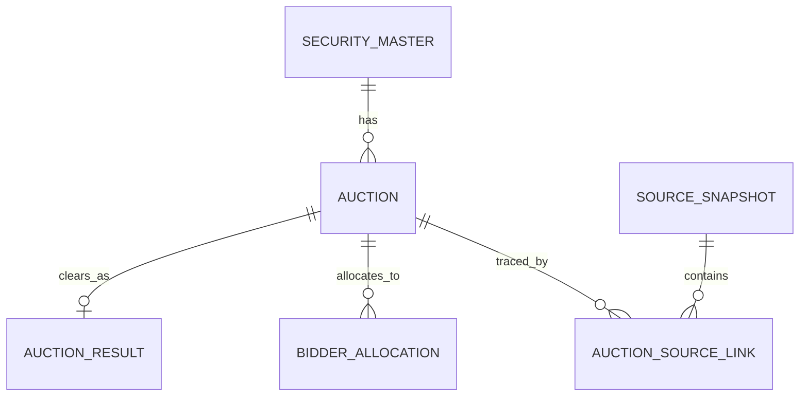

# U.S. Treasury Auction Terminal — API & DB Design

## 1. Source endpoints

| Purpose | Official endpoint | Refresh policy |
|---|---|---|
| Announced / upcoming auctions | `https://www.treasurydirect.gov/TA_WS/securities/announced?format=json` | Poll every 15 minutes on business days |
| Auction results | `https://www.treasurydirect.gov/TA_WS/securities/auctioned?format=json&day=45` | Poll every 5 minutes around scheduled closes, otherwise 30 minutes |

Both endpoints return the same wide record shape (roughly 100 string fields). Fields that are not yet applicable are empty strings. The ingestion layer must convert empty strings to `NULL`, parse dates as U.S. Eastern market dates, and parse amounts/rates as exact decimals.

## 2. Optimized extraction set

### Identity and instrument

- `cusip`, `type`, `securityType`, `term`, `securityTerm`, `originalSecurityTerm`
- `maturityDate`, `originalIssueDate`, `interestRate`, `tips`, `floatingRate`, `series`

### Auction schedule and terms

- `announcementDate`, `auctionDate`, `issueDate`
- `closingTimeCompetitive`, `closingTimeNoncompetitive`, `auctionFormat`
- `offeringAmount`, `reopening`, `cashManagementBillCMB`, `updatedTimestamp`

### Clearing result

- `highYield`, `highDiscountRate`, `highInvestmentRate`, `highDiscountMargin`
- `pricePer100`, `bidToCoverRatio`, `allocationPercentage`
- `totalTendered`, `totalAccepted`, `competitiveTendered`, `competitiveAccepted`

### Bidder composition

- `primaryDealerTendered`, `primaryDealerAccepted`
- `directBidderTendered`, `directBidderAccepted`
- `indirectBidderTendered`, `indirectBidderAccepted`
- `noncompetitiveAccepted`, `treasuryRetailAccepted`, `somaAccepted`, `fimaNoncompetitiveAccepted`

### Traceability

- `pdfFilenameAnnouncement`, `pdfFilenameCompetitiveResults`
- raw JSON payload, endpoint, retrieval timestamp, HTTP status, SHA-256 hash, transform version

Fields such as bidding minimums, STRIPS identifiers, CPI reference values, call fields, or NLP thresholds remain in the raw snapshot and can be promoted later without re-fetching history. They are intentionally excluded from the compact terminal view.

## 3. Type-aware stop-rate rule

| Security | Primary displayed stop | Secondary display |
|---|---|---|
| Bill / CMB | `highDiscountRate` | `highInvestmentRate`, `pricePer100` |
| Note / Bond | `highYield` | coupon `interestRate`, `pricePer100` |
| TIPS | `highYield` (real yield) | coupon, adjusted price/index fields when needed |
| FRN | `highDiscountMargin` | `spread`, `pricePer100` |

The database stores `stop_metric` and `stop_value` rather than four nullable columns in the serving layer. The raw and normalized result tables may still retain secondary metrics.

## 4. Logical model

The natural auction identity is `(cusip, auction_date, issue_date)`. This is safer than CUSIP alone because reopenings reuse a CUSIP across multiple auctions.

## 5. Query patterns and indexes

1. Forward calendar: `status <> 'resulted' ORDER BY auction_date` → partial index on `(status, auction_date)`.
2. Recent tape by type: `auction_date DESC` plus security type → date-led index and join to `security_master`.
3. CUSIP history: `WHERE cusip = ? ORDER BY auction_date DESC` → `(cusip, auction_date DESC)`.
4. Latest raw replay: `ORDER BY fetched_at DESC` → snapshot timestamp index.

The executable PostgreSQL DDL is in `db/treasury_auction_schema.sql`.

## 6. Serving and quality controls

- Use `v_auction_terminal` for the default screen and a materialized daily aggregate only when traffic justifies it.
- Reject negative amounts, invalid CUSIPs, and duplicate business keys.
- Reconcile `bid_to_cover_ratio` against tendered/offering data with tolerance; do not overwrite the official ratio.
- Keep announcement and result polling idempotent with upsert on the composite business key.
- Treat TreasuryDirect data as authoritative and label the terminal’s source timestamp visibly.

