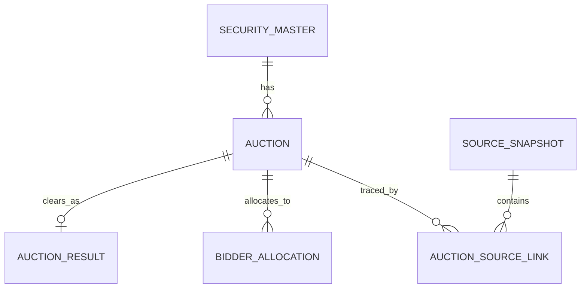

# U.S. Treasury Auction Terminal — API & DB Design

## 1. Source and refresh policy

| Purpose | TreasuryDirect endpoint | Suggested polling |
|---|---|---|
| Announced / upcoming auctions | `https://www.treasurydirect.gov/TA_WS/securities/announced?format=json` | Every 15 minutes on U.S. business days |
| Recent auction results | `https://www.treasurydirect.gov/TA_WS/securities/auctioned?format=json&day=45` | Every 5 minutes near scheduled closes; otherwise every 30 minutes |

TreasuryDirect's [Upcoming Auctions](https://www.treasurydirect.gov/auctions/upcoming/) page and the U.S. government's [Upcoming Auctions dataset listing](https://catalog.data.gov/dataset/upcoming-auctions) identify the announced feed as the source for upcoming terms. The [Auction Results dataset listing](https://catalog.data.gov/dataset/auction-results) identifies the auctioned feed for recent results.

As verified on 24 August 2026, each API row exposes **120 string-valued fields**. Announcement rows and result rows share that wide shape; fields that are not yet applicable are empty strings. Ingestion must convert empty strings to `NULL`, parse market dates without shifting the calendar day, and store money/rates as exact decimals.

## 2. What to show on the compact terminal

### Default forward-calendar row

| Display | API field / rule | Why it earns space |
|---|---|---|
| Auction date | `auctionDate` | Primary desk workflow key |
| Security | `term`, `type`, `cusip`, `reopening` | Identifies tenor and issue |
| Offering | `offeringAmount` | Headline supply |
| Competitive close | `closingTimeCompetitive` | Actionable bid deadline in ET |
| Settlement | `issueDate`; maturity as secondary | Funding and settlement context |
| Last comparable result | latest earlier result with equal `type + term` | Immediate benchmark without opening a detail page |

The comparable-result cell contains only the prior stop and bid-to-cover. This is the most compact way to show schedule and result together without turning the calendar into a research table.

### Result row and detail card

- Stop metric and value
- `bidToCoverRatio`
- `offeringAmount`
- indirect award share = `indirectBidderAccepted / totalAccepted`
- award mix for indirect, direct, primary dealer, and residual other

Price, coupon, investment rate, spread, tendered amount and CUSIP remain available in the selected-result card or API model, but do not all belong in the default table.

### Chart choice

- Calendar tab: upcoming offering amount by auction line.
- Results tab: recent bid-to-cover observations.
- The chart follows the same security filter as the table and updates row context when selected.

Mixed-tenor bid-to-cover is a tape view, not a like-for-like statistical comparison. Deeper analysis should filter by `type + term`.

## 3. Optimized extraction set

### Identity and instrument

- `cusip`, `type`, `securityType`, `term`, `securityTerm`, `originalSecurityTerm`
- `maturityDate`, `originalIssueDate`, `interestRate`, `tips`, `floatingRate`, `series`

### Auction schedule and terms

- `announcementDate`, `auctionDate`, `issueDate`
- `closingTimeCompetitive`, `closingTimeNoncompetitive`, `auctionFormat`
- `offeringAmount`, `reopening`, `cashManagementBillCMB`, `updatedTimestamp`

### Clearing result

- `highYield`, `highDiscountRate`, `highInvestmentRate`, `highDiscountMargin`, `spread`
- `pricePer100`, `bidToCoverRatio`, `allocationPercentage`
- `totalTendered`, `totalAccepted`, `competitiveTendered`, `competitiveAccepted`

### Bidder composition

- `primaryDealerTendered`, `primaryDealerAccepted`
- `directBidderTendered`, `directBidderAccepted`
- `indirectBidderTendered`, `indirectBidderAccepted`
- `noncompetitiveAccepted`, `treasuryRetailAccepted`, `somaAccepted`, `fimaNoncompetitiveAccepted`

### Traceability

- `pdfFilenameAnnouncement`, `pdfFilenameCompetitiveResults`
- endpoint, retrieval timestamp, HTTP status, raw JSON, SHA-256 payload hash, transform version

Bidding minimums, STRIPS identifiers, CPI reference values, call fields and NLP thresholds stay in the raw snapshot. They can be promoted later without refetching history.

## 4. Type-aware stop rule

| Security | Primary displayed stop | Secondary display |
|---|---|---|
| Bill / CMB | `highDiscountRate` | `highInvestmentRate`, `pricePer100` |
| Note / Bond | `highYield` | coupon `interestRate`, `pricePer100` |
| TIPS | `highYield` labeled real yield | coupon and adjusted price/index fields when needed |
| FRN | `highDiscountMargin` | `spread`, `pricePer100` |

The serving model stores `stop_metric` plus `stop_value`, avoiding four sparsely populated columns on the hot query path. Secondary metrics remain typed in `auction_result` and all source values remain in `source_snapshot`.

## 5. Logical data model

The auction business key is `(cusip, auction_date, issue_date)`. CUSIP alone is unsafe because reopenings reuse the same security across auction events. `bidder_allocation.acceptance_rate` means accepted divided by tendered for that bidder class. Award share on the screen is calculated against `auction_result.total_accepted`.

## 6. Hot queries and indexes

1. Forward calendar: `status <> 'resulted' ORDER BY auction_date` → partial `(status, auction_date)` index.
2. Comparable prior result: equal `security_type + security_term`, earlier auction date → `(security_term, auction_date DESC)` plus `(security_type, cusip)`.
3. CUSIP history: `WHERE cusip = ? ORDER BY auction_date DESC` → `(cusip, auction_date DESC)`.
4. Raw replay: `ORDER BY fetched_at DESC` → snapshot timestamp index.

`v_auction_terminal` provides normalized schedule/result rows. `v_auction_monitor` adds the latest earlier same-type, same-term result for the compact forward calendar.

## 7. Data quality and operating rules

- Upsert announcements and results idempotently on the composite business key.
- Store API timestamps without an explicit offset as `America/New_York` source time before converting to `TIMESTAMPTZ`.
- Reject negative amounts, invalid 9-character CUSIPs, impossible dates and duplicate business keys.
- Reconcile the official bid-to-cover against **competitive tendered / public offering amount** within a documented tolerance; keep the official API ratio when rounding or methodology differs.
- Do not interpret indirect bidder awards as a pure foreign-holder measure; present them as a demand-composition proxy.
- Keep the visible source timestamp and whether the screen is live or using a verified fallback snapshot.

The executable PostgreSQL 16 DDL is in `db/treasury_auction_schema.sql`.
