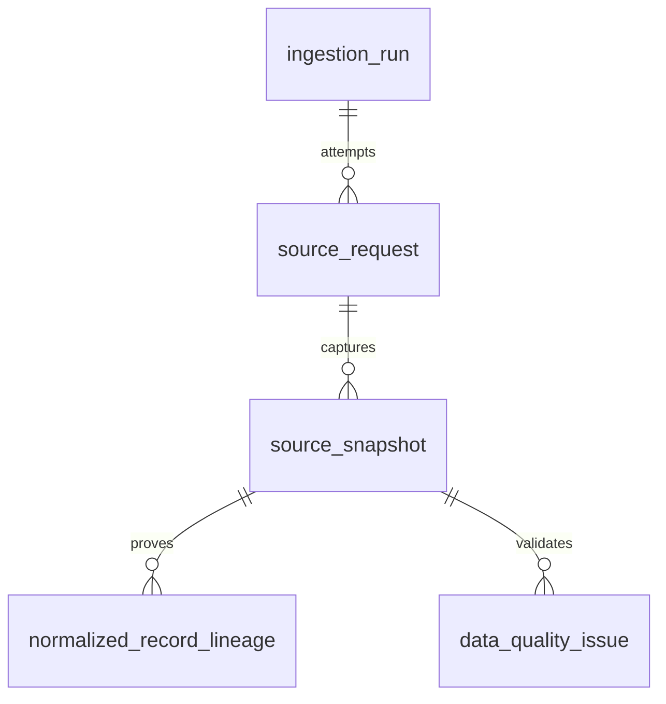
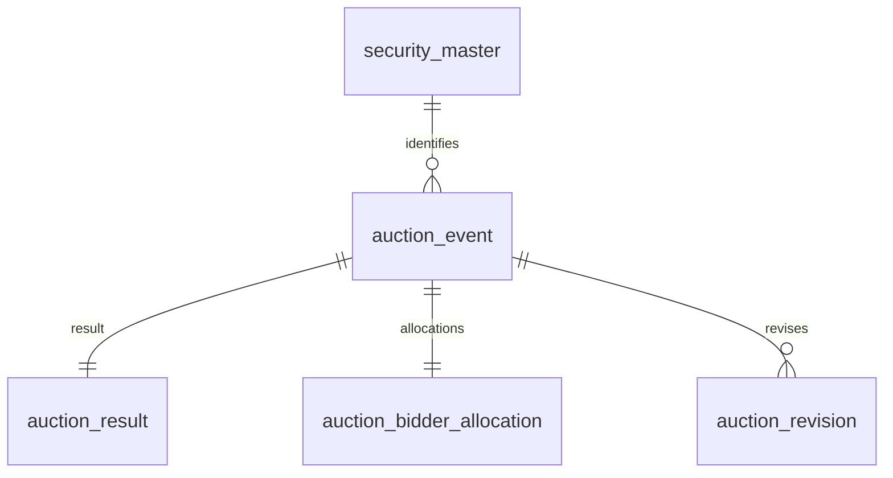
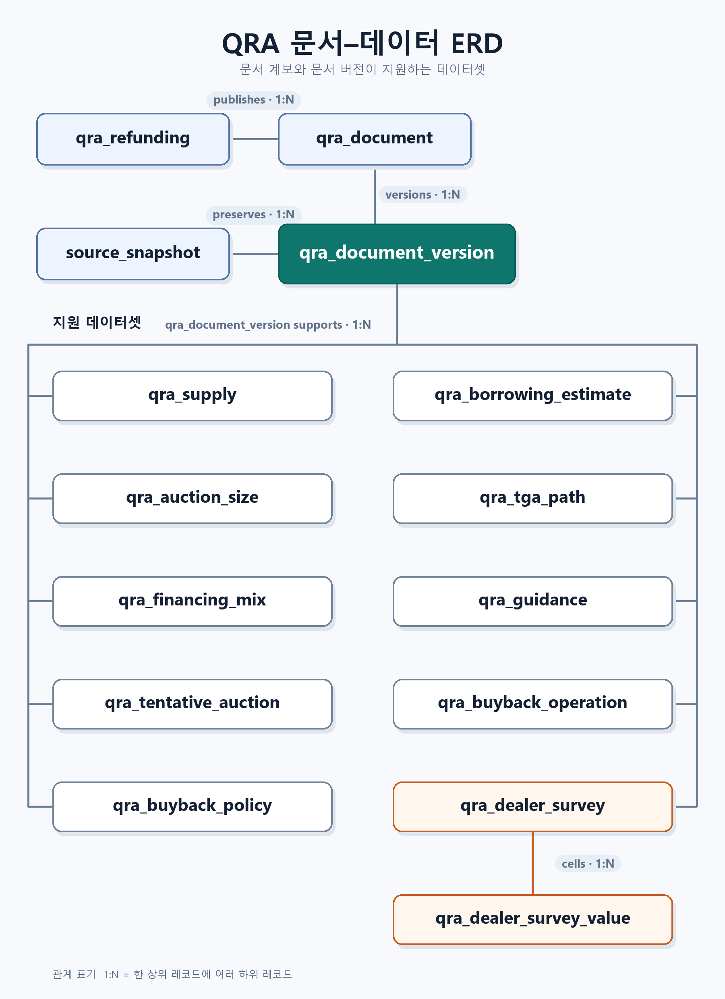
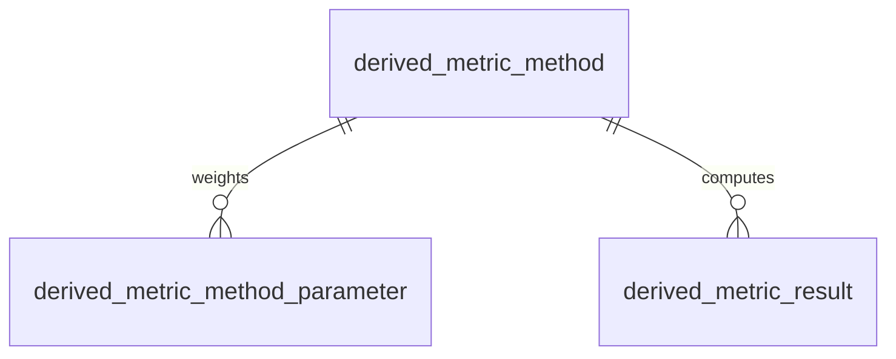

# PostgreSQL DB 명세

PostgreSQL 16 / schema `ust` / migrations `20260903_0001`–`20261007_0002`. 실제 적용 DB의 catalog에서 타입·NULL·기본값·제약·인덱스를 추출했다. 설명과 원천 매핑은 코드 계약과 함께 관리한다. 현재 화면 계약은 `UST_AUCTION_ui-baseline-v3.html`이다.

## v3 구현 범위

- v3의 고객 화면은 `입찰 결과` 단일 상단 메뉴로 구성한다. 예정 입찰 일정과 월간 캘린더는 같은 화면 안에서 `v_auction_dashboard`의 `ANNOUNCED` 행을 사용한다. 별도 일정 데이터 모델을 만들지 않는다.
- 화면에 노출하지 않는 API 필드·데이터 구조 안내는 내부 문서인 `API_FIELD_METADATA.md`, 이 명세, `DATA_REQUIREMENTS_AND_MAPPING.md`에서만 관리한다. 고객 화면 제거는 원천 필드·감사·lineage 저장 삭제를 뜻하지 않는다.
- QRA 공급 기능은 v3 배포 범위에서 제외한다. 기존 `qra_*` 테이블과 `v_qra_*` 읽기 모델은 향후 제공을 위한 보류 스키마이며, v3 조회·배포의 필수 객체나 데이터 적재 선행조건이 아니다.
- 실시간 2Y·10Y·30Y 시장금리는 v3에서 미연결 상태다. 검증된 별도 원천이 생기기 전에는 시장금리 테이블을 추가하거나 입찰 Stop으로 대체하지 않는다.

### v3 화면 조회 계약

| 화면 요소 | DB 객체·필드 | 조회·계산 규칙 |
|---|---|---|
| 최근 입찰·KPI·결과표 | `v_auction_dashboard`의 `RESULT_AVAILABLE` 행 | 사용자 결과 기간과 상품 필터를 적용한다. CUSIP는 내부 식별에만 사용하고 화면에는 표시하지 않는다. |
| 예정 입찰 일정·월간 캘린더 | `v_auction_dashboard`의 `ANNOUNCED` 행 | 기준일 이상 90일 이내의 공식 공고만 표시한다. 결과와 예정이 같은 사건이면 `auction_event_id` 기준으로 결과를 우선한다. |
| 낙찰금리·참여자 비중 | `stop_value`, `*_share_pct`, `other_ui_residual_pct` | 선택 결과와 동일한 `security_type + normalized_security_term`만 비교한다. |
| 응찰률 KPI | `bid_to_cover_ratio` | 원본 배수에 100을 곱해 %로 표시한다. 선택 결과 이전 최대 6개 유효값 평균과 %p가 아닌 퍼센트 값 차이를 계산한다. |
| 응찰률 장기 차트 | `bid_to_cover_ratio`, `auction_date` | 동일 상품·만기 전 이력을 날짜순으로 계산한다. 각 관측일 직전 24개월 초과 경계의 유효값으로 평균·모집단 표준편차(±1σ)를 계산하고 최근 6회 평균은 6건이 모두 있을 때만 표시한다. 조회 시작일보다 25개월 앞선 warm-up 데이터를 확보한다. |
| 상태·출처 | `v_ingestion_status`, `source_snapshot` | 마지막 시도와 성공을 구분하며, 수신 실패 시 표본값으로 대체하지 않는다. |

## ERD

가독성을 위해 ERD를 업무 영역별로 나누었으며, 각 다이어그램의 글꼴 크기를 `20px`로 지정했다.

### 수집·원천·품질 추적



### 국채 입찰



### QRA 문서·데이터 (후속 제공 범위)



[원본 크기 PNG 이미지 열기](images/qra-document-data-erd.png)

### 파생 지표



## 공통 갱신·보관 정책

- A(감사): 실행마다 추가. 원본/정정/문서버전/계산기록은 무기한 보관하며 자동 삭제하지 않는다. DB 백업과 raw 디렉터리를 함께 보관한다. FK의 CASCADE는 명시적인 관리 삭제 시에만 적용되며 수집 명령은 실행/원본 이력을 삭제하지 않는다.
- C(현재): 업무키 upsert. 같은 정규화 내용이면 최근 관측만 갱신; 내용이 바뀌면 auction_revision 추가. QRA 정상 새 문서 버전은 같은 문서의 이전 current fact를 교체하고 이전 값·근거는 parse_summary와 raw에 유지한다. 격리된 새 문서는 이전 정상 fact를 보존한다.
- M(방법): 새 방법은 새 version으로 추가. 공급행의 dv01_method_id와 derived_metric_result는 당시 방법/입력/식/반올림을 고정한다. 기존 방법 파라미터를 수정하지 않는 운영 정책이다.
- 모든 USD 금액은 NUMERIC(24,2), 금리·비율은 NUMERIC(18,9). float/real/double precision 금지. 금융 계산은 Decimal. HTTP timeout/backoff와 PDF 좌표 같은 비금융 라이브러리 내부값은 별개다.
- DATE는 원천 달력일. TIMESTAMPTZ는 실제 순간. ET만 있는 시각은 TIME+America/New_York이며 날짜와 결합할 때만 DST 적용한다.
- NULL 이유는 원천 raw/상품적용규칙/data_quality_issue.null_reason과 DATA_GAPS 계약으로 판별한다. 실제0은 보존한다. QRA source_locator는 필드별 column_label 또는 원문 field명 매핑을 포함하는 record 수준 근거다.
- 업무키는 (cusip,auction_date,issue_date). issue_date NULL은 UQ NULLS NOT DISTINCT로 같은 미완성 키의 중복만 막는다. NULL 발행일 자료는 검증 경고를 남기며 후속 발행일이 확정될 때 다른 사건으로 오합병하지 않는다. 날짜 정정은 원천키 변경이므로 별도 사건+원본을 유지하고 품질검토 대상으로 본다.
- source_snapshot은 URL+hash로 재사용, qra_document_version은 내용 또는 parser/status 변경 시 증가. A→B→A 정정도 순서대로 남긴다. 동시 수집은 명령별 PostgreSQL advisory lock으로 직렬화한다.
- 아래 예시는 형식 예시이며 seed 운영데이터가 아니다. PK/FK/UQ/CHECK의 정확한 정의는 각 표 아래 PostgreSQL catalog 출력이 권위 있는 명세다.

## auction_bidder_allocation

참여자별 응찰·낙찰 원 단위 금액。 갱신·보관 규칙: **C** (공통 정책 참조).

| 컬럼 | 한글 설명 | PostgreSQL 타입 | 단위 | NULL | 기본값 | 원천/생성 | 예시 |
|---|---|---|---|---|---|---|---|
| `auction_event_id` | auction_event 식별키(UUID/연결키) | `uuid` | — | 불가 | `없음` | 정규화/감사 생성 | UUID |
| `primary_dealer_tendered_usd` | PD_응찰액 | `numeric(24,2)` | USD | 허용 | `없음` | API.primary_dealer_tendered | NULL |
| `primary_dealer_accepted_usd` | PD_낙찰액 | `numeric(24,2)` | USD | 허용 | `없음` | API.primary_dealer_accepted | NULL |
| `direct_bidder_tendered_usd` | 직접입찰자_응찰액 | `numeric(24,2)` | USD | 허용 | `없음` | API.direct_bidder_tendered | NULL |
| `direct_bidder_accepted_usd` | 직접입찰자_낙찰액 | `numeric(24,2)` | USD | 허용 | `없음` | API.direct_bidder_accepted | NULL |
| `indirect_bidder_tendered_usd` | in직접입찰자_응찰액 | `numeric(24,2)` | USD | 허용 | `없음` | API.indirect_bidder_tendered | NULL |
| `indirect_bidder_accepted_usd` | in직접입찰자_낙찰액 | `numeric(24,2)` | USD | 허용 | `없음` | API.indirect_bidder_accepted | NULL |
| `treasury_retail_accepted_usd` | 재무부 소매_낙찰액 | `numeric(24,2)` | USD | 허용 | `없음` | API.treas_retail_accepted | NULL |
| `soma_tendered_usd` | SOMA_응찰액 | `numeric(24,2)` | USD | 허용 | `없음` | API.soma_tendered | NULL |
| `soma_accepted_usd` | SOMA_낙찰액 | `numeric(24,2)` | USD | 허용 | `없음` | API.soma_accepted | NULL |
| `soma_holdings_usd` | SOMA_보유액 | `numeric(24,2)` | USD | 허용 | `없음` | API.soma_holdings | NULL |
| `fima_noncomp_tendered_usd` | FIMA 비경쟁_응찰액 | `numeric(24,2)` | USD | 허용 | `없음` | API.fima_noncomp_tendered | NULL |
| `fima_noncomp_accepted_usd` | FIMA 비경쟁_낙찰액 | `numeric(24,2)` | USD | 허용 | `없음` | API.fima_noncomp_accepted | NULL |
| `updated_at` | 갱신 순간(UTC 저장) | `timestamp with time zone` | — | 불가 | `clock_timestamp()` | 정규화/감사 생성 | 2026-08-05T12:30:00Z |

키·제약:

```sql
-- auction_bidder_allocation_auction_event_id_fkey
FOREIGN KEY (auction_event_id) REFERENCES ust.auction_event(auction_event_id) ON DELETE CASCADE;
-- auction_bidder_allocation_direct_bidder_accepted_usd_check
CHECK ((direct_bidder_accepted_usd >= (0)::numeric));
-- auction_bidder_allocation_indirect_bidder_accepted_usd_check
CHECK ((indirect_bidder_accepted_usd >= (0)::numeric));
-- auction_bidder_allocation_pkey
PRIMARY KEY (auction_event_id);
-- auction_bidder_allocation_primary_dealer_accepted_usd_check
CHECK ((primary_dealer_accepted_usd >= (0)::numeric));
```

인덱스:

```sql
CREATE UNIQUE INDEX auction_bidder_allocation_pkey ON ust.auction_bidder_allocation USING btree (auction_event_id)
```

## auction_event

공고·일정과 입찰 사건의 현재 상태。 갱신·보관 규칙: **C** (공통 정책 참조).

| 컬럼 | 한글 설명 | PostgreSQL 타입 | 단위 | NULL | 기본값 | 원천/생성 | 예시 |
|---|---|---|---|---|---|---|---|
| `auction_event_id` | auction_event 식별키(UUID/연결키) | `uuid` | — | 불가 | `gen_random_uuid()` | 정규화/감사 생성 | UUID |
| `security_id` | security 식별키(UUID/연결키) | `uuid` | — | 불가 | `없음` | 정규화/감사 생성 | UUID |
| `cusip` | 미국 증권 식별번호 | `character varying(20)` | — | 불가 | `없음` | API.cusip | 원천 문자열 |
| `record_date` | API 레코드 기준일 | `date` | — | 불가 | `없음` | API.record_date | 2026-08-05 |
| `announcement_date` | 공고일 | `date` | — | 허용 | `없음` | API.announcemt_date | NULL |
| `auction_date` | 입찰일 | `date` | — | 불가 | `없음` | API.auction_date | 2026-08-05 |
| `issue_date` | 발행·결제일 | `date` | — | 허용 | `없음` | API.issue_date | NULL |
| `maturity_date` | 만기일 | `date` | — | 허용 | `없음` | API.maturity_date | NULL |
| `security_type` | 정규화 상품 종류 | `text` | — | 불가 | `없음` | API.security_type | 원천 문자열 |
| `source_security_type` | API 원문 상품 종류 | `text` | — | 허용 | `없음` | 정규화/감사 생성 | NULL |
| `security_term` | 원문 만기 | `text` | — | 불가 | `없음` | API.security_term | 원천 문자열 |
| `normalized_security_term` | 비교용 표준 만기 | `text` | — | 불가 | `없음` | 정규화/감사 생성 | 원천 문자열 |
| `security_term_day_month` | 일·월 기준 원문만기 | `text` | — | 허용 | `없음` | API.security_term_day_month | NULL |
| `security_term_week_year` | 주·년 기준 원문만기 | `text` | — | 허용 | `없음` | API.security_term_week_year | NULL |
| `auction_format` | 입찰 방식 | `text` | — | 허용 | `없음` | API.auction_format | NULL |
| `reopening` | 재발행 여부 | `boolean` | — | 허용 | `없음` | API.reopening | NULL |
| `cash_management_bill` | CMB 여부 | `boolean` | — | 허용 | `없음` | API.cash_management_bill_cmb | NULL |
| `closing_time_comp_raw` | closing_time_comp_raw / 원천 ET 시각 원문 | `text` | — | 허용 | `없음` | 정규화/감사 생성 | NULL |
| `closing_time_comp_et` | closing_time_comp_et / 원천 ET 시각 TIME | `time without time zone` | — | 허용 | `없음` | 정규화/감사 생성 | NULL |
| `closing_time_noncomp_raw` | closing_time_noncomp_raw / 원천 ET 시각 원문 | `text` | — | 허용 | `없음` | 정규화/감사 생성 | NULL |
| `closing_time_noncomp_et` | closing_time_noncomp_et / 원천 ET 시각 TIME | `time without time zone` | — | 허용 | `없음` | 정규화/감사 생성 | NULL |
| `source_timezone` | 원천 시간대 IANA명 | `text` | — | 불가 | `'America/New_York'::text` | 정규화/감사 생성 | 원천 문자열 |
| `offering_amount_usd` | 공고 발행액 | `numeric(24,2)` | USD | 허용 | `없음` | API.offering_amt | NULL |
| `business_key_hash` | cusip/입찰일/발행일 업무키 SHA-256 | `character(64)` | — | 불가 | `없음` | 정규화/감사 생성 | 원천 문자열 |
| `current_content_hash` | 현재 정규화 내용 SHA-256 | `character(64)` | — | 불가 | `없음` | 정규화/감사 생성 | 원천 문자열 |
| `current_snapshot_id` | current_snapshot 식별키(UUID/연결키) | `uuid` | — | 허용 | `없음` | 정규화/감사 생성 | NULL |
| `raw_record` | 원문 필드값 JSON | `jsonb` | — | 불가 | `없음` | 정규화/감사 생성 | {} |
| `first_seen_at` | 최초 관측 순간(UTC 저장) | `timestamp with time zone` | — | 불가 | `clock_timestamp()` | 정규화/감사 생성 | 2026-08-05T12:30:00Z |
| `last_seen_at` | 최근 관측 순간(UTC 저장) | `timestamp with time zone` | — | 불가 | `clock_timestamp()` | 정규화/감사 생성 | 2026-08-05T12:30:00Z |

키·제약:

```sql
-- auction_event_business_key_hash_check
CHECK ((business_key_hash ~ '^[0-9a-f]{64}$'::text));
-- auction_event_business_key_hash_key
UNIQUE (business_key_hash);
-- auction_event_check
CHECK (((maturity_date IS NULL) OR (issue_date IS NULL) OR (maturity_date > issue_date)));
-- auction_event_current_content_hash_check
CHECK ((current_content_hash ~ '^[0-9a-f]{64}$'::text));
-- auction_event_current_snapshot_id_fkey
FOREIGN KEY (current_snapshot_id) REFERENCES ust.source_snapshot(source_snapshot_id);
-- auction_event_cusip_auction_date_issue_date_key
UNIQUE NULLS NOT DISTINCT (cusip, auction_date, issue_date);
-- auction_event_offering_amount_usd_check
CHECK ((offering_amount_usd >= (0)::numeric));
-- auction_event_pkey
PRIMARY KEY (auction_event_id);
-- auction_event_security_id_fkey
FOREIGN KEY (security_id) REFERENCES ust.security_master(security_id);
-- auction_event_source_timezone_check
CHECK ((source_timezone = 'America/New_York'::text));
```

인덱스:

```sql
CREATE UNIQUE INDEX auction_event_business_key_hash_key ON ust.auction_event USING btree (business_key_hash)
CREATE UNIQUE INDEX auction_event_cusip_auction_date_issue_date_key ON ust.auction_event USING btree (cusip, auction_date, issue_date) NULLS NOT DISTINCT
CREATE UNIQUE INDEX auction_event_pkey ON ust.auction_event USING btree (auction_event_id)
CREATE INDEX ix_auction_comparable ON ust.auction_event USING btree (security_type, normalized_security_term, auction_date DESC)
CREATE INDEX ix_auction_cusip ON ust.auction_event USING btree (cusip, auction_date DESC)
CREATE INDEX ix_auction_recent ON ust.auction_event USING btree (auction_date DESC, security_type, normalized_security_term)
```

## auction_result

입찰 결과 수치와 상품별 Stop。 갱신·보관 규칙: **C** (공통 정책 참조).

| 컬럼 | 한글 설명 | PostgreSQL 타입 | 단위 | NULL | 기본값 | 원천/생성 | 예시 |
|---|---|---|---|---|---|---|---|
| `auction_event_id` | auction_event 식별키(UUID/연결키) | `uuid` | — | 불가 | `없음` | 정규화/감사 생성 | UUID |
| `stop_metric_code` | Stop 지표 코드 | `text` | — | 불가 | `없음` | 정규화/감사 생성 | 원천 문자열 |
| `stop_metric_label` | Stop 표시 명칭 | `text` | — | 불가 | `없음` | 정규화/감사 생성 | 원천 문자열 |
| `stop_value` | 상품별 낙찰 Stop | `numeric(18,9)` | % | 허용 | `없음` | 정규화/감사 생성 | NULL |
| `high_discount_rate` | 최고 할인율 | `numeric(18,9)` | % | 허용 | `없음` | API.high_discnt_rate | NULL |
| `high_investment_rate` | 최고 투자수익률 | `numeric(18,9)` | % | 허용 | `없음` | API.high_investment_rate | NULL |
| `high_discount_margin` | 최고 할인마진 | `numeric(18,9)` | % | 허용 | `없음` | API.high_discnt_margin | NULL |
| `high_yield` | 최고 수익률 | `numeric(18,9)` | % | 허용 | `없음` | API.high_yield | NULL |
| `spread` | FRN 스프레드 | `numeric(18,9)` | % | 허용 | `없음` | API.spread | NULL |
| `interest_rate` | 쿠폰금리 | `numeric(18,9)` | % | 허용 | `없음` | API.int_rate | NULL |
| `price_per_100` | 액면100당 낙찰가격 | `numeric(20,9)` | USD/액면100 | 허용 | `없음` | API.price_per100 | NULL |
| `high_price` | 최고가격 | `numeric(20,9)` | USD/액면100 | 허용 | `없음` | API.high_price | NULL |
| `bid_to_cover_ratio` | 원본 응찰배수(2.48 보존) | `numeric(18,9)` | 배 | 허용 | `없음` | API.bid_to_cover_ratio | NULL |
| `allocation_percentage` | 고율에서 비례 배정률 | `numeric(18,9)` | % | 허용 | `없음` | API.allocation_pctage | NULL |
| `total_tendered_usd` | 전체 응찰액 | `numeric(24,2)` | USD | 허용 | `없음` | API.total_tendered | NULL |
| `total_accepted_usd` | 전체 낙찰액 | `numeric(24,2)` | USD | 허용 | `없음` | API.total_accepted | NULL |
| `competitive_tendered_usd` | 경쟁 응찰액 | `numeric(24,2)` | USD | 허용 | `없음` | API.comp_tendered | NULL |
| `competitive_accepted_usd` | 경쟁 낙찰액 | `numeric(24,2)` | USD | 허용 | `없음` | API.comp_accepted | NULL |
| `noncompetitive_accepted_usd` | 비경쟁 낙찰액 | `numeric(24,2)` | USD | 허용 | `없음` | API.noncomp_accepted | NULL |
| `pdf_filename_announcement` | pdf_filename_announcement (원천 명칭 보존) | `text` | — | 허용 | `없음` | API.pdf_filenm_announcemt | NULL |
| `pdf_filename_comp_results` | pdf_filename_comp_results (원천 명칭 보존) | `text` | — | 허용 | `없음` | API.pdf_filenm_comp_results | NULL |
| `pdf_filename_noncomp_results` | pdf_filename_noncomp_results (원천 명칭 보존) | `text` | — | 허용 | `없음` | API.pdf_filenm_noncomp_results | NULL |
| `xml_filename_announcement` | xml_filename_announcement (원천 명칭 보존) | `text` | — | 허용 | `없음` | API.xml_filenm_announcemt | NULL |
| `xml_filename_comp_results` | xml_filename_comp_results (원천 명칭 보존) | `text` | — | 허용 | `없음` | API.xml_filenm_comp_results | NULL |
| `updated_at` | 갱신 순간(UTC 저장) | `timestamp with time zone` | — | 불가 | `clock_timestamp()` | 정규화/감사 생성 | 2026-08-05T12:30:00Z |

키·제약:

```sql
-- auction_result_allocation_percentage_check
CHECK (((allocation_percentage >= (0)::numeric) AND (allocation_percentage <= (100)::numeric)));
-- auction_result_auction_event_id_fkey
FOREIGN KEY (auction_event_id) REFERENCES ust.auction_event(auction_event_id) ON DELETE CASCADE;
-- auction_result_bid_to_cover_ratio_check
CHECK ((bid_to_cover_ratio >= (0)::numeric));
-- auction_result_pkey
PRIMARY KEY (auction_event_id);
-- auction_result_stop_metric_code_check
CHECK ((stop_metric_code = ANY (ARRAY['HIGH_DISCOUNT_RATE'::text, 'HIGH_YIELD'::text, 'HIGH_REAL_YIELD'::text, 'HIGH_DISCOUNT_MARGIN'::text, 'UNMAPPED'::text])));
-- auction_result_total_accepted_usd_check
CHECK ((total_accepted_usd >= (0)::numeric));
-- auction_result_total_tendered_usd_check
CHECK ((total_tendered_usd >= (0)::numeric));
```

인덱스:

```sql
CREATE UNIQUE INDEX auction_result_pkey ON ust.auction_result USING btree (auction_event_id)
```

## auction_revision

정규화 내용 변경 이력과 당시 원문。 갱신·보관 규칙: **A** (공통 정책 참조).

| 컬럼 | 한글 설명 | PostgreSQL 타입 | 단위 | NULL | 기본값 | 원천/생성 | 예시 |
|---|---|---|---|---|---|---|---|
| `auction_revision_id` | auction_revision 식별키(UUID/연결키) | `uuid` | — | 불가 | `gen_random_uuid()` | 정규화/감사 생성 | UUID |
| `auction_event_id` | auction_event 식별키(UUID/연결키) | `uuid` | — | 불가 | `없음` | 정규화/감사 생성 | UUID |
| `revision_number` | 입찰 정정 번호 | `integer` | — | 불가 | `없음` | 정규화/감사 생성 | 0 |
| `content_hash` | 정규화 내용 SHA-256 | `character(64)` | — | 불가 | `없음` | 정규화/감사 생성 | 원천 문자열 |
| `source_snapshot_id` | source_snapshot 식별키(UUID/연결키) | `uuid` | — | 허용 | `없음` | 정규화/감사 생성 | NULL |
| `raw_record` | 원문 필드값 JSON | `jsonb` | — | 불가 | `없음` | 정규화/감사 생성 | {} |
| `typed_record` | 당시 Decimal/날짜 정규화 JSON | `jsonb` | — | 불가 | `없음` | 정규화/감사 생성 | {} |
| `valid_from` | 버전 유효 시작 순간(UTC 저장) | `timestamp with time zone` | — | 불가 | `clock_timestamp()` | 정규화/감사 생성 | 2026-08-05T12:30:00Z |
| `valid_to` | 버전 유효 종료 순간(UTC 저장) | `timestamp with time zone` | — | 허용 | `없음` | 정규화/감사 생성 | NULL |
| `is_current` | 현재 버전 여부 | `boolean` | — | 불가 | `true` | 정규화/감사 생성 | true |
| `change_fields` | 이전 정정과 달라진 필드 목록 | `text[]` | — | 불가 | `ARRAY[]::text[]` | 정규화/감사 생성 | 원천 문자열 |

키·제약:

```sql
-- auction_revision_auction_event_id_fkey
FOREIGN KEY (auction_event_id) REFERENCES ust.auction_event(auction_event_id) ON DELETE CASCADE;
-- auction_revision_auction_event_id_revision_number_key
UNIQUE (auction_event_id, revision_number);
-- auction_revision_check
CHECK (((valid_to IS NULL) OR (valid_to >= valid_from)));
-- auction_revision_pkey
PRIMARY KEY (auction_revision_id);
-- auction_revision_revision_number_check
CHECK ((revision_number > 0));
-- auction_revision_source_snapshot_id_fkey
FOREIGN KEY (source_snapshot_id) REFERENCES ust.source_snapshot(source_snapshot_id);
```

인덱스:

```sql
CREATE UNIQUE INDEX auction_revision_auction_event_id_revision_number_key ON ust.auction_revision USING btree (auction_event_id, revision_number)
CREATE UNIQUE INDEX auction_revision_pkey ON ust.auction_revision USING btree (auction_revision_id)
CREATE UNIQUE INDEX uq_auction_revision_current ON ust.auction_revision USING btree (auction_event_id) WHERE is_current
```

## data_quality_issue

누락·타입·합계·검증 거절과 처리 상태。 갱신·보관 규칙: **A** (공통 정책 참조).

| 컬럼 | 한글 설명 | PostgreSQL 타입 | 단위 | NULL | 기본값 | 원천/생성 | 예시 |
|---|---|---|---|---|---|---|---|
| `data_quality_issue_id` | data_quality_issue 식별키(UUID/연결키) | `bigint` | — | 불가 | `IDENTITY` | 수집기/HTTP/계산 방법 설정 | 0 |
| `run_id` | run 식별키(UUID/연결키) | `uuid` | — | 허용 | `없음` | 수집기/HTTP/계산 방법 설정 | NULL |
| `source_snapshot_id` | source_snapshot 식별키(UUID/연결키) | `uuid` | — | 허용 | `없음` | 수집기/HTTP/계산 방법 설정 | NULL |
| `entity_type` | 연결 레코드 테이블/종류 | `text` | — | 허용 | `없음` | 수집기/HTTP/계산 방법 설정 | NULL |
| `entity_id` | entity 식별키(UUID/연결키) | `uuid` | — | 허용 | `없음` | 수집기/HTTP/계산 방법 설정 | NULL |
| `field_name` | 문제 원천 필드 | `text` | — | 허용 | `없음` | 수집기/HTTP/계산 방법 설정 | NULL |
| `severity` | 검증 심각도 | `text` | — | 불가 | `없음` | 수집기/HTTP/계산 방법 설정 | 원천 문자열 |
| `rule_code` | 검증 규칙 코드 | `text` | — | 불가 | `없음` | 수집기/HTTP/계산 방법 설정 | 원천 문자열 |
| `raw_value` | 문제 원문 값 | `text` | — | 허용 | `없음` | 수집기/HTTP/계산 방법 설정 | NULL |
| `null_reason` | NULL의 원인 | `text` | — | 허용 | `없음` | 수집기/HTTP/계산 방법 설정 | NULL |
| `message` | 검증 메시지 | `text` | — | 불가 | `없음` | 수집기/HTTP/계산 방법 설정 | 원천 문자열 |
| `resolution_status` | 이슈 처리 상태 | `text` | — | 불가 | `'OPEN'::text` | 수집기/HTTP/계산 방법 설정 | 원천 문자열 |
| `created_at` | 생성 순간(UTC 저장) | `timestamp with time zone` | — | 불가 | `clock_timestamp()` | 수집기/HTTP/계산 방법 설정 | 2026-08-05T12:30:00Z |
| `resolved_at` | 이슈 해결 순간(UTC 저장) | `timestamp with time zone` | — | 허용 | `없음` | 수집기/HTTP/계산 방법 설정 | NULL |

키·제약:

```sql
-- data_quality_issue_null_reason_check
CHECK ((null_reason = ANY (ARRAY['SOURCE_NULL'::text, 'NOT_APPLICABLE'::text, 'UNAVAILABLE_SOURCE'::text, 'NOT_CONNECTED'::text, 'PARSE_FAILED'::text])));
-- data_quality_issue_pkey
PRIMARY KEY (data_quality_issue_id);
-- data_quality_issue_resolution_status_check
CHECK ((resolution_status = ANY (ARRAY['OPEN'::text, 'ACCEPTED'::text, 'RESOLVED'::text, 'IGNORED'::text])));
-- data_quality_issue_run_id_fkey
FOREIGN KEY (run_id) REFERENCES ust.ingestion_run(run_id) ON DELETE SET NULL;
-- data_quality_issue_severity_check
CHECK ((severity = ANY (ARRAY['INFO'::text, 'WARN'::text, 'ERROR'::text, 'FATAL'::text])));
-- data_quality_issue_source_snapshot_id_fkey
FOREIGN KEY (source_snapshot_id) REFERENCES ust.source_snapshot(source_snapshot_id) ON DELETE SET NULL;
```

인덱스:

```sql
CREATE UNIQUE INDEX data_quality_issue_pkey ON ust.data_quality_issue USING btree (data_quality_issue_id)
CREATE INDEX ix_quality_open ON ust.data_quality_issue USING btree (resolution_status, severity, created_at DESC)
```

## derived_metric_method

공식 지표와 구분한 계산 방법의 불변 버전。 갱신·보관 규칙: **M** (공통 정책 참조).

| 컬럼 | 한글 설명 | PostgreSQL 타입 | 단위 | NULL | 기본값 | 원천/생성 | 예시 |
|---|---|---|---|---|---|---|---|
| `derived_metric_method_id` | derived_metric_method 식별키(UUID/연결키) | `uuid` | — | 불가 | `gen_random_uuid()` | 수집기/HTTP/계산 방법 설정 | UUID |
| `method_code` | 계산 방법 식별코드 | `text` | — | 불가 | `없음` | 수집기/HTTP/계산 방법 설정 | 원천 문자열 |
| `version` | 계산 방법 버전 | `text` | — | 불가 | `없음` | 수집기/HTTP/계산 방법 설정 | 원천 문자열 |
| `name` | 방법 표시명 | `text` | — | 불가 | `없음` | 수집기/HTTP/계산 방법 설정 | 원천 문자열 |
| `description` | 방법 설명 | `text` | — | 불가 | `없음` | 수집기/HTTP/계산 방법 설정 | 원천 문자열 |
| `formula` | 재현 가능한 계산식 | `text` | — | 불가 | `없음` | 수집기/HTTP/계산 방법 설정 | 원천 문자열 |
| `unit` | 계산결과·파라미터 단위 | `text` | — | 불가 | `없음` | 수집기/HTTP/계산 방법 설정 | 원천 문자열 |
| `value_class` | 실적/전망/권고/설문/파생 분류 | `text` | — | 불가 | `'DERIVED_UI_PROXY'::text` | 수집기/HTTP/계산 방법 설정 | 원천 문자열 |
| `source_authority` | 수치 권한·기관 구분 | `text` | — | 불가 | `'UI_METHOD_CONFIG'::text` | 수집기/HTTP/계산 방법 설정 | 원천 문자열 |
| `effective_from` | 방법 적용 시작일 | `date` | — | 불가 | `없음` | 수집기/HTTP/계산 방법 설정 | 2026-08-05 |
| `effective_to` | 방법 적용 종료일 | `date` | — | 허용 | `없음` | 수집기/HTTP/계산 방법 설정 | NULL |
| `rounding_rule` | 반올림 규칙 | `text` | — | 허용 | `없음` | 수집기/HTTP/계산 방법 설정 | NULL |
| `is_official_treasury_metric` | 재무부 공식 지표 여부 | `boolean` | — | 불가 | `false` | 수집기/HTTP/계산 방법 설정 | true |

키·제약:

```sql
-- derived_metric_method_check
CHECK ((effective_to >= effective_from));
-- derived_metric_method_method_code_version_key
UNIQUE (method_code, version);
-- derived_metric_method_pkey
PRIMARY KEY (derived_metric_method_id);
-- derived_metric_method_value_class_check
CHECK ((value_class = 'DERIVED_UI_PROXY'::text));
```

인덱스:

```sql
CREATE UNIQUE INDEX derived_metric_method_method_code_version_key ON ust.derived_metric_method USING btree (method_code, version)
CREATE UNIQUE INDEX derived_metric_method_pkey ON ust.derived_metric_method USING btree (derived_metric_method_id)
```

## derived_metric_method_parameter

계산 방법 버전별 만기 가중치。 갱신·보관 규칙: **M** (공통 정책 참조).

| 컬럼 | 한글 설명 | PostgreSQL 타입 | 단위 | NULL | 기본값 | 원천/생성 | 예시 |
|---|---|---|---|---|---|---|---|
| `derived_metric_method_parameter_id` | derived_metric_method_parameter 식별키(UUID/연결키) | `uuid` | — | 불가 | `gen_random_uuid()` | 수집기/HTTP/계산 방법 설정 | UUID |
| `derived_metric_method_id` | derived_metric_method 식별키(UUID/연결키) | `uuid` | — | 불가 | `없음` | 수집기/HTTP/계산 방법 설정 | UUID |
| `parameter_name` | 파라미터 종류 | `text` | — | 불가 | `없음` | 수집기/HTTP/계산 방법 설정 | 원천 문자열 |
| `parameter_key` | 가중치의 만기 키 | `text` | — | 불가 | `없음` | 수집기/HTTP/계산 방법 설정 | 원천 문자열 |
| `numeric_value` | Decimal 파라미터 | `numeric(18,9)` | — | 허용 | `없음` | 수집기/HTTP/계산 방법 설정 | NULL |
| `text_value` | 문자열 파라미터 | `text` | — | 허용 | `없음` | 수집기/HTTP/계산 방법 설정 | NULL |
| `unit` | 계산결과·파라미터 단위 | `text` | — | 허용 | `없음` | 수집기/HTTP/계산 방법 설정 | NULL |

키·제약:

```sql
-- derived_metric_method_paramet_derived_metric_method_id_para_key
UNIQUE (derived_metric_method_id, parameter_name, parameter_key);
-- derived_metric_method_parameter_check
CHECK (((((numeric_value IS NOT NULL))::integer + ((text_value IS NOT NULL))::integer) = 1));
-- derived_metric_method_parameter_derived_metric_method_id_fkey
FOREIGN KEY (derived_metric_method_id) REFERENCES ust.derived_metric_method(derived_metric_method_id) ON DELETE CASCADE;
-- derived_metric_method_parameter_pkey
PRIMARY KEY (derived_metric_method_parameter_id);
```

인덱스:

```sql
CREATE UNIQUE INDEX derived_metric_method_paramet_derived_metric_method_id_para_key ON ust.derived_metric_method_parameter USING btree (derived_metric_method_id, parameter_name, parameter_key)
CREATE UNIQUE INDEX derived_metric_method_parameter_pkey ON ust.derived_metric_method_parameter USING btree (derived_metric_method_parameter_id)
```

## derived_metric_result

계산 값, 입력 ID/원값, 식·버전·반올림의 재현 기록。 갱신·보관 규칙: **A** (공통 정책 참조).

| 컬럼 | 한글 설명 | PostgreSQL 타입 | 단위 | NULL | 기본값 | 원천/생성 | 예시 |
|---|---|---|---|---|---|---|---|
| `derived_metric_result_id` | derived_metric_result 식별키(UUID/연결키) | `uuid` | — | 불가 | `gen_random_uuid()` | 수집기/HTTP/계산 방법 설정 | UUID |
| `derived_metric_method_id` | derived_metric_method 식별키(UUID/연결키) | `uuid` | — | 불가 | `없음` | 수집기/HTTP/계산 방법 설정 | UUID |
| `entity_type` | 연결 레코드 테이블/종류 | `text` | — | 불가 | `없음` | 수집기/HTTP/계산 방법 설정 | 원천 문자열 |
| `entity_id` | entity 식별키(UUID/연결키) | `uuid` | — | 불가 | `없음` | 수집기/HTTP/계산 방법 설정 | UUID |
| `source_document_version_id` | source_document_version 식별키(UUID/연결키) | `uuid` | — | 허용 | `없음` | 수집기/HTTP/계산 방법 설정 | NULL |
| `metric_value` | 계산 결과 | `numeric(30,9)` | — | 허용 | `없음` | 수집기/HTTP/계산 방법 설정 | NULL |
| `input_record_ids` | 계산 입력 레코드 UUID 목록 | `uuid[]` | — | 불가 | `없음` | 수집기/HTTP/계산 방법 설정 | 원천 문자열 |
| `input_values` | 당시 입력 수치와 가중치 | `jsonb` | — | 불가 | `없음` | 수집기/HTTP/계산 방법 설정 | {} |
| `formula` | 재현 가능한 계산식 | `text` | — | 불가 | `없음` | 수집기/HTTP/계산 방법 설정 | 원천 문자열 |
| `rounding_rule` | 반올림 규칙 | `text` | — | 불가 | `없음` | 수집기/HTTP/계산 방법 설정 | 원천 문자열 |
| `value_class` | 실적/전망/권고/설문/파생 분류 | `text` | — | 불가 | `'DERIVED_UI_PROXY'::text` | 수집기/HTTP/계산 방법 설정 | 원천 문자열 |
| `calculated_at` | 계산 순간(UTC 저장) | `timestamp with time zone` | — | 불가 | `clock_timestamp()` | 수집기/HTTP/계산 방법 설정 | 2026-08-05T12:30:00Z |

키·제약:

```sql
-- derived_metric_result_derived_metric_method_id_entity_type__key
UNIQUE (derived_metric_method_id, entity_type, entity_id, source_document_version_id);
-- derived_metric_result_derived_metric_method_id_fkey
FOREIGN KEY (derived_metric_method_id) REFERENCES ust.derived_metric_method(derived_metric_method_id);
-- derived_metric_result_pkey
PRIMARY KEY (derived_metric_result_id);
-- derived_metric_result_source_document_version_id_fkey
FOREIGN KEY (source_document_version_id) REFERENCES ust.qra_document_version(qra_document_version_id);
-- derived_metric_result_value_class_check
CHECK ((value_class = 'DERIVED_UI_PROXY'::text));
```

인덱스:

```sql
CREATE UNIQUE INDEX derived_metric_result_derived_metric_method_id_entity_type__key ON ust.derived_metric_result USING btree (derived_metric_method_id, entity_type, entity_id, source_document_version_id)
CREATE UNIQUE INDEX derived_metric_result_pkey ON ust.derived_metric_result USING btree (derived_metric_result_id)
```

## ingestion_run

수집 실행, 범위, 진행·실패·적재 집계。 갱신·보관 규칙: **A** (공통 정책 참조).

| 컬럼 | 한글 설명 | PostgreSQL 타입 | 단위 | NULL | 기본값 | 원천/생성 | 예시 |
|---|---|---|---|---|---|---|---|
| `run_id` | run 식별키(UUID/연결키) | `uuid` | — | 불가 | `gen_random_uuid()` | 수집기/HTTP/계산 방법 설정 | UUID |
| `source_name` | 원천 종류 | `text` | — | 불가 | `없음` | 수집기/HTTP/계산 방법 설정 | 원천 문자열 |
| `job_type` | 수집 명령 종류 | `text` | — | 불가 | `없음` | 수집기/HTTP/계산 방법 설정 | 원천 문자열 |
| `requested_from` | 요청 범위 시작 | `date` | — | 허용 | `없음` | 수집기/HTTP/계산 방법 설정 | NULL |
| `requested_to` | 요청 범위 끝 | `date` | — | 허용 | `없음` | 수집기/HTTP/계산 방법 설정 | NULL |
| `started_at` | 실행 시작 순간(UTC 저장) | `timestamp with time zone` | — | 불가 | `clock_timestamp()` | 수집기/HTTP/계산 방법 설정 | 2026-08-05T12:30:00Z |
| `finished_at` | 실행 종료 순간(UTC 저장) | `timestamp with time zone` | — | 허용 | `없음` | 수집기/HTTP/계산 방법 설정 | NULL |
| `status` | 실행 상태 | `text` | — | 불가 | `'RUNNING'::text` | 수집기/HTTP/계산 방법 설정 | 원천 문자열 |
| `pages_attempted` | 페이지_시도 건수 | `integer` | 건 | 불가 | `0` | 수집기/HTTP/계산 방법 설정 | 0 |
| `pages_succeeded` | 페이지_성공 건수 | `integer` | 건 | 불가 | `0` | 수집기/HTTP/계산 방법 설정 | 0 |
| `documents_attempted` | 문서_시도 건수 | `integer` | 건 | 불가 | `0` | 수집기/HTTP/계산 방법 설정 | 0 |
| `documents_succeeded` | 문서_성공 건수 | `integer` | 건 | 불가 | `0` | 수집기/HTTP/계산 방법 설정 | 0 |
| `documents_review_required` | 문서_review_required 건수 | `integer` | 건 | 불가 | `0` | 수집기/HTTP/계산 방법 설정 | 0 |
| `rows_received` | 행_수신 건수 | `bigint` | 건 | 불가 | `0` | 수집기/HTTP/계산 방법 설정 | 0 |
| `rows_inserted` | 행_추가 건수 | `bigint` | 건 | 불가 | `0` | 수집기/HTTP/계산 방법 설정 | 0 |
| `rows_updated` | 행_수정 건수 | `bigint` | 건 | 불가 | `0` | 수집기/HTTP/계산 방법 설정 | 0 |
| `rows_unchanged` | 행_동일 건수 | `bigint` | 건 | 불가 | `0` | 수집기/HTTP/계산 방법 설정 | 0 |
| `rows_rejected` | 행_거절 건수 | `bigint` | 건 | 불가 | `0` | 수집기/HTTP/계산 방법 설정 | 0 |
| `checkpoint` | 완료 페이지와 전체 페이지 수 | `jsonb` | — | 불가 | `'{}'::jsonb` | 수집기/HTTP/계산 방법 설정 | {} |
| `error_summary` | 오류 요약 | `text` | — | 허용 | `없음` | 수집기/HTTP/계산 방법 설정 | NULL |

키·제약:

```sql
-- ingestion_run_check
CHECK (((finished_at IS NULL) OR (finished_at >= started_at)));
-- ingestion_run_check1
CHECK (((rows_received >= 0) AND (rows_rejected >= 0)));
-- ingestion_run_pkey
PRIMARY KEY (run_id);
-- ingestion_run_status_check
CHECK ((status = ANY (ARRAY['RUNNING'::text, 'SUCCESS'::text, 'PARTIAL_FAILURE'::text, 'FAILED'::text, 'DRY_RUN'::text])));
```

인덱스:

```sql
CREATE UNIQUE INDEX ingestion_run_pkey ON ust.ingestion_run USING btree (run_id)
CREATE INDEX ix_run_source ON ust.ingestion_run USING btree (source_name, job_type, started_at DESC)
CREATE INDEX ix_run_status ON ust.ingestion_run USING btree (status, started_at DESC)
```

## normalized_record_lineage

정규화 레코드와 모든 관측 원본의 연결。 갱신·보관 규칙: **A** (공통 정책 참조).

| 컬럼 | 한글 설명 | PostgreSQL 타입 | 단위 | NULL | 기본값 | 원천/생성 | 예시 |
|---|---|---|---|---|---|---|---|
| `normalized_record_lineage_id` | normalized_record_lineage 식별키(UUID/연결키) | `bigint` | — | 불가 | `IDENTITY` | 수집기/HTTP/계산 방법 설정 | 0 |
| `entity_type` | 연결 레코드 테이블/종류 | `text` | — | 불가 | `없음` | 수집기/HTTP/계산 방법 설정 | 원천 문자열 |
| `entity_id` | entity 식별키(UUID/연결키) | `uuid` | — | 불가 | `없음` | 수집기/HTTP/계산 방법 설정 | UUID |
| `source_snapshot_id` | source_snapshot 식별키(UUID/연결키) | `uuid` | — | 불가 | `없음` | 수집기/HTTP/계산 방법 설정 | UUID |
| `source_locator` | 페이지/시트/표/행/열/selector/인용문/추출신뢰도 | `jsonb` | — | 불가 | `'{}'::jsonb` | 수집기/HTTP/계산 방법 설정 | {} |
| `parser_version` | 추출/정규화 코드 버전 | `text` | — | 불가 | `없음` | 수집기/HTTP/계산 방법 설정 | 원천 문자열 |
| `confidence` | 추출 신뢰도 | `numeric(5,4)` | — | 허용 | `없음` | 수집기/HTTP/계산 방법 설정 | NULL |
| `created_at` | 생성 순간(UTC 저장) | `timestamp with time zone` | — | 불가 | `clock_timestamp()` | 수집기/HTTP/계산 방법 설정 | 2026-08-05T12:30:00Z |

키·제약:

```sql
-- normalized_record_lineage_confidence_check
CHECK (((confidence >= (0)::numeric) AND (confidence <= (1)::numeric)));
-- normalized_record_lineage_entity_type_entity_id_source_snap_key
UNIQUE (entity_type, entity_id, source_snapshot_id, parser_version);
-- normalized_record_lineage_pkey
PRIMARY KEY (normalized_record_lineage_id);
-- normalized_record_lineage_source_snapshot_id_fkey
FOREIGN KEY (source_snapshot_id) REFERENCES ust.source_snapshot(source_snapshot_id);
```

인덱스:

```sql
CREATE UNIQUE INDEX normalized_record_lineage_entity_type_entity_id_source_snap_key ON ust.normalized_record_lineage USING btree (entity_type, entity_id, source_snapshot_id, parser_version)
CREATE UNIQUE INDEX normalized_record_lineage_pkey ON ust.normalized_record_lineage USING btree (normalized_record_lineage_id)
```

## qra_auction_size

월별·상품별 actual/anticipated 입찰규모와 별도 TBAC 권고。 갱신·보관 규칙: **C** (공통 정책 참조).

| 컬럼 | 한글 설명 | PostgreSQL 타입 | 단위 | NULL | 기본값 | 원천/생성 | 예시 |
|---|---|---|---|---|---|---|---|
| `qra_auction_size_id` | qra_auction_size 식별키(UUID/연결키) | `uuid` | — | 불가 | `gen_random_uuid()` | QRA 문서/추출·식별 규칙 (매핑표 참조) | UUID |
| `qra_refunding_id` | qra_refunding 식별키(UUID/연결키) | `uuid` | — | 불가 | `없음` | QRA 문서/추출·식별 규칙 (매핑표 참조) | UUID |
| `qra_document_version_id` | qra_document_version 식별키(UUID/연결키) | `uuid` | — | 불가 | `없음` | QRA 문서/추출·식별 규칙 (매핑표 참조) | UUID |
| `auction_month` | 입찰 월의 첫날 | `date` | — | 불가 | `없음` | QRA 문서/추출·식별 규칙 (매핑표 참조) | 2026-08-05 |
| `security_type` | 정규화 상품 종류 | `text` | — | 불가 | `없음` | QRA 문서/추출·식별 규칙 (매핑표 참조) | 원천 문자열 |
| `normalized_security_term` | 비교용 표준 만기 | `text` | — | 불가 | `없음` | QRA 문서/추출·식별 규칙 (매핑표 참조) | 원천 문자열 |
| `reopening` | 재발행 여부 | `boolean` | — | 허용 | `없음` | QRA 문서/추출·식별 규칙 (매핑표 참조) | NULL |
| `size_status` | 실제/예정 입찰규모 구분 | `text` | — | 불가 | `없음` | QRA 문서/추출·식별 규칙 (매핑표 참조) | 원천 문자열 |
| `auction_size_usd` | 정례 입찰액 | `numeric(24,2)` | USD | 불가 | `없음` | QRA 문서/추출·식별 규칙 (매핑표 참조) | 0 |
| `prior_qra_auction_size_usd` | 직전 QRA 동일 조건 입찰액 | `numeric(24,2)` | USD | 허용 | `없음` | QRA 문서/추출·식별 규칙 (매핑표 참조) | NULL |
| `change_from_prior_usd` | 직전 대비 금액 변화 | `numeric(24,2)` | USD | 허용 | `없음` | QRA 문서/추출·식별 규칙 (매핑표 참조) | NULL |
| `value_class` | 실적/전망/권고/설문/파생 분류 | `text` | — | 불가 | `없음` | QRA 문서/추출·식별 규칙 (매핑표 참조) | 원천 문자열 |
| `source_authority` | 수치 권한·기관 구분 | `text` | — | 불가 | `없음` | QRA 문서/추출·식별 규칙 (매핑표 참조) | 원천 문자열 |
| `source_locator` | 페이지/시트/표/행/열/selector/인용문/추출신뢰도 | `jsonb` | — | 불가 | `없음` | 수집기/HTTP/계산 방법 설정 | {} |

키·제약:

```sql
-- qra_auction_size_auction_size_usd_check
CHECK ((auction_size_usd >= (0)::numeric));
-- qra_auction_size_pkey
PRIMARY KEY (qra_auction_size_id);
-- qra_auction_size_qra_document_version_id_fkey
FOREIGN KEY (qra_document_version_id) REFERENCES ust.qra_document_version(qra_document_version_id);
-- qra_auction_size_qra_refunding_id_auction_month_security_ty_key
UNIQUE NULLS NOT DISTINCT (qra_refunding_id, auction_month, security_type, normalized_security_term, reopening, size_status, value_class);
-- qra_auction_size_qra_refunding_id_fkey
FOREIGN KEY (qra_refunding_id) REFERENCES ust.qra_refunding(qra_refunding_id) ON DELETE CASCADE;
-- qra_auction_size_size_status_check
CHECK ((size_status = ANY (ARRAY['ACTUAL'::text, 'ANTICIPATED'::text])));
-- qra_auction_size_value_class_check
CHECK ((value_class = ANY (ARRAY['OFFICIAL_ACTUAL'::text, 'OFFICIAL_ESTIMATE'::text, 'TBAC_RECOMMENDATION'::text, 'PRIMARY_DEALER_SURVEY'::text, 'DERIVED_UI_PROXY'::text])));
```

인덱스:

```sql
CREATE INDEX ix_qra_size_monitor ON ust.qra_auction_size USING btree (qra_refunding_id, auction_month, normalized_security_term)
CREATE UNIQUE INDEX qra_auction_size_pkey ON ust.qra_auction_size USING btree (qra_auction_size_id)
CREATE UNIQUE INDEX qra_auction_size_qra_refunding_id_auction_month_security_ty_key ON ust.qra_auction_size USING btree (qra_refunding_id, auction_month, security_type, normalized_security_term, reopening, size_status, value_class) NULLS NOT DISTINCT
```

## qra_borrowing_estimate

분기별 순시장성차입 전망·실적과 현금 가정。 갱신·보관 규칙: **C** (공통 정책 참조).

| 컬럼 | 한글 설명 | PostgreSQL 타입 | 단위 | NULL | 기본값 | 원천/생성 | 예시 |
|---|---|---|---|---|---|---|---|
| `qra_borrowing_estimate_id` | qra_borrowing_estimate 식별키(UUID/연결키) | `uuid` | — | 불가 | `gen_random_uuid()` | QRA 문서/추출·식별 규칙 (매핑표 참조) | UUID |
| `qra_refunding_id` | qra_refunding 식별키(UUID/연결키) | `uuid` | — | 불가 | `없음` | QRA 문서/추출·식별 규칙 (매핑표 참조) | UUID |
| `qra_document_version_id` | qra_document_version 식별키(UUID/연결키) | `uuid` | — | 불가 | `없음` | QRA 문서/추출·식별 규칙 (매핑표 참조) | UUID |
| `calendar_year` | 달력 연도 | `integer` | — | 불가 | `없음` | QRA 문서/추출·식별 규칙 (매핑표 참조) | 0 |
| `calendar_quarter` | 달력 분기 | `smallint` | — | 불가 | `없음` | QRA 문서/추출·식별 규칙 (매핑표 참조) | 0 |
| `fiscal_year` | 미 회계연도 | `integer` | — | 허용 | `없음` | QRA 문서/추출·식별 규칙 (매핑표 참조) | NULL |
| `fiscal_quarter` | 미 회계분기 | `smallint` | — | 허용 | `없음` | QRA 문서/추출·식별 규칙 (매핑표 참조) | NULL |
| `period_start` | 값 적용 기간 시작일 | `date` | — | 불가 | `없음` | QRA 문서/추출·식별 규칙 (매핑표 참조) | 2026-08-05 |
| `period_end` | 값 적용 기간 종료일 | `date` | — | 불가 | `없음` | QRA 문서/추출·식별 규칙 (매핑표 참조) | 2026-08-05 |
| `borrowing_amount_usd` | privately-held 순시장성차입 | `numeric(24,2)` | USD | 불가 | `없음` | QRA 문서/추출·식별 규칙 (매핑표 참조) | 0 |
| `end_cash_balance_usd` | 분기말 현금 잔액·가정 | `numeric(24,2)` | USD | 허용 | `없음` | QRA 문서/추출·식별 규칙 (매핑표 참조) | NULL |
| `prior_estimate_usd` | 직전 전망(명시 delta로 검산 가능) | `numeric(24,2)` | USD | 허용 | `없음` | QRA 문서/추출·식별 규칙 (매핑표 참조) | NULL |
| `change_from_prior_usd` | 직전 대비 금액 변화 | `numeric(24,2)` | USD | 허용 | `없음` | QRA 문서/추출·식별 규칙 (매핑표 참조) | NULL |
| `change_reason` | 원천 변화 사유 문단 | `text` | — | 허용 | `없음` | QRA 문서/추출·식별 규칙 (매핑표 참조) | NULL |
| `value_class` | 실적/전망/권고/설문/파생 분류 | `text` | — | 불가 | `없음` | QRA 문서/추출·식별 규칙 (매핑표 참조) | 원천 문자열 |
| `source_authority` | 수치 권한·기관 구분 | `text` | — | 불가 | `없음` | QRA 문서/추출·식별 규칙 (매핑표 참조) | 원천 문자열 |
| `source_locator` | 페이지/시트/표/행/열/selector/인용문/추출신뢰도 | `jsonb` | — | 불가 | `없음` | 수집기/HTTP/계산 방법 설정 | {} |

키·제약:

```sql
-- qra_borrowing_estimate_calendar_quarter_check
CHECK (((calendar_quarter >= 1) AND (calendar_quarter <= 4)));
-- qra_borrowing_estimate_check
CHECK ((period_end >= period_start));
-- qra_borrowing_estimate_pkey
PRIMARY KEY (qra_borrowing_estimate_id);
-- qra_borrowing_estimate_qra_document_version_id_fkey
FOREIGN KEY (qra_document_version_id) REFERENCES ust.qra_document_version(qra_document_version_id);
-- qra_borrowing_estimate_qra_refunding_id_calendar_year_calen_key
UNIQUE (qra_refunding_id, calendar_year, calendar_quarter, value_class, qra_document_version_id);
-- qra_borrowing_estimate_qra_refunding_id_fkey
FOREIGN KEY (qra_refunding_id) REFERENCES ust.qra_refunding(qra_refunding_id) ON DELETE CASCADE;
-- qra_borrowing_estimate_value_class_check
CHECK ((value_class = ANY (ARRAY['OFFICIAL_ACTUAL'::text, 'OFFICIAL_ESTIMATE'::text, 'TBAC_RECOMMENDATION'::text, 'PRIMARY_DEALER_SURVEY'::text, 'DERIVED_UI_PROXY'::text])));
```

인덱스:

```sql
CREATE UNIQUE INDEX qra_borrowing_estimate_pkey ON ust.qra_borrowing_estimate USING btree (qra_borrowing_estimate_id)
CREATE UNIQUE INDEX qra_borrowing_estimate_qra_refunding_id_calendar_year_calen_key ON ust.qra_borrowing_estimate USING btree (qra_refunding_id, calendar_year, calendar_quarter, value_class, qra_document_version_id)
```

## qra_buyback_operation

XML 우선 잠정 buyback 운용 일정。 갱신·보관 규칙: **C** (공통 정책 참조).

| 컬럼 | 한글 설명 | PostgreSQL 타입 | 단위 | NULL | 기본값 | 원천/생성 | 예시 |
|---|---|---|---|---|---|---|---|
| `qra_buyback_operation_id` | qra_buyback_operation 식별키(UUID/연결키) | `uuid` | — | 불가 | `gen_random_uuid()` | QRA 문서/추출·식별 규칙 (매핑표 참조) | UUID |
| `qra_refunding_id` | qra_refunding 식별키(UUID/연결키) | `uuid` | — | 불가 | `없음` | QRA 문서/추출·식별 규칙 (매핑표 참조) | UUID |
| `qra_document_version_id` | qra_document_version 식별키(UUID/연결키) | `uuid` | — | 불가 | `없음` | QRA 문서/추출·식별 규칙 (매핑표 참조) | UUID |
| `calendar_name` | XML 일정 명칭 | `text` | — | 허용 | `없음` | QRA 문서/추출·식별 규칙 (매핑표 참조) | NULL |
| `calendar_start_date` | XML 일정 시작일 | `date` | — | 허용 | `없음` | QRA 문서/추출·식별 규칙 (매핑표 참조) | NULL |
| `calendar_end_date` | XML 일정 종료일 | `date` | — | 허용 | `없음` | QRA 문서/추출·식별 규칙 (매핑표 참조) | NULL |
| `purchase_bucket_name` | 매입 대상 bucket | `text` | — | 허용 | `없음` | QRA 문서/추출·식별 규칙 (매핑표 참조) | NULL |
| `security_type` | 정규화 상품 종류 | `text` | — | 허용 | `없음` | QRA 문서/추출·식별 규칙 (매핑표 참조) | NULL |
| `operation_type` | buyback 운용 종류 | `text` | — | 허용 | `없음` | QRA 문서/추출·식별 규칙 (매핑표 참조) | NULL |
| `minimum_purchase_amount_usd` | 최소 매입금액 | `numeric(24,2)` | USD | 허용 | `없음` | QRA 문서/추출·식별 규칙 (매핑표 참조) | NULL |
| `maximum_purchase_amount_usd` | 최대 매입금액 | `numeric(24,2)` | USD | 허용 | `없음` | QRA 문서/추출·식별 규칙 (매핑표 참조) | NULL |
| `maturity_date_range_start` | 대상 만기일 범위 시작 | `date` | — | 허용 | `없음` | QRA 문서/추출·식별 규칙 (매핑표 참조) | NULL |
| `maturity_date_range_end` | 대상 만기일 범위 종료 | `date` | — | 허용 | `없음` | QRA 문서/추출·식별 규칙 (매핑표 참조) | NULL |
| `announcement_date` | 공고일 | `date` | — | 허용 | `없음` | QRA 문서/추출·식별 규칙 (매핑표 참조) | NULL |
| `operation_date` | 매입 운용일 | `date` | — | 불가 | `없음` | QRA 문서/추출·식별 규칙 (매핑표 참조) | 2026-08-05 |
| `settlement_date` | 결제일 | `date` | — | 허용 | `없음` | QRA 문서/추출·식별 규칙 (매핑표 참조) | NULL |
| `operation_start_time_et` | operation_start_time_et / 원천 ET 시각 TIME | `time without time zone` | — | 허용 | `없음` | QRA 문서/추출·식별 규칙 (매핑표 참조) | NULL |
| `operation_end_time_et` | operation_end_time_et / 원천 ET 시각 TIME | `time without time zone` | — | 허용 | `없음` | QRA 문서/추출·식별 규칙 (매핑표 참조) | NULL |
| `source_timezone` | 원천 시간대 IANA명 | `text` | — | 불가 | `'America/New_York'::text` | QRA 문서/추출·식별 규칙 (매핑표 참조) | 원천 문자열 |
| `source_locator` | 페이지/시트/표/행/열/selector/인용문/추출신뢰도 | `jsonb` | — | 불가 | `없음` | 수집기/HTTP/계산 방법 설정 | {} |
| `value_class` | 실적/전망/권고/설문/파생 분류 | `text` | — | 불가 | `'OFFICIAL_ESTIMATE'::text` | QRA 문서/추출·식별 규칙 (매핑표 참조) | 원천 문자열 |
| `source_authority` | 수치 권한·기관 구분 | `text` | — | 불가 | `'US_TREASURY'::text` | QRA 문서/추출·식별 규칙 (매핑표 참조) | 원천 문자열 |

키·제약:

```sql
-- qra_buyback_operation_check
CHECK ((minimum_purchase_amount_usd <= maximum_purchase_amount_usd));
-- qra_buyback_operation_check1
CHECK ((maturity_date_range_start <= maturity_date_range_end));
-- qra_buyback_operation_pkey
PRIMARY KEY (qra_buyback_operation_id);
-- qra_buyback_operation_qra_document_version_id_fkey
FOREIGN KEY (qra_document_version_id) REFERENCES ust.qra_document_version(qra_document_version_id);
-- qra_buyback_operation_qra_refunding_id_fkey
FOREIGN KEY (qra_refunding_id) REFERENCES ust.qra_refunding(qra_refunding_id) ON DELETE CASCADE;
-- qra_buyback_operation_qra_refunding_id_operation_date_purch_key
UNIQUE NULLS NOT DISTINCT (qra_refunding_id, operation_date, purchase_bucket_name, operation_type, operation_start_time_et);
-- qra_buyback_operation_value_class_check
CHECK ((value_class = ANY (ARRAY['OFFICIAL_ACTUAL'::text, 'OFFICIAL_ESTIMATE'::text, 'TBAC_RECOMMENDATION'::text, 'PRIMARY_DEALER_SURVEY'::text, 'DERIVED_UI_PROXY'::text])));
```

인덱스:

```sql
CREATE INDEX ix_qra_buyback ON ust.qra_buyback_operation USING btree (operation_date, purchase_bucket_name)
CREATE UNIQUE INDEX qra_buyback_operation_pkey ON ust.qra_buyback_operation USING btree (qra_buyback_operation_id)
CREATE UNIQUE INDEX qra_buyback_operation_qra_refunding_id_operation_date_purch_key ON ust.qra_buyback_operation USING btree (qra_refunding_id, operation_date, purchase_bucket_name, operation_type, operation_start_time_et) NULLS NOT DISTINCT
```

## qra_buyback_policy

Policy Statement의 용도별 buyback 상한。 갱신·보관 규칙: **C** (공통 정책 참조).

| 컬럼 | 한글 설명 | PostgreSQL 타입 | 단위 | NULL | 기본값 | 원천/생성 | 예시 |
|---|---|---|---|---|---|---|---|
| `qra_buyback_policy_id` | qra_buyback_policy 식별키(UUID/연결키) | `uuid` | — | 불가 | `gen_random_uuid()` | QRA 문서/추출·식별 규칙 (매핑표 참조) | UUID |
| `qra_refunding_id` | qra_refunding 식별키(UUID/연결키) | `uuid` | — | 불가 | `없음` | QRA 문서/추출·식별 규칙 (매핑표 참조) | UUID |
| `qra_document_version_id` | qra_document_version 식별키(UUID/연결키) | `uuid` | — | 불가 | `없음` | QRA 문서/추출·식별 규칙 (매핑표 참조) | UUID |
| `operation_purpose` | 매입 상한의 용도 | `text` | — | 불가 | `없음` | QRA 문서/추출·식별 규칙 (매핑표 참조) | 원천 문자열 |
| `maximum_amount_usd` | 가이던스 최대금액 | `numeric(24,2)` | USD | 불가 | `없음` | QRA 문서/추출·식별 규칙 (매핑표 참조) | 0 |
| `evidence_text` | 근거 원문 문장 | `text` | — | 불가 | `없음` | QRA 문서/추출·식별 규칙 (매핑표 참조) | 원천 문자열 |
| `value_class` | 실적/전망/권고/설문/파생 분류 | `text` | — | 불가 | `없음` | QRA 문서/추출·식별 규칙 (매핑표 참조) | 원천 문자열 |
| `source_authority` | 수치 권한·기관 구분 | `text` | — | 불가 | `없음` | QRA 문서/추출·식별 규칙 (매핑표 참조) | 원천 문자열 |
| `source_locator` | 페이지/시트/표/행/열/selector/인용문/추출신뢰도 | `jsonb` | — | 불가 | `없음` | 수집기/HTTP/계산 방법 설정 | {} |

키·제약:

```sql
-- qra_buyback_policy_maximum_amount_usd_check
CHECK ((maximum_amount_usd >= (0)::numeric));
-- qra_buyback_policy_pkey
PRIMARY KEY (qra_buyback_policy_id);
-- qra_buyback_policy_qra_document_version_id_fkey
FOREIGN KEY (qra_document_version_id) REFERENCES ust.qra_document_version(qra_document_version_id);
-- qra_buyback_policy_qra_refunding_id_fkey
FOREIGN KEY (qra_refunding_id) REFERENCES ust.qra_refunding(qra_refunding_id);
-- qra_buyback_policy_qra_refunding_id_operation_purpose_value_key
UNIQUE (qra_refunding_id, operation_purpose, value_class);
-- qra_buyback_policy_value_class_check
CHECK ((value_class = ANY (ARRAY['OFFICIAL_ACTUAL'::text, 'OFFICIAL_ESTIMATE'::text, 'TBAC_RECOMMENDATION'::text, 'PRIMARY_DEALER_SURVEY'::text, 'DERIVED_UI_PROXY'::text])));
```

인덱스:

```sql
CREATE UNIQUE INDEX qra_buyback_policy_pkey ON ust.qra_buyback_policy USING btree (qra_buyback_policy_id)
CREATE UNIQUE INDEX qra_buyback_policy_qra_refunding_id_operation_purpose_value_key ON ust.qra_buyback_policy USING btree (qra_refunding_id, operation_purpose, value_class)
```

## qra_dealer_survey

설문 시점, 대상 기간, 검증 상태와 통계 출처。 갱신·보관 규칙: **C** (공통 정책 참조).

| 컬럼 | 한글 설명 | PostgreSQL 타입 | 단위 | NULL | 기본값 | 원천/생성 | 예시 |
|---|---|---|---|---|---|---|---|
| `qra_dealer_survey_id` | qra_dealer_survey 식별키(UUID/연결키) | `uuid` | — | 불가 | `gen_random_uuid()` | QRA 문서/추출·식별 규칙 (매핑표 참조) | UUID |
| `qra_refunding_id` | qra_refunding 식별키(UUID/연결키) | `uuid` | — | 불가 | `없음` | QRA 문서/추출·식별 규칙 (매핑표 참조) | UUID |
| `qra_document_version_id` | qra_document_version 식별키(UUID/연결키) | `uuid` | — | 불가 | `없음` | QRA 문서/추출·식별 규칙 (매핑표 참조) | UUID |
| `survey_as_of_date` | 명시된 조사 기준일(일 미기재 NULL) | `date` | — | 허용 | `없음` | QRA 문서/추출·식별 규칙 (매핑표 참조) | NULL |
| `survey_as_of_month` | 명시된 조사월 첫날 | `date` | — | 불가 | `없음` | QRA 문서/추출·식별 규칙 (매핑표 참조) | 2026-08-05 |
| `date_precision` | 원천 날짜 정밀도 DAY/MONTH | `text` | — | 불가 | `없음` | QRA 문서/추출·식별 규칙 (매핑표 참조) | 원천 문자열 |
| `target_fiscal_year` | 설문 대상 FY | `integer` | — | 허용 | `없음` | QRA 문서/추출·식별 규칙 (매핑표 참조) | NULL |
| `target_period_start` | 설문 대상기간 시작 | `date` | — | 허용 | `없음` | QRA 문서/추출·식별 규칙 (매핑표 참조) | NULL |
| `target_period_end` | 설문 대상기간 말 | `date` | — | 허용 | `없음` | QRA 문서/추출·식별 규칙 (매핑표 참조) | NULL |
| `expected_increase_timing` | 명시된 증액 개시시점 | `text` | — | 허용 | `없음` | QRA 문서/추출·식별 규칙 (매핑표 참조) | NULL |
| `source_sheet` | 원천 시트명 | `text` | — | 허용 | `없음` | QRA 문서/추출·식별 규칙 (매핑표 참조) | NULL |
| `source_table` | 원천 표명 | `text` | — | 허용 | `없음` | QRA 문서/추출·식별 규칙 (매핑표 참조) | NULL |
| `validation_status` | 출처 검증 상태 | `text` | — | 불가 | `'UNVERIFIED'::text` | QRA 문서/추출·식별 규칙 (매핑표 참조) | 원천 문자열 |
| `value_class` | 실적/전망/권고/설문/파생 분류 | `text` | — | 불가 | `'PRIMARY_DEALER_SURVEY'::text` | QRA 문서/추출·식별 규칙 (매핑표 참조) | 원천 문자열 |
| `source_authority` | 수치 권한·기관 구분 | `text` | — | 불가 | `'US_TREASURY_PRIMARY_DEALER_SURVEY'::text` | QRA 문서/추출·식별 규칙 (매핑표 참조) | 원천 문자열 |

키·제약:

```sql
-- qra_dealer_survey_date_precision_check
CHECK ((date_precision = ANY (ARRAY['DAY'::text, 'MONTH'::text])));
-- qra_dealer_survey_pkey
PRIMARY KEY (qra_dealer_survey_id);
-- qra_dealer_survey_qra_document_version_id_fkey
FOREIGN KEY (qra_document_version_id) REFERENCES ust.qra_document_version(qra_document_version_id);
-- qra_dealer_survey_qra_refunding_id_fkey
FOREIGN KEY (qra_refunding_id) REFERENCES ust.qra_refunding(qra_refunding_id) ON DELETE CASCADE;
-- qra_dealer_survey_qra_refunding_id_survey_as_of_month_targe_key
UNIQUE NULLS NOT DISTINCT (qra_refunding_id, survey_as_of_month, target_period_end);
-- qra_dealer_survey_validation_status_check
CHECK ((validation_status = ANY (ARRAY['VERIFIED'::text, 'UNVERIFIED'::text, 'QUARANTINED'::text])));
-- qra_dealer_survey_value_class_check
CHECK ((value_class = 'PRIMARY_DEALER_SURVEY'::text));
```

인덱스:

```sql
CREATE UNIQUE INDEX qra_dealer_survey_pkey ON ust.qra_dealer_survey USING btree (qra_dealer_survey_id)
CREATE UNIQUE INDEX qra_dealer_survey_qra_refunding_id_survey_as_of_month_targe_key ON ust.qra_dealer_survey USING btree (qra_refunding_id, survey_as_of_month, target_period_end) NULLS NOT DISTINCT
```

## qra_dealer_survey_value

만기·상품·재발행·통계량·시나리오별 설문 셀。 갱신·보관 규칙: **C** (공통 정책 참조).

| 컬럼 | 한글 설명 | PostgreSQL 타입 | 단위 | NULL | 기본값 | 원천/생성 | 예시 |
|---|---|---|---|---|---|---|---|
| `qra_dealer_survey_value_id` | qra_dealer_survey_value 식별키(UUID/연결키) | `uuid` | — | 불가 | `gen_random_uuid()` | QRA 문서/추출·식별 규칙 (매핑표 참조) | UUID |
| `qra_dealer_survey_id` | qra_dealer_survey 식별키(UUID/연결키) | `uuid` | — | 불가 | `없음` | QRA 문서/추출·식별 규칙 (매핑표 참조) | UUID |
| `normalized_security_term` | 비교용 표준 만기 | `text` | — | 불가 | `없음` | QRA 문서/추출·식별 규칙 (매핑표 참조) | 원천 문자열 |
| `security_type` | 정규화 상품 종류 | `text` | — | 불가 | `없음` | QRA 문서/추출·식별 규칙 (매핑표 참조) | 원천 문자열 |
| `reopening` | 재발행 여부 | `boolean` | — | 허용 | `없음` | QRA 문서/추출·식별 규칙 (매핑표 참조) | NULL |
| `scenario` | 기대규모/놀랍지 않은 범위의 LOW/HIGH | `text` | — | 불가 | `없음` | QRA 문서/추출·식별 규칙 (매핑표 참조) | 원천 문자열 |
| `statistic` | TRIMMED_MEAN/STD 등 원문 통계량 | `text` | — | 불가 | `없음` | QRA 문서/추출·식별 규칙 (매핑표 참조) | 원천 문자열 |
| `current_auction_size_usd` | 근거가 확인된 현재입찰액 | `numeric(24,2)` | USD | 허용 | `없음` | QRA 문서/추출·식별 규칙 (매핑표 참조) | NULL |
| `expected_auction_size_usd` | 해당 통계량의 예상 규모 | `numeric(24,2)` | USD | 허용 | `없음` | QRA 문서/추출·식별 규칙 (매핑표 참조) | NULL |
| `calculated_pct_change` | 현재 대비 예상 변화율 | `numeric(18,9)` | % | 허용 | `없음` | QRA 문서/추출·식별 규칙 (매핑표 참조) | NULL |
| `source_locator` | 페이지/시트/표/행/열/selector/인용문/추출신뢰도 | `jsonb` | — | 불가 | `없음` | 수집기/HTTP/계산 방법 설정 | {} |
| `formula` | 재현 가능한 계산식 | `text` | — | 허용 | `없음` | QRA 문서/추출·식별 규칙 (매핑표 참조) | NULL |
| `calculation_version` | 파생 계산 버전 | `text` | — | 허용 | `없음` | QRA 문서/추출·식별 규칙 (매핑표 참조) | NULL |

키·제약:

```sql
-- qra_dealer_survey_value_current_auction_size_usd_check
CHECK ((current_auction_size_usd >= (0)::numeric));
-- qra_dealer_survey_value_expected_auction_size_usd_check
CHECK ((expected_auction_size_usd >= (0)::numeric));
-- qra_dealer_survey_value_pkey
PRIMARY KEY (qra_dealer_survey_value_id);
-- qra_dealer_survey_value_qra_dealer_survey_id_fkey
FOREIGN KEY (qra_dealer_survey_id) REFERENCES ust.qra_dealer_survey(qra_dealer_survey_id) ON DELETE CASCADE;
-- qra_dealer_survey_value_qra_dealer_survey_id_security_type__key
UNIQUE NULLS NOT DISTINCT (qra_dealer_survey_id, security_type, normalized_security_term, reopening, statistic, scenario);
```

인덱스:

```sql
CREATE UNIQUE INDEX qra_dealer_survey_value_pkey ON ust.qra_dealer_survey_value USING btree (qra_dealer_survey_value_id)
CREATE UNIQUE INDEX qra_dealer_survey_value_qra_dealer_survey_id_security_type__key ON ust.qra_dealer_survey_value USING btree (qra_dealer_survey_id, security_type, normalized_security_term, reopening, statistic, scenario) NULLS NOT DISTINCT
```

## qra_document

동적으로 발견한 공식 문서의 논리 식별。 갱신·보관 규칙: **C** (공통 정책 참조).

| 컬럼 | 한글 설명 | PostgreSQL 타입 | 단위 | NULL | 기본값 | 원천/생성 | 예시 |
|---|---|---|---|---|---|---|---|
| `qra_document_id` | qra_document 식별키(UUID/연결키) | `uuid` | — | 불가 | `gen_random_uuid()` | QRA 문서/추출·식별 규칙 (매핑표 참조) | UUID |
| `qra_refunding_id` | qra_refunding 식별키(UUID/연결키) | `uuid` | — | 불가 | `없음` | QRA 문서/추출·식별 규칙 (매핑표 참조) | UUID |
| `canonical_url` | 정규화 절대 URL | `text` | — | 불가 | `없음` | QRA 문서/추출·식별 규칙 (매핑표 참조) | 원천 문자열 |
| `document_type` | document_type (원천 명칭 보존) | `text` | — | 불가 | `없음` | QRA 문서/추출·식별 규칙 (매핑표 참조) | 원천 문자열 |
| `anchor_text` | 원천 링크 표시문구 | `text` | — | 허용 | `없음` | QRA 문서/추출·식별 규칙 (매핑표 참조) | NULL |
| `discovered_on_url` | 링크 발견 공식 페이지 | `text` | — | 불가 | `없음` | QRA 문서/추출·식별 규칙 (매핑표 참조) | 원천 문자열 |
| `release_datetime` | 실제 발표 순간 | `timestamp with time zone` | — | 허용 | `없음` | QRA 문서/추출·식별 규칙 (매핑표 참조) | NULL |
| `release_timezone` | 원천 발표 시간대 | `text` | — | 불가 | `'America/New_York'::text` | QRA 문서/추출·식별 규칙 (매핑표 참조) | 원천 문자열 |
| `current_version_id` | current_version 식별키(UUID/연결키) | `uuid` | — | 허용 | `없음` | QRA 문서/추출·식별 규칙 (매핑표 참조) | NULL |
| `first_seen_at` | 최초 관측 순간(UTC 저장) | `timestamp with time zone` | — | 불가 | `clock_timestamp()` | QRA 문서/추출·식별 규칙 (매핑표 참조) | 2026-08-05T12:30:00Z |
| `last_seen_at` | 최근 관측 순간(UTC 저장) | `timestamp with time zone` | — | 불가 | `clock_timestamp()` | QRA 문서/추출·식별 규칙 (매핑표 참조) | 2026-08-05T12:30:00Z |

키·제약:

```sql
-- fk_qra_document_current
FOREIGN KEY (current_version_id) REFERENCES ust.qra_document_version(qra_document_version_id);
-- qra_document_pkey
PRIMARY KEY (qra_document_id);
-- qra_document_qra_refunding_id_canonical_url_key
UNIQUE (qra_refunding_id, canonical_url);
-- qra_document_qra_refunding_id_fkey
FOREIGN KEY (qra_refunding_id) REFERENCES ust.qra_refunding(qra_refunding_id) ON DELETE CASCADE;
```

인덱스:

```sql
CREATE INDEX ix_qra_document_url ON ust.qra_document USING btree (canonical_url, last_seen_at DESC)
CREATE UNIQUE INDEX qra_document_pkey ON ust.qra_document USING btree (qra_document_id)
CREATE UNIQUE INDEX qra_document_qra_refunding_id_canonical_url_key ON ust.qra_document USING btree (qra_refunding_id, canonical_url)
```

## qra_document_version

동일 URL의 내용/파서 버전 및 추출 근거 전체。 갱신·보관 규칙: **A** (공통 정책 참조).

| 컬럼 | 한글 설명 | PostgreSQL 타입 | 단위 | NULL | 기본값 | 원천/생성 | 예시 |
|---|---|---|---|---|---|---|---|
| `qra_document_version_id` | qra_document_version 식별키(UUID/연결키) | `uuid` | — | 불가 | `gen_random_uuid()` | QRA 문서/추출·식별 규칙 (매핑표 참조) | UUID |
| `qra_document_id` | qra_document 식별키(UUID/연결키) | `uuid` | — | 불가 | `없음` | QRA 문서/추출·식별 규칙 (매핑표 참조) | UUID |
| `source_snapshot_id` | source_snapshot 식별키(UUID/연결키) | `uuid` | — | 불가 | `없음` | QRA 문서/추출·식별 규칙 (매핑표 참조) | UUID |
| `version_number` | 문서 버전 번호 | `integer` | — | 불가 | `없음` | QRA 문서/추출·식별 규칙 (매핑표 참조) | 0 |
| `content_sha256` | 응답 본문 SHA-256 | `character(64)` | — | 불가 | `없음` | QRA 문서/추출·식별 규칙 (매핑표 참조) | 원천 문자열 |
| `parser_version` | 추출/정규화 코드 버전 | `text` | — | 불가 | `없음` | QRA 문서/추출·식별 규칙 (매핑표 참조) | 원천 문자열 |
| `parse_status` | 추출/검토/격리 상태 | `text` | — | 불가 | `'PENDING'::text` | QRA 문서/추출·식별 규칙 (매핑표 참조) | 원천 문자열 |
| `parsed_at` | 파싱 순간(UTC 저장) | `timestamp with time zone` | — | 허용 | `없음` | QRA 문서/추출·식별 규칙 (매핑표 참조) | NULL |
| `parse_summary` | 전체 추출값·근거·검증이슈 JSON | `jsonb` | — | 불가 | `'{}'::jsonb` | 수집기/HTTP/계산 방법 설정 | {} |
| `is_current` | 현재 버전 여부 | `boolean` | — | 불가 | `true` | QRA 문서/추출·식별 규칙 (매핑표 참조) | true |
| `created_at` | 생성 순간(UTC 저장) | `timestamp with time zone` | — | 불가 | `clock_timestamp()` | QRA 문서/추출·식별 규칙 (매핑표 참조) | 2026-08-05T12:30:00Z |

키·제약:

```sql
-- qra_document_version_parse_status_check
CHECK ((parse_status = ANY (ARRAY['PENDING'::text, 'PARSED'::text, 'RAW_ONLY'::text, 'REVIEW_REQUIRED'::text, 'QUARANTINED'::text, 'FAILED'::text])));
-- qra_document_version_pkey
PRIMARY KEY (qra_document_version_id);
-- qra_document_version_qra_document_id_fkey
FOREIGN KEY (qra_document_id) REFERENCES ust.qra_document(qra_document_id) ON DELETE CASCADE;
-- qra_document_version_qra_document_id_version_number_key
UNIQUE (qra_document_id, version_number);
-- qra_document_version_source_snapshot_id_fkey
FOREIGN KEY (source_snapshot_id) REFERENCES ust.source_snapshot(source_snapshot_id);
-- qra_document_version_version_number_check
CHECK ((version_number > 0));
```

인덱스:

```sql
CREATE INDEX ix_qra_version_hash ON ust.qra_document_version USING btree (content_sha256)
CREATE UNIQUE INDEX qra_document_version_pkey ON ust.qra_document_version USING btree (qra_document_version_id)
CREATE UNIQUE INDEX qra_document_version_qra_document_id_version_number_key ON ust.qra_document_version USING btree (qra_document_id, version_number)
CREATE UNIQUE INDEX uq_qra_version_current ON ust.qra_document_version USING btree (qra_document_id) WHERE is_current
```

## qra_financing_mix

순차입·쿠폰·Bill·buyback·현금의 분기 조달 구성。 갱신·보관 규칙: **C** (공통 정책 참조).

| 컬럼 | 한글 설명 | PostgreSQL 타입 | 단위 | NULL | 기본값 | 원천/생성 | 예시 |
|---|---|---|---|---|---|---|---|
| `qra_financing_mix_id` | qra_financing_mix 식별키(UUID/연결키) | `uuid` | — | 불가 | `gen_random_uuid()` | QRA 문서/추출·식별 규칙 (매핑표 참조) | UUID |
| `qra_refunding_id` | qra_refunding 식별키(UUID/연결키) | `uuid` | — | 불가 | `없음` | QRA 문서/추출·식별 규칙 (매핑표 참조) | UUID |
| `qra_document_version_id` | qra_document_version 식별키(UUID/연결키) | `uuid` | — | 불가 | `없음` | QRA 문서/추출·식별 규칙 (매핑표 참조) | UUID |
| `period_start` | 값 적용 기간 시작일 | `date` | — | 불가 | `없음` | QRA 문서/추출·식별 규칙 (매핑표 참조) | 2026-08-05 |
| `period_end` | 값 적용 기간 종료일 | `date` | — | 불가 | `없음` | QRA 문서/추출·식별 규칙 (매핑표 참조) | 2026-08-05 |
| `fiscal_year` | 미 회계연도 | `integer` | — | 허용 | `없음` | QRA 문서/추출·식별 규칙 (매핑표 참조) | NULL |
| `fiscal_quarter` | 미 회계분기 | `smallint` | — | 허용 | `없음` | QRA 문서/추출·식별 규칙 (매핑표 참조) | NULL |
| `privately_held_net_market_borrowing_usd` | 민간보유 순시장성차입 | `numeric(24,2)` | USD | 허용 | `없음` | QRA 문서/추출·식별 규칙 (매핑표 참조) | NULL |
| `net_coupon_issuance_usd` | 순쿠폰 발행 | `numeric(24,2)` | USD | 허용 | `없음` | QRA 문서/추출·식별 규칙 (매핑표 참조) | NULL |
| `implied_change_in_bills_usd` | 암묵적 Bill 순증감 | `numeric(24,2)` | USD | 허용 | `없음` | QRA 문서/추출·식별 규칙 (매핑표 참조) | NULL |
| `assumed_buybacks_usd` | 가정 buyback 금액 | `numeric(24,2)` | USD | 허용 | `없음` | QRA 문서/추출·식별 규칙 (매핑표 참조) | NULL |
| `end_tga_usd` | 기말 TGA(출처 연결 시) | `numeric(24,2)` | USD | 허용 | `없음` | QRA 문서/추출·식별 규칙 (매핑표 참조) | NULL |
| `value_class` | 실적/전망/권고/설문/파생 분류 | `text` | — | 불가 | `없음` | QRA 문서/추출·식별 규칙 (매핑표 참조) | 원천 문자열 |
| `source_authority` | 수치 권한·기관 구분 | `text` | — | 불가 | `없음` | QRA 문서/추출·식별 규칙 (매핑표 참조) | 원천 문자열 |
| `source_locator` | 페이지/시트/표/행/열/selector/인용문/추출신뢰도 | `jsonb` | — | 불가 | `없음` | 수집기/HTTP/계산 방법 설정 | {} |
| `calculation_method` | 원천 계산 설명 | `text` | — | 허용 | `없음` | QRA 문서/추출·식별 규칙 (매핑표 참조) | NULL |
| `input_record_ids` | 계산 입력 레코드 UUID 목록 | `uuid[]` | — | 불가 | `ARRAY[]::uuid[]` | QRA 문서/추출·식별 규칙 (매핑표 참조) | 원천 문자열 |
| `rounding_rule` | 반올림 규칙 | `text` | — | 허용 | `없음` | QRA 문서/추출·식별 규칙 (매핑표 참조) | NULL |

키·제약:

```sql
-- qra_financing_mix_pkey
PRIMARY KEY (qra_financing_mix_id);
-- qra_financing_mix_qra_document_version_id_fkey
FOREIGN KEY (qra_document_version_id) REFERENCES ust.qra_document_version(qra_document_version_id);
-- qra_financing_mix_qra_refunding_id_fkey
FOREIGN KEY (qra_refunding_id) REFERENCES ust.qra_refunding(qra_refunding_id) ON DELETE CASCADE;
-- qra_financing_mix_qra_refunding_id_period_start_value_class_key
UNIQUE (qra_refunding_id, period_start, value_class);
-- qra_financing_mix_value_class_check
CHECK ((value_class = ANY (ARRAY['OFFICIAL_ACTUAL'::text, 'OFFICIAL_ESTIMATE'::text, 'TBAC_RECOMMENDATION'::text, 'PRIMARY_DEALER_SURVEY'::text, 'DERIVED_UI_PROXY'::text])));
```

인덱스:

```sql
CREATE INDEX ix_qra_mix_period ON ust.qra_financing_mix USING btree (period_start DESC)
CREATE UNIQUE INDEX qra_financing_mix_pkey ON ust.qra_financing_mix USING btree (qra_financing_mix_id)
CREATE UNIQUE INDEX qra_financing_mix_qra_refunding_id_period_start_value_class_key ON ust.qra_financing_mix USING btree (qra_refunding_id, period_start, value_class)
```

## qra_guidance

공식 명시 문장에 연결한 상품별 공급 가이던스。 갱신·보관 규칙: **C** (공통 정책 참조).

| 컬럼 | 한글 설명 | PostgreSQL 타입 | 단위 | NULL | 기본값 | 원천/생성 | 예시 |
|---|---|---|---|---|---|---|---|
| `qra_guidance_id` | qra_guidance 식별키(UUID/연결키) | `uuid` | — | 불가 | `gen_random_uuid()` | QRA 문서/추출·식별 규칙 (매핑표 참조) | UUID |
| `qra_refunding_id` | qra_refunding 식별키(UUID/연결키) | `uuid` | — | 불가 | `없음` | QRA 문서/추출·식별 규칙 (매핑표 참조) | UUID |
| `qra_document_version_id` | qra_document_version 식별키(UUID/연결키) | `uuid` | — | 불가 | `없음` | QRA 문서/추출·식별 규칙 (매핑표 참조) | UUID |
| `instrument_group` | 가이던스 상품군 | `text` | — | 불가 | `없음` | QRA 문서/추출·식별 규칙 (매핑표 참조) | 원천 문자열 |
| `guidance_status` | 명시 문장 기반 공급방향 | `text` | — | 불가 | `없음` | QRA 문서/추출·식별 규칙 (매핑표 참조) | 원천 문자열 |
| `effective_period` | 원천에 명시된 가이던스 적용기간 문장 | `text` | — | 허용 | `없음` | QRA 문서/추출·식별 규칙 (매핑표 참조) | NULL |
| `evidence_text` | 근거 원문 문장 | `text` | — | 불가 | `없음` | QRA 문서/추출·식별 규칙 (매핑표 참조) | 원천 문자열 |
| `value_class` | 실적/전망/권고/설문/파생 분류 | `text` | — | 불가 | `없음` | QRA 문서/추출·식별 규칙 (매핑표 참조) | 원천 문자열 |
| `source_authority` | 수치 권한·기관 구분 | `text` | — | 불가 | `없음` | QRA 문서/추출·식별 규칙 (매핑표 참조) | 원천 문자열 |
| `source_locator` | 페이지/시트/표/행/열/selector/인용문/추출신뢰도 | `jsonb` | — | 불가 | `없음` | 수집기/HTTP/계산 방법 설정 | {} |

키·제약:

```sql
-- qra_guidance_guidance_status_check
CHECK ((guidance_status = ANY (ARRAY['INCREASE'::text, 'DECREASE'::text, 'UNCHANGED'::text, 'MAINTAIN'::text, 'FLEXIBLE'::text, 'OTHER'::text])));
-- qra_guidance_instrument_group_check
CHECK ((instrument_group = ANY (ARRAY['NOMINAL_COUPON'::text, 'TIPS'::text, 'FRN'::text, 'BILL'::text])));
-- qra_guidance_pkey
PRIMARY KEY (qra_guidance_id);
-- qra_guidance_qra_document_version_id_fkey
FOREIGN KEY (qra_document_version_id) REFERENCES ust.qra_document_version(qra_document_version_id);
-- qra_guidance_qra_refunding_id_fkey
FOREIGN KEY (qra_refunding_id) REFERENCES ust.qra_refunding(qra_refunding_id) ON DELETE CASCADE;
-- qra_guidance_qra_refunding_id_instrument_group_evidence_tex_key
UNIQUE (qra_refunding_id, instrument_group, evidence_text);
-- qra_guidance_value_class_check
CHECK ((value_class = ANY (ARRAY['OFFICIAL_ACTUAL'::text, 'OFFICIAL_ESTIMATE'::text, 'TBAC_RECOMMENDATION'::text, 'PRIMARY_DEALER_SURVEY'::text, 'DERIVED_UI_PROXY'::text])));
```

인덱스:

```sql
CREATE UNIQUE INDEX qra_guidance_pkey ON ust.qra_guidance USING btree (qra_guidance_id)
CREATE UNIQUE INDEX qra_guidance_qra_refunding_id_instrument_group_evidence_tex_key ON ust.qra_guidance USING btree (qra_refunding_id, instrument_group, evidence_text)
```

## qra_refunding

2/5/8/11월 Refunding 식별 및 달력/회계/대상 기간。 갱신·보관 규칙: **C** (공통 정책 참조).

| 컬럼 | 한글 설명 | PostgreSQL 타입 | 단위 | NULL | 기본값 | 원천/생성 | 예시 |
|---|---|---|---|---|---|---|---|
| `qra_refunding_id` | qra_refunding 식별키(UUID/연결키) | `uuid` | — | 불가 | `gen_random_uuid()` | QRA 문서/추출·식별 규칙 (매핑표 참조) | UUID |
| `refunding_year` | Refunding 연도 | `integer` | — | 불가 | `없음` | QRA 문서/추출·식별 규칙 (매핑표 참조) | 0 |
| `refunding_month` | Refunding 발표월 | `smallint` | — | 불가 | `없음` | QRA 문서/추출·식별 규칙 (매핑표 참조) | 0 |
| `release_datetime` | 실제 발표 순간 | `timestamp with time zone` | — | 허용 | `없음` | QRA 문서/추출·식별 규칙 (매핑표 참조) | NULL |
| `release_timezone` | 원천 발표 시간대 | `text` | — | 불가 | `'America/New_York'::text` | QRA 문서/추출·식별 규칙 (매핑표 참조) | 원천 문자열 |
| `calendar_quarter` | 달력 분기 | `smallint` | — | 허용 | `없음` | QRA 문서/추출·식별 규칙 (매핑표 참조) | NULL |
| `fiscal_year` | 미 회계연도 | `integer` | — | 허용 | `없음` | QRA 문서/추출·식별 규칙 (매핑표 참조) | NULL |
| `fiscal_quarter` | 미 회계분기 | `smallint` | — | 허용 | `없음` | QRA 문서/추출·식별 규칙 (매핑표 참조) | NULL |
| `covered_period_start` | 대상 기간 시작일 | `date` | — | 허용 | `없음` | QRA 문서/추출·식별 규칙 (매핑표 참조) | NULL |
| `covered_period_end` | 대상 기간 종료일 | `date` | — | 허용 | `없음` | QRA 문서/추출·식별 규칙 (매핑표 참조) | NULL |
| `next_scheduled_release_date` | 다음 본 발표 예정일 | `date` | — | 허용 | `없음` | QRA 문서/추출·식별 규칙 (매핑표 참조) | NULL |
| `prior_qra_refunding_id` | prior_qra_refunding 식별키(UUID/연결키) | `uuid` | — | 허용 | `없음` | QRA 문서/추출·식별 규칙 (매핑표 참조) | NULL |
| `source_page_url` | Refunding 발견 페이지 | `text` | — | 불가 | `없음` | QRA 문서/추출·식별 규칙 (매핑표 참조) | 원천 문자열 |
| `created_at` | 생성 순간(UTC 저장) | `timestamp with time zone` | — | 불가 | `clock_timestamp()` | QRA 문서/추출·식별 규칙 (매핑표 참조) | 2026-08-05T12:30:00Z |
| `updated_at` | 갱신 순간(UTC 저장) | `timestamp with time zone` | — | 불가 | `clock_timestamp()` | QRA 문서/추출·식별 규칙 (매핑표 참조) | 2026-08-05T12:30:00Z |

키·제약:

```sql
-- qra_refunding_calendar_quarter_check
CHECK (((calendar_quarter >= 1) AND (calendar_quarter <= 4)));
-- qra_refunding_check
CHECK ((covered_period_end >= covered_period_start));
-- qra_refunding_fiscal_quarter_check
CHECK (((fiscal_quarter >= 1) AND (fiscal_quarter <= 4)));
-- qra_refunding_pkey
PRIMARY KEY (qra_refunding_id);
-- qra_refunding_prior_qra_refunding_id_fkey
FOREIGN KEY (prior_qra_refunding_id) REFERENCES ust.qra_refunding(qra_refunding_id);
-- qra_refunding_refunding_month_check
CHECK ((refunding_month = ANY (ARRAY[2, 5, 8, 11])));
-- qra_refunding_refunding_year_check
CHECK (((refunding_year >= 1970) AND (refunding_year <= 2200)));
-- qra_refunding_refunding_year_refunding_month_key
UNIQUE (refunding_year, refunding_month);
```

인덱스:

```sql
CREATE INDEX ix_qra_latest ON ust.qra_refunding USING btree (refunding_year DESC, refunding_month DESC)
CREATE UNIQUE INDEX qra_refunding_pkey ON ust.qra_refunding USING btree (qra_refunding_id)
CREATE UNIQUE INDEX qra_refunding_refunding_year_refunding_month_key ON ust.qra_refunding USING btree (refunding_year, refunding_month)
```

## qra_supply

만기별 Gross/Maturing/Net 명목 쿠폰 공급。 갱신·보관 규칙: **C** (공통 정책 참조).

| 컬럼 | 한글 설명 | PostgreSQL 타입 | 단위 | NULL | 기본값 | 원천/생성 | 예시 |
|---|---|---|---|---|---|---|---|
| `qra_supply_id` | qra_supply 식별키(UUID/연결키) | `uuid` | — | 불가 | `gen_random_uuid()` | QRA 문서/추출·식별 규칙 (매핑표 참조) | UUID |
| `qra_refunding_id` | qra_refunding 식별키(UUID/연결키) | `uuid` | — | 불가 | `없음` | QRA 문서/추출·식별 규칙 (매핑표 참조) | UUID |
| `qra_document_version_id` | qra_document_version 식별키(UUID/연결키) | `uuid` | — | 불가 | `없음` | QRA 문서/추출·식별 규칙 (매핑표 참조) | UUID |
| `period_start` | 값 적용 기간 시작일 | `date` | — | 불가 | `없음` | QRA 문서/추출·식별 규칙 (매핑표 참조) | 2026-08-05 |
| `period_end` | 값 적용 기간 종료일 | `date` | — | 불가 | `없음` | QRA 문서/추출·식별 규칙 (매핑표 참조) | 2026-08-05 |
| `fiscal_year` | 미 회계연도 | `integer` | — | 허용 | `없음` | QRA 문서/추출·식별 규칙 (매핑표 참조) | NULL |
| `fiscal_quarter` | 미 회계분기 | `smallint` | — | 허용 | `없음` | QRA 문서/추출·식별 규칙 (매핑표 참조) | NULL |
| `security_type` | 정규화 상품 종류 | `text` | — | 불가 | `'Nominal coupon'::text` | QRA 문서/추출·식별 규칙 (매핑표 참조) | 원천 문자열 |
| `normalized_security_term` | 비교용 표준 만기 | `text` | — | 불가 | `없음` | QRA 문서/추출·식별 규칙 (매핑표 참조) | 원천 문자열 |
| `gross_issuance_usd` | 총발행액 | `numeric(24,2)` | USD | 허용 | `없음` | QRA 문서/추출·식별 규칙 (매핑표 참조) | NULL |
| `maturing_amount_usd` | 만기도래액 | `numeric(24,2)` | USD | 허용 | `없음` | QRA 문서/추출·식별 규칙 (매핑표 참조) | NULL |
| `net_issuance_usd` | 순발행액 | `numeric(24,2)` | USD | 허용 | `없음` | QRA 문서/추출·식별 규칙 (매핑표 참조) | NULL |
| `dv01_method_id` | dv01_method 식별키(UUID/연결키) | `uuid` | — | 허용 | `없음` | QRA 문서/추출·식별 규칙 (매핑표 참조) | NULL |
| `value_class` | 실적/전망/권고/설문/파생 분류 | `text` | — | 불가 | `없음` | QRA 문서/추출·식별 규칙 (매핑표 참조) | 원천 문자열 |
| `source_authority` | 수치 권한·기관 구분 | `text` | — | 불가 | `없음` | QRA 문서/추출·식별 규칙 (매핑표 참조) | 원천 문자열 |
| `source_locator` | 페이지/시트/표/행/열/selector/인용문/추출신뢰도 | `jsonb` | — | 불가 | `없음` | 수집기/HTTP/계산 방법 설정 | {} |

키·제약:

```sql
-- fk_supply_method
FOREIGN KEY (dv01_method_id) REFERENCES ust.derived_metric_method(derived_metric_method_id);
-- qra_supply_check
CHECK ((period_end >= period_start));
-- qra_supply_gross_issuance_usd_check
CHECK ((gross_issuance_usd >= (0)::numeric));
-- qra_supply_maturing_amount_usd_check
CHECK ((maturing_amount_usd >= (0)::numeric));
-- qra_supply_pkey
PRIMARY KEY (qra_supply_id);
-- qra_supply_qra_document_version_id_fkey
FOREIGN KEY (qra_document_version_id) REFERENCES ust.qra_document_version(qra_document_version_id);
-- qra_supply_qra_refunding_id_fkey
FOREIGN KEY (qra_refunding_id) REFERENCES ust.qra_refunding(qra_refunding_id) ON DELETE CASCADE;
-- qra_supply_qra_refunding_id_period_start_security_type_norm_key
UNIQUE (qra_refunding_id, period_start, security_type, normalized_security_term, value_class);
-- qra_supply_value_class_check
CHECK ((value_class = ANY (ARRAY['OFFICIAL_ACTUAL'::text, 'OFFICIAL_ESTIMATE'::text, 'TBAC_RECOMMENDATION'::text, 'PRIMARY_DEALER_SURVEY'::text, 'DERIVED_UI_PROXY'::text])));
```

인덱스:

```sql
CREATE INDEX ix_qra_supply ON ust.qra_supply USING btree (qra_refunding_id, normalized_security_term)
CREATE UNIQUE INDEX qra_supply_pkey ON ust.qra_supply USING btree (qra_supply_id)
CREATE UNIQUE INDEX qra_supply_qra_refunding_id_period_start_security_type_norm_key ON ust.qra_supply USING btree (qra_refunding_id, period_start, security_type, normalized_security_term, value_class)
```

## qra_tentative_auction

XML 우선 잠정 입찰 일정。 갱신·보관 규칙: **C** (공통 정책 참조).

| 컬럼 | 한글 설명 | PostgreSQL 타입 | 단위 | NULL | 기본값 | 원천/생성 | 예시 |
|---|---|---|---|---|---|---|---|
| `qra_tentative_auction_id` | qra_tentative_auction 식별키(UUID/연결키) | `uuid` | — | 불가 | `gen_random_uuid()` | QRA 문서/추출·식별 규칙 (매핑표 참조) | UUID |
| `qra_refunding_id` | qra_refunding 식별키(UUID/연결키) | `uuid` | — | 불가 | `없음` | QRA 문서/추출·식별 규칙 (매핑표 참조) | UUID |
| `qra_document_version_id` | qra_document_version 식별키(UUID/연결키) | `uuid` | — | 불가 | `없음` | QRA 문서/추출·식별 규칙 (매핑표 참조) | UUID |
| `calendar_name` | XML 일정 명칭 | `text` | — | 허용 | `없음` | QRA 문서/추출·식별 규칙 (매핑표 참조) | NULL |
| `calendar_start_date` | XML 일정 시작일 | `date` | — | 허용 | `없음` | QRA 문서/추출·식별 규칙 (매핑표 참조) | NULL |
| `calendar_end_date` | XML 일정 종료일 | `date` | — | 허용 | `없음` | QRA 문서/추출·식별 규칙 (매핑표 참조) | NULL |
| `security_term` | 원문 만기 | `text` | — | 허용 | `없음` | QRA 문서/추출·식별 규칙 (매핑표 참조) | NULL |
| `security_type` | 정규화 상품 종류 | `text` | — | 허용 | `없음` | QRA 문서/추출·식별 규칙 (매핑표 참조) | NULL |
| `reopening` | 재발행 여부 | `boolean` | — | 허용 | `없음` | QRA 문서/추출·식별 규칙 (매핑표 참조) | NULL |
| `tips` | TIPS 여부 | `boolean` | — | 허용 | `없음` | QRA 문서/추출·식별 규칙 (매핑표 참조) | NULL |
| `floating_rate` | 변동금리 여부 | `boolean` | — | 허용 | `없음` | QRA 문서/추출·식별 규칙 (매핑표 참조) | NULL |
| `announcement_date` | 공고일 | `date` | — | 허용 | `없음` | QRA 문서/추출·식별 규칙 (매핑표 참조) | NULL |
| `auction_date` | 입찰일 | `date` | — | 불가 | `없음` | QRA 문서/추출·식별 규칙 (매핑표 참조) | 2026-08-05 |
| `settlement_date` | 결제일 | `date` | — | 허용 | `없음` | QRA 문서/추출·식별 규칙 (매핑표 참조) | NULL |
| `source_locator` | 페이지/시트/표/행/열/selector/인용문/추출신뢰도 | `jsonb` | — | 불가 | `없음` | 수집기/HTTP/계산 방법 설정 | {} |
| `value_class` | 실적/전망/권고/설문/파생 분류 | `text` | — | 불가 | `'OFFICIAL_ESTIMATE'::text` | QRA 문서/추출·식별 규칙 (매핑표 참조) | 원천 문자열 |
| `source_authority` | 수치 권한·기관 구분 | `text` | — | 불가 | `'US_TREASURY'::text` | QRA 문서/추출·식별 규칙 (매핑표 참조) | 원천 문자열 |

키·제약:

```sql
-- qra_tentative_auction_pkey
PRIMARY KEY (qra_tentative_auction_id);
-- qra_tentative_auction_qra_document_version_id_fkey
FOREIGN KEY (qra_document_version_id) REFERENCES ust.qra_document_version(qra_document_version_id);
-- qra_tentative_auction_qra_refunding_id_auction_date_securit_key
UNIQUE NULLS NOT DISTINCT (qra_refunding_id, auction_date, security_type, security_term, reopening);
-- qra_tentative_auction_qra_refunding_id_fkey
FOREIGN KEY (qra_refunding_id) REFERENCES ust.qra_refunding(qra_refunding_id) ON DELETE CASCADE;
-- qra_tentative_auction_value_class_check
CHECK ((value_class = ANY (ARRAY['OFFICIAL_ACTUAL'::text, 'OFFICIAL_ESTIMATE'::text, 'TBAC_RECOMMENDATION'::text, 'PRIMARY_DEALER_SURVEY'::text, 'DERIVED_UI_PROXY'::text])));
```

인덱스:

```sql
CREATE INDEX ix_qra_schedule ON ust.qra_tentative_auction USING btree (auction_date, security_type, security_term)
CREATE UNIQUE INDEX qra_tentative_auction_pkey ON ust.qra_tentative_auction USING btree (qra_tentative_auction_id)
CREATE UNIQUE INDEX qra_tentative_auction_qra_refunding_id_auction_date_securit_key ON ust.qra_tentative_auction USING btree (qra_refunding_id, auction_date, security_type, security_term, reopening) NULLS NOT DISTINCT
```

## qra_tga_path

관측/가정/범위별 TGA 앵커。 갱신·보관 규칙: **C** (공통 정책 참조).

| 컬럼 | 한글 설명 | PostgreSQL 타입 | 단위 | NULL | 기본값 | 원천/생성 | 예시 |
|---|---|---|---|---|---|---|---|
| `qra_tga_path_id` | qra_tga_path 식별키(UUID/연결키) | `uuid` | — | 불가 | `gen_random_uuid()` | QRA 문서/추출·식별 규칙 (매핑표 참조) | UUID |
| `qra_refunding_id` | qra_refunding 식별키(UUID/연결키) | `uuid` | — | 불가 | `없음` | QRA 문서/추출·식별 규칙 (매핑표 참조) | UUID |
| `qra_document_version_id` | qra_document_version 식별키(UUID/연결키) | `uuid` | — | 불가 | `없음` | QRA 문서/추출·식별 규칙 (매핑표 참조) | UUID |
| `observation_date` | TGA 기준일 또는 명시 기간 대표일 | `date` | — | 불가 | `없음` | QRA 문서/추출·식별 규칙 (매핑표 참조) | 2026-08-05 |
| `point_type` | 시작실제/분기말가정/중간peak/다음말가정 | `text` | — | 불가 | `없음` | QRA 문서/추출·식별 규칙 (매핑표 참조) | 원천 문자열 |
| `balance_usd` | TGA 잔고·가정 | `numeric(24,2)` | USD | 불가 | `없음` | QRA 문서/추출·식별 규칙 (매핑표 참조) | 0 |
| `range_low_usd` | 가정 범위 하단 | `numeric(24,2)` | USD | 허용 | `없음` | QRA 문서/추출·식별 규칙 (매핑표 참조) | NULL |
| `range_high_usd` | 가정 범위 상단 | `numeric(24,2)` | USD | 허용 | `없음` | QRA 문서/추출·식별 규칙 (매핑표 참조) | NULL |
| `value_class` | 실적/전망/권고/설문/파생 분류 | `text` | — | 불가 | `없음` | QRA 문서/추출·식별 규칙 (매핑표 참조) | 원천 문자열 |
| `source_authority` | 수치 권한·기관 구분 | `text` | — | 불가 | `없음` | QRA 문서/추출·식별 규칙 (매핑표 참조) | 원천 문자열 |
| `source_locator` | 페이지/시트/표/행/열/selector/인용문/추출신뢰도 | `jsonb` | — | 불가 | `없음` | 수집기/HTTP/계산 방법 설정 | {} |

키·제약:

```sql
-- qra_tga_path_balance_usd_check
CHECK ((balance_usd >= (0)::numeric));
-- qra_tga_path_check
CHECK ((range_low_usd <= range_high_usd));
-- qra_tga_path_pkey
PRIMARY KEY (qra_tga_path_id);
-- qra_tga_path_point_type_check
CHECK ((point_type = ANY (ARRAY['ACTUAL_START'::text, 'QUARTER_END_ASSUMPTION'::text, 'INTERMEDIATE_PEAK'::text, 'NEXT_QUARTER_END_ASSUMPTION'::text])));
-- qra_tga_path_qra_document_version_id_fkey
FOREIGN KEY (qra_document_version_id) REFERENCES ust.qra_document_version(qra_document_version_id);
-- qra_tga_path_qra_refunding_id_fkey
FOREIGN KEY (qra_refunding_id) REFERENCES ust.qra_refunding(qra_refunding_id) ON DELETE CASCADE;
-- qra_tga_path_qra_refunding_id_observation_date_point_type_v_key
UNIQUE (qra_refunding_id, observation_date, point_type, value_class);
-- qra_tga_path_value_class_check
CHECK ((value_class = ANY (ARRAY['OFFICIAL_ACTUAL'::text, 'OFFICIAL_ESTIMATE'::text, 'TBAC_RECOMMENDATION'::text, 'PRIMARY_DEALER_SURVEY'::text, 'DERIVED_UI_PROXY'::text])));
```

인덱스:

```sql
CREATE INDEX ix_qra_tga ON ust.qra_tga_path USING btree (qra_refunding_id, observation_date)
CREATE UNIQUE INDEX qra_tga_path_pkey ON ust.qra_tga_path USING btree (qra_tga_path_id)
CREATE UNIQUE INDEX qra_tga_path_qra_refunding_id_observation_date_point_type_v_key ON ust.qra_tga_path USING btree (qra_refunding_id, observation_date, point_type, value_class)
```

## security_master

CUSIP 단위 증권 기본정보。 갱신·보관 규칙: **C** (공통 정책 참조).

| 컬럼 | 한글 설명 | PostgreSQL 타입 | 단위 | NULL | 기본값 | 원천/생성 | 예시 |
|---|---|---|---|---|---|---|---|
| `security_id` | security 식별키(UUID/연결키) | `uuid` | — | 불가 | `gen_random_uuid()` | 정규화/감사 생성 | UUID |
| `cusip` | 미국 증권 식별번호 | `character varying(20)` | — | 불가 | `없음` | API.cusip | 원천 문자열 |
| `security_type` | 정규화 상품 종류 | `text` | — | 불가 | `없음` | API.security_type | 원천 문자열 |
| `original_security_term` | 최초 발행 만기 | `text` | — | 허용 | `없음` | API.original_security_term | NULL |
| `series` | 발행 시리즈 | `text` | — | 허용 | `없음` | API.series | NULL |
| `inflation_index_security` | 물가연동 여부 | `boolean` | — | 허용 | `없음` | API.inflation_index_security | NULL |
| `floating_rate` | 변동금리 여부 | `boolean` | — | 허용 | `없음` | API.floating_rate | NULL |
| `original_issue_date` | 최초 발행일 | `date` | — | 허용 | `없음` | API.original_issue_date | NULL |
| `maturity_date` | 만기일 | `date` | — | 허용 | `없음` | API.maturity_date | NULL |
| `first_seen_at` | 최초 관측 순간(UTC 저장) | `timestamp with time zone` | — | 불가 | `clock_timestamp()` | 정규화/감사 생성 | 2026-08-05T12:30:00Z |
| `last_seen_at` | 최근 관측 순간(UTC 저장) | `timestamp with time zone` | — | 불가 | `clock_timestamp()` | 정규화/감사 생성 | 2026-08-05T12:30:00Z |

키·제약:

```sql
-- security_master_cusip_key
UNIQUE (cusip);
-- security_master_pkey
PRIMARY KEY (security_id);
```

인덱스:

```sql
CREATE UNIQUE INDEX security_master_cusip_key ON ust.security_master USING btree (cusip)
CREATE UNIQUE INDEX security_master_pkey ON ust.security_master USING btree (security_id)
```

## source_request

HTTP 시도 및 안전한 파라미터/응답 메타데이터。 갱신·보관 규칙: **A** (공통 정책 참조).

| 컬럼 | 한글 설명 | PostgreSQL 타입 | 단위 | NULL | 기본값 | 원천/생성 | 예시 |
|---|---|---|---|---|---|---|---|
| `source_request_id` | source_request 식별키(UUID/연결키) | `bigint` | — | 불가 | `IDENTITY` | 수집기/HTTP/계산 방법 설정 | 0 |
| `run_id` | run 식별키(UUID/연결키) | `uuid` | — | 불가 | `없음` | 수집기/HTTP/계산 방법 설정 | UUID |
| `request_url` | HTTP 요청 URL | `text` | — | 불가 | `없음` | 수집기/HTTP/계산 방법 설정 | 원천 문자열 |
| `safe_parameters` | 허용된 공개 쿼리 파라미터만 직렬화 | `jsonb` | — | 불가 | `'{}'::jsonb` | 수집기/HTTP/계산 방법 설정 | {} |
| `request_headers` | 비밀정보 제외 요청 헤더 | `jsonb` | — | 불가 | `'{}'::jsonb` | 수집기/HTTP/계산 방법 설정 | {} |
| `http_status` | HTTP 상태코드 | `integer` | — | 허용 | `없음` | 수집기/HTTP/계산 방법 설정 | NULL |
| `response_headers` | HTTP 응답 헤더 | `jsonb` | — | 불가 | `'{}'::jsonb` | 수집기/HTTP/계산 방법 설정 | {} |
| `fetched_at` | 수집 순간(UTC 저장) | `timestamp with time zone` | — | 불가 | `clock_timestamp()` | 수집기/HTTP/계산 방법 설정 | 2026-08-05T12:30:00Z |
| `elapsed_ms` | HTTP 소요시간 | `integer` | — | 허용 | `없음` | 수집기/HTTP/계산 방법 설정 | NULL |
| `attempt_number` | 재시도 순번 | `smallint` | — | 불가 | `1` | 수집기/HTTP/계산 방법 설정 | 0 |
| `error_message` | HTTP/처리 오류 | `text` | — | 허용 | `없음` | 수집기/HTTP/계산 방법 설정 | NULL |

키·제약:

```sql
-- source_request_http_status_check
CHECK (((http_status >= 100) AND (http_status <= 599)));
-- source_request_pkey
PRIMARY KEY (source_request_id);
-- source_request_run_id_fkey
FOREIGN KEY (run_id) REFERENCES ust.ingestion_run(run_id) ON DELETE CASCADE;
```

인덱스:

```sql
CREATE INDEX ix_request_url ON ust.source_request USING btree (request_url, fetched_at DESC)
CREATE UNIQUE INDEX source_request_pkey ON ust.source_request USING btree (source_request_id)
```

## source_snapshot

변경 불가능한 원본 파일의 해시·위치·응답 메타。 갱신·보관 규칙: **A** (공통 정책 참조).

| 컬럼 | 한글 설명 | PostgreSQL 타입 | 단위 | NULL | 기본값 | 원천/생성 | 예시 |
|---|---|---|---|---|---|---|---|
| `source_snapshot_id` | source_snapshot 식별키(UUID/연결키) | `uuid` | — | 불가 | `gen_random_uuid()` | 수집기/HTTP/계산 방법 설정 | UUID |
| `source_request_id` | source_request 식별키(UUID/연결키) | `bigint` | — | 허용 | `없음` | 수집기/HTTP/계산 방법 설정 | NULL |
| `source_name` | 원천 종류 | `text` | — | 불가 | `없음` | 수집기/HTTP/계산 방법 설정 | 원천 문자열 |
| `source_url` | 요청한 공식 URL | `text` | — | 불가 | `없음` | 수집기/HTTP/계산 방법 설정 | 원천 문자열 |
| `final_url` | 리디렉션 후 공식 URL | `text` | — | 불가 | `없음` | 수집기/HTTP/계산 방법 설정 | 원천 문자열 |
| `discovered_on_url` | 링크 발견 공식 페이지 | `text` | — | 허용 | `없음` | 수집기/HTTP/계산 방법 설정 | NULL |
| `anchor_text` | 원천 링크 표시문구 | `text` | — | 허용 | `없음` | 수집기/HTTP/계산 방법 설정 | NULL |
| `content_sha256` | 응답 본문 SHA-256 | `character(64)` | — | 불가 | `없음` | 수집기/HTTP/계산 방법 설정 | 원천 문자열 |
| `mime_type` | 원천 Content-Type | `text` | — | 불가 | `없음` | 수집기/HTTP/계산 방법 설정 | 원천 문자열 |
| `content_length` | 실제 응답 본문 바이트 수 | `bigint` | byte | 불가 | `없음` | 수집기/HTTP/계산 방법 설정 | 0 |
| `etag` | HTTP ETag | `text` | — | 허용 | `없음` | 수집기/HTTP/계산 방법 설정 | NULL |
| `last_modified` | HTTP Last-Modified 원문 | `text` | — | 허용 | `없음` | 수집기/HTTP/계산 방법 설정 | NULL |
| `fetched_at` | 수집 순간(UTC 저장) | `timestamp with time zone` | — | 불가 | `없음` | 수집기/HTTP/계산 방법 설정 | 2026-08-05T12:30:00Z |
| `raw_storage_uri` | 변경 불가 원본의 절대 경로 | `text` | — | 불가 | `없음` | 수집기/HTTP/계산 방법 설정 | 원천 문자열 |
| `parser_version` | 추출/정규화 코드 버전 | `text` | — | 허용 | `없음` | 수집기/HTTP/계산 방법 설정 | NULL |
| `response_meta` | API labels/dataTypes/dataFormats/count/pages 등 | `jsonb` | — | 불가 | `'{}'::jsonb` | 수집기/HTTP/계산 방법 설정 | {} |

키·제약:

```sql
-- source_snapshot_content_length_check
CHECK ((content_length >= 0));
-- source_snapshot_content_sha256_check
CHECK ((content_sha256 ~ '^[0-9a-f]{64}$'::text));
-- source_snapshot_pkey
PRIMARY KEY (source_snapshot_id);
-- source_snapshot_source_request_id_fkey
FOREIGN KEY (source_request_id) REFERENCES ust.source_request(source_request_id) ON DELETE SET NULL;
-- source_snapshot_source_url_content_sha256_key
UNIQUE (source_url, content_sha256);
```

인덱스:

```sql
CREATE INDEX ix_snapshot_hash ON ust.source_snapshot USING btree (content_sha256)
CREATE INDEX ix_snapshot_url ON ust.source_snapshot USING btree (source_url, fetched_at DESC)
CREATE UNIQUE INDEX source_snapshot_pkey ON ust.source_snapshot USING btree (source_snapshot_id)
CREATE UNIQUE INDEX source_snapshot_source_url_content_sha256_key ON ust.source_snapshot USING btree (source_url, content_sha256)
```

## 읽기 모델

화면별 컬럼 대응/계산/결측은 DATA_REQUIREMENTS_AND_MAPPING.md를 따른다. SELECT 권한만 부여해 사용한다. 조회 범위는 DATE 조건으로 필터하며 WI/Tail/실시간 시장금리 컬럼은 만들지 않는다.

### v_auction_dashboard

컬럼: `auction_event_id` (uuid), `cusip` (character varying), `security_type` (text), `security_term` (text), `normalized_security_term` (text), `reopening` (boolean), `announcement_date` (date), `auction_date` (date), `closing_time_comp_et` (time without time zone), `source_timezone` (text), `issue_date` (date), `maturity_date` (date), `offering_amount_usd` (numeric), `coupon_rate` (numeric), `stop_metric_code` (text), `stop_metric_label` (text), `stop_value` (numeric), `bid_to_cover_ratio` (numeric), `bid_to_cover_display_pct` (numeric), `allotted_at_high_pct` (numeric), `price_per_100` (numeric), `indirect_share_pct` (numeric), `direct_share_pct` (numeric), `primary_dealer_share_pct` (numeric), `other_ui_residual_pct` (numeric), `prior_auction_event_id` (uuid), `prior_stop_value` (numeric), `prior_bid_to_cover_ratio` (numeric), `prior_six_valid_stop_average` (numeric), `prior_six_valid_stop_sample_count` (integer), `indirect_change_pp` (numeric), `direct_change_pp` (numeric), `primary_dealer_change_pp` (numeric), `event_status` (text), `current_snapshot_id` (uuid), `last_seen_at` (timestamp with time zone)

```sql
 SELECT e.auction_event_id,
    e.cusip,
    e.security_type,
    e.security_term,
    e.normalized_security_term,
    e.reopening,
    e.announcement_date,
    e.auction_date,
    e.closing_time_comp_et,
    e.source_timezone,
    e.issue_date,
    e.maturity_date,
    e.offering_amount_usd,
    r.interest_rate AS coupon_rate,
    r.stop_metric_code,
    r.stop_metric_label,
    r.stop_value,
    r.bid_to_cover_ratio,
    (r.bid_to_cover_ratio * (100)::numeric) AS bid_to_cover_display_pct,
    r.allocation_percentage AS allotted_at_high_pct,
    r.price_per_100,
    ((a.indirect_bidder_accepted_usd / NULLIF(r.total_accepted_usd, (0)::numeric)) * (100)::numeric) AS indirect_share_pct,
    ((a.direct_bidder_accepted_usd / NULLIF(r.total_accepted_usd, (0)::numeric)) * (100)::numeric) AS direct_share_pct,
    ((a.primary_dealer_accepted_usd / NULLIF(r.total_accepted_usd, (0)::numeric)) * (100)::numeric) AS primary_dealer_share_pct,
        CASE
            WHEN ((((100)::numeric - ((((a.indirect_bidder_accepted_usd + a.direct_bidder_accepted_usd) + a.primary_dealer_accepted_usd) / NULLIF(r.total_accepted_usd, (0)::numeric)) * (100)::numeric)) >= (0)::numeric) AND (((100)::numeric - ((((a.indirect_bidder_accepted_usd + a.direct_bidder_accepted_usd) + a.primary_dealer_accepted_usd) / NULLIF(r.total_accepted_usd, (0)::numeric)) * (100)::numeric)) <= (100)::numeric)) THEN ((100)::numeric - ((((a.indirect_bidder_accepted_usd + a.direct_bidder_accepted_usd) + a.primary_dealer_accepted_usd) / NULLIF(r.total_accepted_usd, (0)::numeric)) * (100)::numeric))
            ELSE NULL::numeric
        END AS other_ui_residual_pct,
    pc.prior_auction_event_id,
    pc.prior_stop_value,
    pc.prior_bid_to_cover_ratio,
    pc.prior_six_valid_stop_average,
    pc.prior_six_valid_stop_sample_count,
    (((a.indirect_bidder_accepted_usd / NULLIF(r.total_accepted_usd, (0)::numeric)) * (100)::numeric) - pc.prior_indirect_share_pct) AS indirect_change_pp,
    (((a.direct_bidder_accepted_usd / NULLIF(r.total_accepted_usd, (0)::numeric)) * (100)::numeric) - pc.prior_direct_share_pct) AS direct_change_pp,
    (((a.primary_dealer_accepted_usd / NULLIF(r.total_accepted_usd, (0)::numeric)) * (100)::numeric) - pc.prior_primary_dealer_share_pct) AS primary_dealer_change_pp,
        CASE
            WHEN (r.bid_to_cover_ratio IS NULL) THEN 'ANNOUNCED'::text
            ELSE 'RESULT_AVAILABLE'::text
        END AS event_status,
    e.current_snapshot_id,
    e.last_seen_at
   FROM (((ust.auction_event e
     LEFT JOIN ust.auction_result r USING (auction_event_id))
     LEFT JOIN ust.auction_bidder_allocation a USING (auction_event_id))
     LEFT JOIN ust.v_auction_prior_comparable pc USING (auction_event_id));
```

### v_auction_prior_comparable

컬럼: `auction_event_id` (uuid), `prior_auction_event_id` (uuid), `prior_auction_date` (date), `prior_stop_metric_code` (text), `prior_stop_value` (numeric), `prior_bid_to_cover_ratio` (numeric), `prior_indirect_share_pct` (numeric), `prior_direct_share_pct` (numeric), `prior_primary_dealer_share_pct` (numeric), `prior_six_valid_stop_average` (numeric), `prior_six_valid_stop_sample_count` (integer)

```sql
 SELECT e.auction_event_id,
    p.auction_event_id AS prior_auction_event_id,
    p.auction_date AS prior_auction_date,
    pr.stop_metric_code AS prior_stop_metric_code,
    pr.stop_value AS prior_stop_value,
    pr.bid_to_cover_ratio AS prior_bid_to_cover_ratio,
    ((pa.indirect_bidder_accepted_usd / NULLIF(pr.total_accepted_usd, (0)::numeric)) * (100)::numeric) AS prior_indirect_share_pct,
    ((pa.direct_bidder_accepted_usd / NULLIF(pr.total_accepted_usd, (0)::numeric)) * (100)::numeric) AS prior_direct_share_pct,
    ((pa.primary_dealer_accepted_usd / NULLIF(pr.total_accepted_usd, (0)::numeric)) * (100)::numeric) AS prior_primary_dealer_share_pct,
    avg6.stop_average AS prior_six_valid_stop_average,
    avg6.sample_count AS prior_six_valid_stop_sample_count
   FROM ((((ust.auction_event e
     LEFT JOIN LATERAL ( SELECT pe.auction_event_id,
            pe.security_id,
            pe.cusip,
            pe.record_date,
            pe.announcement_date,
            pe.auction_date,
            pe.issue_date,
            pe.maturity_date,
            pe.security_type,
            pe.source_security_type,
            pe.security_term,
            pe.normalized_security_term,
            pe.security_term_day_month,
            pe.security_term_week_year,
            pe.auction_format,
            pe.reopening,
            pe.cash_management_bill,
            pe.closing_time_comp_raw,
            pe.closing_time_comp_et,
            pe.closing_time_noncomp_raw,
            pe.closing_time_noncomp_et,
            pe.source_timezone,
            pe.offering_amount_usd,
            pe.business_key_hash,
            pe.current_content_hash,
            pe.current_snapshot_id,
            pe.raw_record,
            pe.first_seen_at,
            pe.last_seen_at
           FROM (ust.auction_event pe
             JOIN ust.auction_result px USING (auction_event_id))
          WHERE ((pe.security_type = e.security_type) AND (pe.normalized_security_term = e.normalized_security_term) AND (pe.auction_date < e.auction_date) AND (px.stop_value IS NOT NULL))
          ORDER BY pe.auction_date DESC, pe.auction_event_id DESC
         LIMIT 1) p ON (true))
     LEFT JOIN ust.auction_result pr ON ((pr.auction_event_id = p.auction_event_id)))
     LEFT JOIN ust.auction_bidder_allocation pa ON ((pa.auction_event_id = p.auction_event_id)))
     LEFT JOIN LATERAL ( SELECT avg(x.stop_value) AS stop_average,
            (count(*))::integer AS sample_count
           FROM ( SELECT xr.stop_value
                   FROM (ust.auction_event xe
                     JOIN ust.auction_result xr USING (auction_event_id))
                  WHERE ((xe.security_type = e.security_type) AND (xe.normalized_security_term = e.normalized_security_term) AND (xe.auction_date < e.auction_date) AND (xr.stop_value IS NOT NULL))
                  ORDER BY xe.auction_date DESC, xe.auction_event_id DESC
                 LIMIT 6) x) avg6 ON (true));
```

### v_ingestion_status

컬럼: `source_name` (text), `last_attempt_at` (timestamp with time zone), `last_success_at` (timestamp with time zone), `last_run_status` (text), `requested_from` (date), `requested_to` (date), `received` (bigint), `rejected` (bigint), `last_error` (text)

```sql
 SELECT source_name,
    max(started_at) AS last_attempt_at,
    max(finished_at) FILTER (WHERE (status = 'SUCCESS'::text)) AS last_success_at,
    (array_agg(status ORDER BY started_at DESC))[1] AS last_run_status,
    (array_agg(requested_from ORDER BY started_at DESC))[1] AS requested_from,
    (array_agg(requested_to ORDER BY started_at DESC))[1] AS requested_to,
    (array_agg(rows_received ORDER BY started_at DESC))[1] AS received,
    (array_agg(rows_rejected ORDER BY started_at DESC))[1] AS rejected,
    (array_agg(error_summary ORDER BY started_at DESC))[1] AS last_error
   FROM ust.ingestion_run
  GROUP BY source_name;
```

### v_qra_auction_size_comparison

컬럼: `qra_auction_size_id` (uuid), `qra_refunding_id` (uuid), `qra_document_version_id` (uuid), `auction_month` (date), `security_type` (text), `normalized_security_term` (text), `reopening` (boolean), `size_status` (text), `auction_size_usd` (numeric), `prior_qra_auction_size_usd` (numeric), `change_from_prior_usd` (numeric), `value_class` (text), `source_authority` (text), `source_locator` (jsonb), `prior_record_id` (uuid), `comparable_prior_size_usd` (numeric), `comparable_change_usd` (numeric)

```sql
 SELECT s.qra_auction_size_id,
    s.qra_refunding_id,
    s.qra_document_version_id,
    s.auction_month,
    s.security_type,
    s.normalized_security_term,
    s.reopening,
    s.size_status,
    s.auction_size_usd,
    s.prior_qra_auction_size_usd,
    s.change_from_prior_usd,
    s.value_class,
    s.source_authority,
    s.source_locator,
    p.qra_auction_size_id AS prior_record_id,
    p.auction_size_usd AS comparable_prior_size_usd,
    (s.auction_size_usd - p.auction_size_usd) AS comparable_change_usd
   FROM ((ust.qra_auction_size s
     JOIN ust.qra_refunding r USING (qra_refunding_id))
     LEFT JOIN LATERAL ( SELECT ps.qra_auction_size_id,
            ps.qra_refunding_id,
            ps.qra_document_version_id,
            ps.auction_month,
            ps.security_type,
            ps.normalized_security_term,
            ps.reopening,
            ps.size_status,
            ps.auction_size_usd,
            ps.prior_qra_auction_size_usd,
            ps.change_from_prior_usd,
            ps.value_class,
            ps.source_authority,
            ps.source_locator
           FROM (ust.qra_auction_size ps
             JOIN ust.qra_refunding pr USING (qra_refunding_id))
          WHERE ((ROW(pr.refunding_year, pr.refunding_month) < ROW(r.refunding_year, r.refunding_month)) AND (ps.auction_month = s.auction_month) AND (ps.security_type = s.security_type) AND (ps.normalized_security_term = s.normalized_security_term) AND (NOT (ps.reopening IS DISTINCT FROM s.reopening)) AND (((ps.value_class = ANY (ARRAY['OFFICIAL_ACTUAL'::text, 'OFFICIAL_ESTIMATE'::text])) AND (s.value_class = ANY (ARRAY['OFFICIAL_ACTUAL'::text, 'OFFICIAL_ESTIMATE'::text]))) OR (ps.value_class = s.value_class)))
          ORDER BY pr.refunding_year DESC, pr.refunding_month DESC
         LIMIT 1) p ON (true));
```

### v_qra_comparison

컬럼: `qra_refunding_id` (uuid), `refunding_year` (integer), `refunding_month` (smallint), `release_datetime` (timestamp with time zone), `prior_refunding_id` (uuid), `calendar_year` (integer), `calendar_quarter` (smallint), `borrowing_amount_usd` (numeric), `prior_estimate_usd` (numeric), `borrowing_change_usd` (numeric), `end_cash_balance_usd` (numeric), `value_class` (text), `source_authority` (text), `current_estimate_record_id` (uuid), `prior_estimate_record_id` (uuid), `qra_document_version_id` (uuid), `cross_document_change_usd` (numeric)

```sql
 WITH ordered AS (
         SELECT r.qra_refunding_id,
            r.refunding_year,
            r.refunding_month,
            r.release_datetime,
            r.release_timezone,
            r.calendar_quarter,
            r.fiscal_year,
            r.fiscal_quarter,
            r.covered_period_start,
            r.covered_period_end,
            r.next_scheduled_release_date,
            r.prior_qra_refunding_id,
            r.source_page_url,
            r.created_at,
            r.updated_at,
            lag(r.qra_refunding_id) OVER (ORDER BY r.refunding_year, r.refunding_month) AS prior_refunding_id
           FROM ust.qra_refunding r
        )
 SELECT o.qra_refunding_id,
    o.refunding_year,
    o.refunding_month,
    o.release_datetime,
    o.prior_refunding_id,
    b.calendar_year,
    b.calendar_quarter,
    b.borrowing_amount_usd,
    COALESCE(b.prior_estimate_usd, pb.borrowing_amount_usd) AS prior_estimate_usd,
    COALESCE(b.change_from_prior_usd, (b.borrowing_amount_usd - COALESCE(b.prior_estimate_usd, pb.borrowing_amount_usd))) AS borrowing_change_usd,
    b.end_cash_balance_usd,
    b.value_class,
    b.source_authority,
    b.qra_borrowing_estimate_id AS current_estimate_record_id,
    pb.qra_borrowing_estimate_id AS prior_estimate_record_id,
    b.qra_document_version_id,
    (b.borrowing_amount_usd - pb.borrowing_amount_usd) AS cross_document_change_usd
   FROM ((ordered o
     LEFT JOIN ust.qra_borrowing_estimate b USING (qra_refunding_id))
     LEFT JOIN ust.qra_borrowing_estimate pb ON (((pb.qra_refunding_id = o.prior_refunding_id) AND (pb.calendar_year = b.calendar_year) AND (pb.calendar_quarter = b.calendar_quarter) AND (pb.value_class = 'OFFICIAL_ESTIMATE'::text))));
```

### v_qra_dealer_outlook

컬럼: `refunding_year` (integer), `refunding_month` (smallint), `qra_dealer_survey_id` (uuid), `survey_as_of_date` (date), `target_period_start` (date), `target_period_end` (date), `expected_increase_timing` (text), `validation_status` (text), `survey_as_of_month` (date), `date_precision` (text), `target_fiscal_year` (integer), `security_type` (text), `reopening` (boolean), `scenario` (text), `normalized_security_term` (text), `statistic` (text), `current_auction_size_usd` (numeric), `expected_auction_size_usd` (numeric), `pct_change` (numeric), `source_locator` (jsonb)

```sql
 SELECT r.refunding_year,
    r.refunding_month,
    s.qra_dealer_survey_id,
    s.survey_as_of_date,
    s.target_period_start,
    s.target_period_end,
    s.expected_increase_timing,
    s.validation_status,
    s.survey_as_of_month,
    s.date_precision,
    s.target_fiscal_year,
    v.security_type,
    v.reopening,
    v.scenario,
    v.normalized_security_term,
    v.statistic,
    v.current_auction_size_usd,
    v.expected_auction_size_usd,
    (((v.expected_auction_size_usd / NULLIF(v.current_auction_size_usd, (0)::numeric)) - (1)::numeric) * (100)::numeric) AS pct_change,
    v.source_locator
   FROM ((ust.qra_dealer_survey s
     JOIN ust.qra_refunding r USING (qra_refunding_id))
     JOIN ust.qra_dealer_survey_value v USING (qra_dealer_survey_id))
  WHERE (s.validation_status = 'VERIFIED'::text);
```

### v_qra_supply_monitor

컬럼: `qra_refunding_id` (uuid), `refunding_year` (integer), `refunding_month` (smallint), `period_start` (date), `period_end` (date), `fiscal_year` (integer), `fiscal_quarter` (smallint), `security_type` (text), `normalized_security_term` (text), `gross_issuance_usd` (numeric), `maturing_amount_usd` (numeric), `net_issuance_usd` (numeric), `tenor_weight` (numeric), `dv01_10y_equivalent_proxy_usd` (numeric), `calculation_version` (text), `value_class` (text), `source_authority` (text), `source_locator` (jsonb), `qra_supply_id` (uuid), `dv01_method_id` (uuid), `proxy_value_class` (text), `proxy_formula` (text), `proxy_input_record_ids` (ARRAY), `rounding_rule` (text)

```sql
 SELECT r.qra_refunding_id,
    r.refunding_year,
    r.refunding_month,
    s.period_start,
    s.period_end,
    s.fiscal_year,
    s.fiscal_quarter,
    s.security_type,
    s.normalized_security_term,
    s.gross_issuance_usd,
    s.maturing_amount_usd,
    s.net_issuance_usd,
    p.numeric_value AS tenor_weight,
    (s.net_issuance_usd * p.numeric_value) AS dv01_10y_equivalent_proxy_usd,
    m.version AS calculation_version,
    s.value_class,
    s.source_authority,
    s.source_locator,
    s.qra_supply_id,
    s.dv01_method_id,
    'DERIVED_UI_PROXY'::text AS proxy_value_class,
    'net_issuance_usd * tenor_weight'::text AS proxy_formula,
    ARRAY[s.qra_supply_id] AS proxy_input_record_ids,
    m.rounding_rule
   FROM (((ust.qra_supply s
     JOIN ust.qra_refunding r USING (qra_refunding_id))
     LEFT JOIN ust.derived_metric_method m ON ((m.derived_metric_method_id = s.dv01_method_id)))
     LEFT JOIN ust.derived_metric_method_parameter p ON (((p.derived_metric_method_id = m.derived_metric_method_id) AND (p.parameter_name = 'tenor_weight'::text) AND (p.parameter_key = s.normalized_security_term))));
```

### v_qra_tga_path

컬럼: `refunding_year` (integer), `refunding_month` (smallint), `release_datetime` (timestamp with time zone), `qra_tga_path_id` (uuid), `qra_refunding_id` (uuid), `qra_document_version_id` (uuid), `observation_date` (date), `point_type` (text), `balance_usd` (numeric), `range_low_usd` (numeric), `range_high_usd` (numeric), `value_class` (text), `source_authority` (text), `source_locator` (jsonb)

```sql
 SELECT r.refunding_year,
    r.refunding_month,
    r.release_datetime,
    t.qra_tga_path_id,
    t.qra_refunding_id,
    t.qra_document_version_id,
    t.observation_date,
    t.point_type,
    t.balance_usd,
    t.range_low_usd,
    t.range_high_usd,
    t.value_class,
    t.source_authority,
    t.source_locator
   FROM (ust.qra_tga_path t
     JOIN ust.qra_refunding r USING (qra_refunding_id));
```
